## AOP requires rebuild - Writeup of my reverse engineer approach
I'm an R&D engineer at an electronic repair company and an overall enthousiast of reverse engineering hardware and software. When encountering a 'dead' AOP panel at work with no available solution to fix this piece of hardware I wass triggered to investigate this at home in my spare time.

 As trying to provide a way for people to restore there AOP in an easy way would be nice, it is not my main goal. I choose this project because I would like to glitch out firmware from a secured microcontroller and to reverse engineer microcontroller firmware. I have no practical experience in the former and a very brief experience in the latter and was hoping to develop it during this project. 

 The structure of this writeup is lineair in time and genuine. Meaning I just write my approaches and efforts along the way, and if, after gettings smarter they are deemed irrelevant or there were incorrect assumptions I still let this be part of this writeup. 


## Siemens AOP

Siemens AOP (6SE6400-5AP00-0BB0
) is an Operator panel used to communicate with Micromaster drives. It has more features this basic brother 'BOP' hence the names Advanced Operator Panel and Basic Operator Panel.


Some of its functions are:
- It can upload and download parameters sets from a drive
- It can scan RS232 and RS485 ports for drives
- You can view / edit drive parameters with the display and buttons.

## Problem when battery is low or removed
It can stop working and its display would say : 
```
AOP is slave to PC! 
AOP requires rebuild 
P to exit when done
```


The cause of this is that the internal coin cell battery was either removed or dropped to much in voltage over the years.
According to [this thread](https://support.industry.siemens.com/cs/document/21367554/micromaster-4-(aop)-lifetime-and-exchange-of-the-aop-battery?dti=0&lc=en-BE) it should last 5-8 years on a single coin-cell. You could replace this battery if you happen to think about this before it runs out. But let's not kid eachother, nobody does since there is no indication for it on the display. There is however an internal parameter P8560, where you could check this battery level. But again it requires the user to think about this actively...
[Update: thats a lie, there is actually a battery low warning on the screen, it would however have made for a better incentive for this project]

## Known solutions 
From the manual, you get no help. It doesn't even mention this fault. From the internet the only suggestion I find is buying a new one, but that seems kind of a waste. Let's try to save some bucks and try to solve it ourselves. 

## Reverse engineering the AOP hardware
Let's open up this display and see what we are working with:


Okay, whenever I reverse a PCB like this, I start up by taking note of all the chips and there function. 
Reading all the markings I get:


Looking up all the datasheets we can get a simple idea of what each chip does:

Chip marking | Short function 
--- | --- |
2144B69FAV SIEMENS A&D | Microcontroller 
ACT/P8 | 16Mhz Crystall
HA573 | Octal latches
SAMSUNG K6X4008C1F-UF55 | CMOS SRAM
AHC00 | quad NAND gates
AHC08 | quad AND gates
L4931C50 | 3.3V LDO
74VHC32 | quad OR gates
HA74 | flip flop
MAX691A | supervisor
ADM202EA | RS232 line driver
PCF8563 | Real-time clock/calendar
32.768k | 32khz Crystall

Okay since the removal of the battery causes the issue, we want to check which chips are powered from this battery.

It seems the battery is only connected to the supervisor (MAX691A), the SRAM (K6X4008C1F-UF55) and the RTC (PCF8563). 


Okay from this we could guess what goes wrong.
I would assume the microcontroller performs all the logic and only uses the SRAM to store the drive-parameter sets it has uploaded. Though it could be that they wrote a bootloader with which they loaded some configuration into the SRAM. Alternatively the real time clock might need a valid datetime setting to work. Off course a combination of both could be the case as well.

One solution could be to read out the RTC / SRAM in circuit. Though I'd assume the connections to the MCU would alter our signals (a not powered mcu likely has some low impedance connection to ground on its IO). Apart from that it would also take us some effort.

Another option would be to attach a battery to the supply of the chips and them trying to desolder them without shorting any connections while desoldering and off course while not desoldering the batteryleads. An even more effortfull and risky solution if you would ask me, well for the SRAM at least. And we would need a working unit (I don't have one for now).

The cleanest solution I could think of would be trying to dump the MCU's firmware. Writing a program for this chips that reads the RTC and SRAM's content of a working AOP and reflashing the original firmware. Then the contents of a broken AOP could be restored in a similar fashion.

But no cigar there, the chipname 2144B69FAV SIEMENS A&D doesn't seem to give use any hits in google. Of course it being branded a 'SIEMENS'-chip at would not bring much hope. Seems like they bought or developped a custom MCU...

Fortunately I have a second broken AOP laying around. The PCB design seems totally identical, except for 2 chipmarkings...

The SRAM seems to be a CY62148ELL-45ZSXI on this one. The marking on the MCU: F2144AFA20V H8S/2144A
bingo! This brings some hope back, they nonetheless used an off-the-shelf MCU. Maybe they rebranded them in an effort to counter the dumping of the chip / make RE more difficult.


Okay we are dealing with a chip from Renesas. The datasheet is revisioned in 2006 so the chip is already quite old... Lets hope it supports upload functionality.

I started out by searching for the flash program software for this MCU. It seems to be conveniently named [Flash development toolkit](https://www.renesas.com/us/en/software-tool/flash-development-toolkit-programming-gui).
Let's spin up a Windows XP virtual machine in VMWare as I assume this program was developped in tis era. Install the software and creat a new project.


When proceeding on making the project it ask us the type  of controller. It knows the 2144 type we have so that's good. Then it asks us for a serial port for our connection to the chip. Perfect! Gives use some hope we don't need to buy a specific debugger / programmer to program/upload these chips. 


<br>

> Sidenote: Serial port is a PC port people often had on older pc's dating from the DOS, Windows XP era. I know it for it being used to communicate with (old) industrial electronics (PLC's, frequency drives, ...). But in fact it can be used for whatever communication you want. It is UART communication on RS232 levels. 

For the CPU frequency the software suggests 20Mhz but let's change it to 16Mhz because of the crystall on the PCB.


Next the connection type... We can choose between BOOT Mode and USER Program Mode. The former seems to erases its flash prior to connect. Well, let's NOT choose this one. 


USER Program Mode assumes we have a USER micro kernel installed. I don't  really know what this means but I assume its a bootloader similar like the one in an Arduino (Optiboot). Which enables a user to program it using serial. Let's just hope it is there.

As for the communication speed I just go with the default.

When the project is set up we go look for an upload method.


<br><br>'Device' -> 'Upload Image' seems what we need. Lets select the whole user flash region and hit  upload. <br><br>


I have nothing attached yet ofcourse so it doesn't read out anything but we can see from the debug window that it tried to communicate using COM1 with my chip, perfect. Let's figure out how to connect with the MCU.

The chip's manual didn't help me much there but I found another pdf: [Renesas Flash Programmer  
Sample Circuit for Programming  
by Using a PC’s Serial Port](https://www.renesas.com/document/man/renesas-flash-programmer-sample-circuit-programming-using-pcs-serial-port).

We have 3 connections options: 
- Type A circuit
- Type B circuit
- Type C circuit

Let's work with type B circuit since in the software I see we are apparently using 'Protocol B' let's assume this reflects the connection circuit. 


Okay, we need a RS232 to TTL converter chip. As from our chip markings we have seen that there is such a transceiver present on the PCB (ADM202EA).
Lets find out where pins FLMD0, TOOL0 and _RESET are located an how they are routed on the pcb.


Well no hits there, the datasheet doesn't seem to get any references on these names.
Let's take another approach and start from the RS232 transceiver and see how it is routed. We are only interested in the T/R IN/OUT connections, let's trace them.


The second channel doesn't seem used since T2in connects to ground. T1in and R1OUT seems to be connected to pin 97 and 98 (TxD1 and RxD1).
The RS232-leveled signals seems to go through 1k-resistors and one goes to pluggable connector, the other only to a testpin.

Okay, with that info lets re-evaluate our PC - MCU connection choice (type B). Maybe it's not what we need since we don't have those pins and since the relation to the 'Protocol: B' in software was just a wild assumption.

Type A also uses the FLMD0 pin, but looking at type C, this one might be a fit.


The pins required on the microcontroller seem to somewhat match what we got available.

TxD <-> TxD1
RxD <-> RxD1
MD0 <-> MD0
MD1 <-> MD1
RESET <-> /RES or /RES0


Let's make Type C circuit our new assumption and check what the current connections for MD0, MD1 and RESET are. From the circuit definition MD0 and RESET should be high, MD1 should be low.


- MD0 has a hard ground.
- MD1 is pulled up to VCC and is connected to  to  on-board dip-switch pin-1. Which when enabled pulls MD1 low.
- /RES  is connected to /RESET of the supervisor

It's quite a big datasheet so let us ask chatGPT what these pins do.


Okay, the difference between required upload configuration and current configuration seems to be the enable of the on-chip ROM. Not sure if this really effects the ability to perform a upload/download though...

Trust ChatGPT but verify:


Let's meet in the middle, we put MD1 to ground with the dipswitch but let MD0 be tied to ground. We go to the software and hit upload!

No luck. Maybe it's handy to get a view of what is happening on the serial port. For that I use some software called IO ninja and use it's serial monitor function. I enable it on COM3 because thats my serial port. After enabling the monitor I pass it through to my WINXP VM where it can be found as COM1.


We can tell that the software opens up the COM-port with the following settings:
- Baudrate: 9600
- Data bits: 8
- Stop bits: 1
- Parity: None

For short 9600 8N1, the most common communication setting.

As for what the software sends  we see '0000 27'. Maybe I should search the internet on some more info about programming this or similar MCU's. After some searches I found this: [System Specifications for Standard Boot Firmware](https://community.renesas.com/the_vault/other_products/h8/f/h8---forum/27943/how-to-program-a-h8-3067-microcontroller) It's about a different kind of microcontrollers (RA series) but it contains some info about the Serial Communication Interface (SCI).


Okay this seems to match our baud settings. We also learn that the software should put RxD low for the MCU to do some initialisation and respond. I'm assuming the 4 zeros we saw do just that. Unfortunately our MCU isn't responding yet, but okay I'm aware I didn't had the signal settings right. Let's do it good this time.

I disconnected MD0 from its fixed ground connection by physically pulling the pin high and attaching a wire, after which I pulled it high again (from an electronic standpoint this time).


- Here you see the wire on the cpu that is attached to MD0 and the 2 other wires are for a 3V3 supply.

Trying the upload once again yields no result. The CPU seemed properly powered, MD0 was high, MD1 low, as requested. But then I checked /RESET again, hmm it was low the whole time so the CPU isn't even running. I didn't think about this signal much untill now. After some measuring I figured the supervisor is keeping it in reset because it's VCC signal is below its threshold. Turned out I also naively assumed that the CPU needed a 3V3 supply but it turns out it needs 5V (the threshold of the supervisor chip is 4.65V).

Now all 3 signals are okay, I give it another go ... still no cigar :/

From the serial traffic it seemed that the cpu didn't reply in any way so either there is no bootloader listening on this serial connection or I'm still doing things wrong.

I decided it would now be a good idea to fully reverse the schematic of the PCB so I have a clear view of everything.

After spending several hours I was finally done retracing all electronic paths in Kicad and was represented with: 

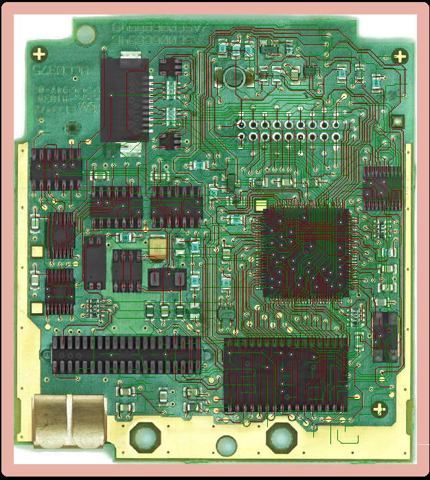
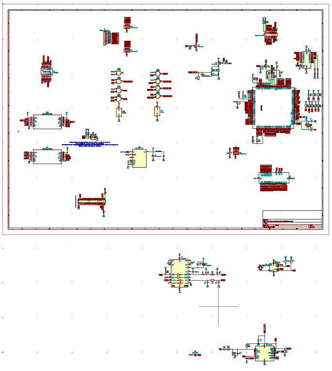

This soothing RE process brought me the following relevations: 
- Its a 4 layer PCB with a GND layer and a 5V layer in the middle. signals on the outside (lucky me!)
- PB7 and PB3 seem to be some configuration pins (see image below). The PCB provides footprints to solder a pulldown and a pullup resistor (pulldown not installed). Might be interesting to determine what can be configured with these pins when reversing the firmware.
- SCI0 goas to the plug connector.
- RES0 from the MCU is not connected
- P82 can switch the battery voltage with a BJT which then goas to P72 of the mcu?
- P83 / Q3 can switch the power to the supervisor to ground. 
- The signals going to the pinheader for the display doesn't make much sense to me since they are also connected to the SRAM. And some other signals come from the flip flop. 

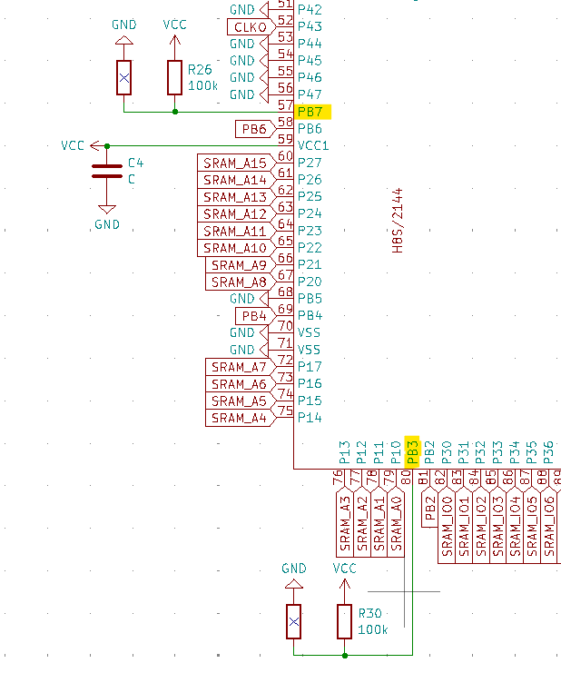
<br>
(Configuration pins)
<br><br>

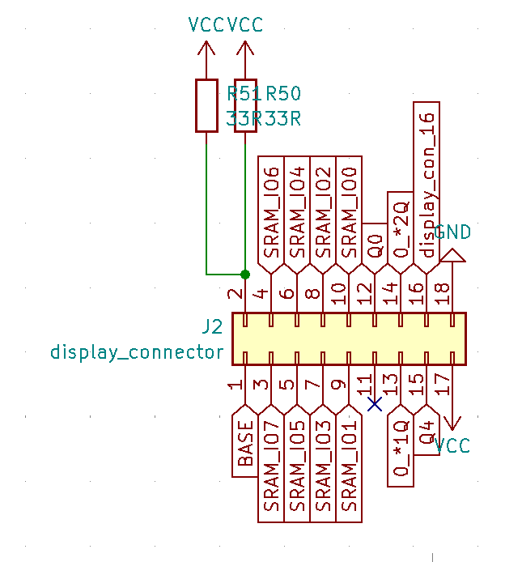
<br>
(weird display connections)
<br><br>

Having all the electronical connections between the chips clears some questions but gives rise to others...

But what this shematic certainly tells me is how to properly power the board: VIN must be 5.5V - 20V and from this supply 5V Vcc will be made.

Now I had the device powered the proper way I tried communication again, again with no luck.
After some time I decided to resolder the display to the board (I disoldered it for making the Xray scan). What I was afraid for happend: the display doesn't work anymore, I see only the backlight going on. When removing the display I used a hot air gun to melt the solder but because I wasn't to carefull and an unhealthy spot arised in the LCD cause by the heat. When cooling down the LCD looked normal again but I has now been confirmed that I must have broken the LCD. Unless it's the microcontroller that has accidentally died in the mean time...

I checked some signals from the MCU with my oscilloscope and I saw it 'being alive', meaning it did set some pulses on some pins making me believe that it is certainly the display that is broken.

Another day, another approach. Temporarely tired from establishing software communication I wanted to take a closer look to the RTC. It has an I2C interface. I soldered some parallel wires to SDA, SCL and GND and tried to read its configuration from a library I found online. Using the address I found in the datasheet (A3h and A2h). Sadly the code seemed stuck on the chip initialisation. 
Then I decided to try the I2C scanner sketch. No luck.
Highered the address loop because it only goes to 128, while A3 is hex for 163. But again no luck.

Further analysing using my oscilloscope got me smarter: the MCU is not powered and in this state it's SDA and SCL pins have some impedance to ground which is low enough to not make my I2C communications signals valid. So I decided to power the MCU while my Arduino tries  to read/detect the RTC. Guess what? When the MCU is powered the SDA and SCL signals where to strongly pulled up so my problem remained. Finally, partly against my will I decided to cut the traces to the MCU. That eventually made reading and configuring this RTC possible. 

While there is a chance that putting a valid date into a broken AOP might solve the problem I don't have high hopes for this. I can't even test this right now since I wouldn't be able to confirm the workings with my broken display. But anyway this would take away the fun of exploring the MCU's firmware...

Exploring the internet some more I realised the H8S/2144 chip can also be named HD64F2144. This then brought me to the conclusion that there exists an [Elnec adapter](https://www.elnec.com/en/products/programming-adapters/DIL48_QFP100-1_ZIF_H8S-4/) with which to firmware of the chip could be read with Beeprog. I do have access to this programmer at work, unfortunately I do not have 280.0 € to spend for an adapter. But at least it gives me somewhat certainty that readout of this chip is possible, and in the explanation in the beeprog software there are no indications of readout security.

The datasheet that made me notice that H8S/2144 <-> HD64F2144 was:
https://www.ele.uva.es/~jesman/BigSeti/ftp/Microcontroladores/Hitachi/H8-300H/h8_16bit.pdf
Apart from this obvious aspect it also made RxD0/TxD0 more obvious. Which made me think: maybe instead of SCI1 I need to use SCI0?? (SCI = Serial communication interface by the way).
These signals are connected to the pluggable connector but in its pure TTL form (no RS232 transceiver). I tried it with a TTL converter attached to my pc but still the same miserable results.

Then I focused some more on starting with a working, clean chip. Like the programmers from siemens would have prototyped with when designing this board. In other words I tried to find a starters kid for this MCU. In [another manual](Manuals/h8s_renesas_mcus.pdf) I found The 2144 didn't seem to have one but the most similar one for which such a kit exist seemed to be:
H8S/2166 starters kit with part number: 3DK2166
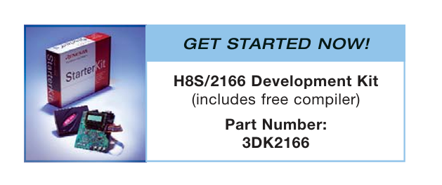
While the starts kit of the H8S series are still 'active' according to Renesas (https://www.renesas.com/en/products/microcontrollers-microprocessors/other-mcus-mpus/h8s-family-mcus/h8s2456r-starter-kit-renesas-starter-kit-h8s2456r) I don't seem to find a seller anywhere for these, also no one selling these on Ebay. Quite unfortunate.

Another free moment later I decided to optimise my setup. It was clumsy because I always soldered and desoldered wires to the PCB for power, signals. 
I also got hold of a working AOP from work but don't want to risk breaking this one in any way. 
To more fluently power AOP's and listen to the signals comming out of the pluggable connector I discovered there exists this I/O adding module for the micromaster called 1790L811A on which you can plug the AOP. 
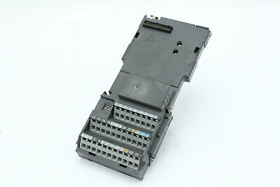
We had a broken one laying around at work which I transformed to easily power and communicate with my target PCB:
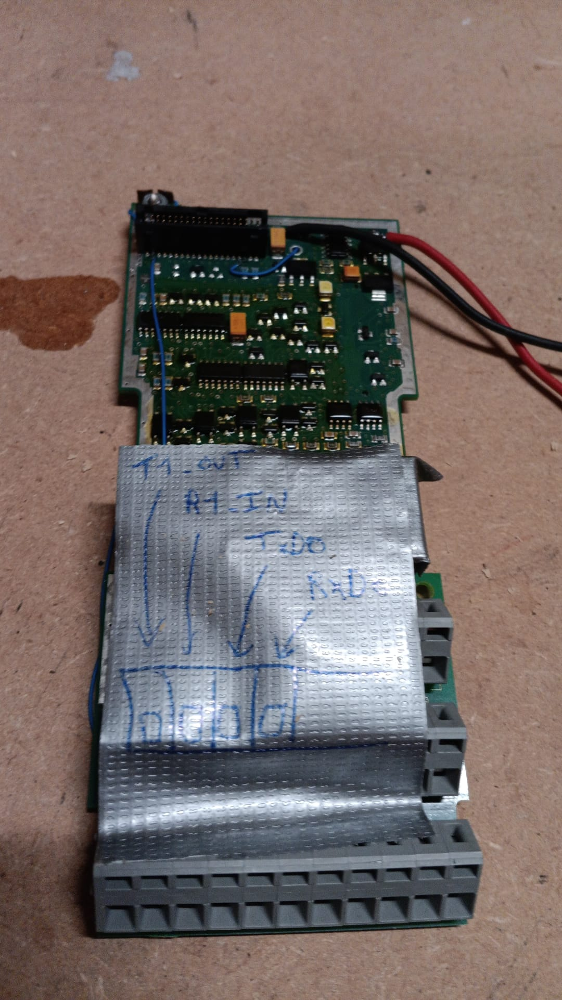
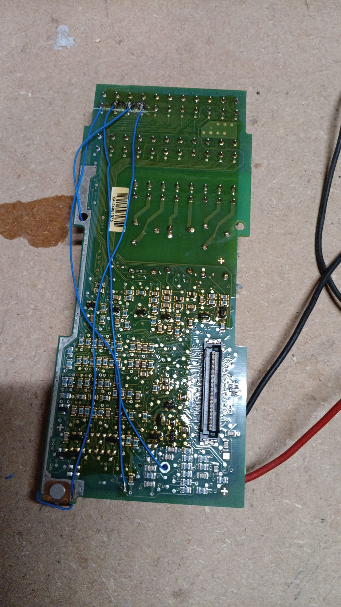
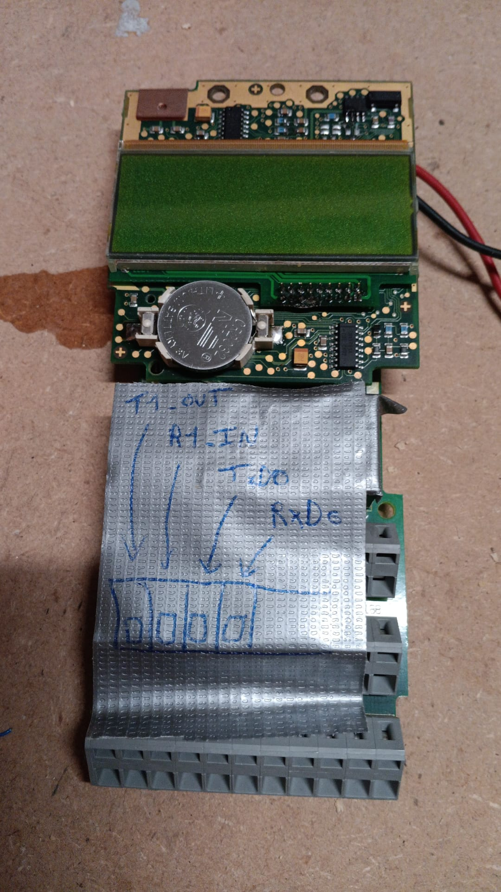

Another day again, I choose to put my focus on the broken display. I was willing to buy a new display. 
I started to google search for it using the keywords I could read on the pcb "VLUK2089 display".
No results but I came across this [website](https://s7detali.narod.ru/MM4_AOP/MM4_AOP.html):

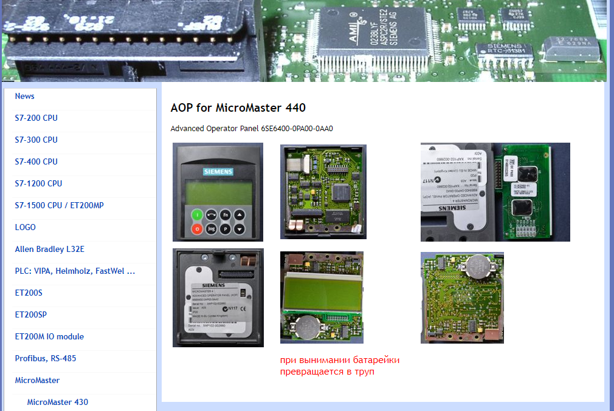

With the text - I quote - "при вынимании батарейки
превращается в труп"
which translates: 'when you take out the battery
it turns into a corpse'. This made me laugh in a way while also feeling miserable as I have no real progress into a solution for this currently...

Apart from this they do seem to have pretty images of the AOP and display (which made me hit my google search). I didn't know till now that google forms results based on OCR performed on webpage images.

Since the image of their AOP-PCB is also very clear, you could easily read the chipmarking of the MCU: HD64F2144FA. It was not a Siemens rebrand it seems and also a plus for them: there display is removable, to bad mine wasn.'t...
Anyway nothing quite new it seems but this made me lookup this specific code in the datasheet:

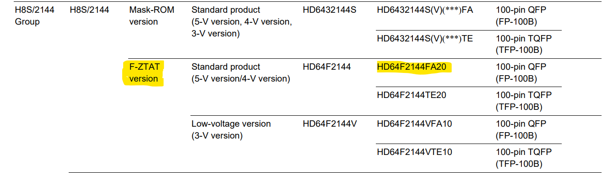

Learning us this is the F-ZTAT version. 
Around the same time I got response on a help-ticket I submitted to Renesas support regarding my inability to communicate with this chip:

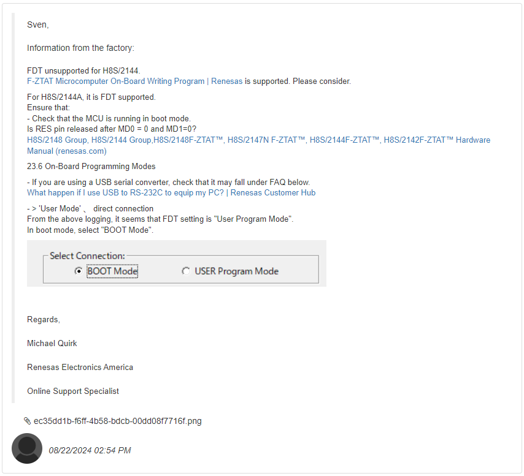

After this I asked for the F-ZTAT program and received some exe after which the ticket got closed. On the renesas website only updates for the F-ZTAT software could be downloaded now. But on the Japanese website of Renesas I was able to find some demo software.

Also I searched the web for more info on this F-ZTAT program and what the process was to program a chip using this program. The exe's or installer packages I currently got didn't seem to be a full program. They don't start or they ask for certain files. 

- https://www.apnet.co.jp/eng/products/flash2.html#dl
- https://web.archive.org/web/20020401144908/http://www.apnet.co.jp:80/hghome/product/superh/flash.html
- https://www7b.biglobe.ne.jp/~kenjia/J_H8.html#h8k
- https://download.csdn.net/download/qq_43598101/87614191?spm=1003.2122.3001.6634.19
s

I learned that the program is actually called Flash Writer PRO (2) and should look something like this:

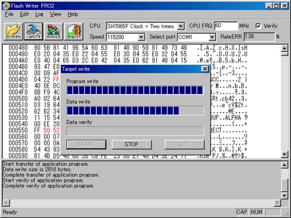

The program I received from Renesas wouldn't even start, it seems to require a certain .inf file:

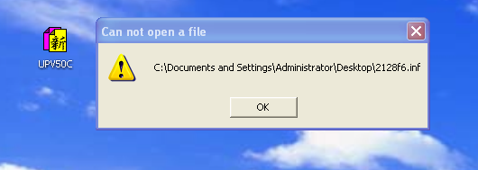

Also from my search journey I somewhat understood that this program has no upload function. 

The [Single Power Supply
F-ZTATTM
On-Board Programming
Application Note](Manuals/REN_rej05b0520_onboardprg_APN_20041213.pdf) gave me some more info. 

The program setup would look like: 
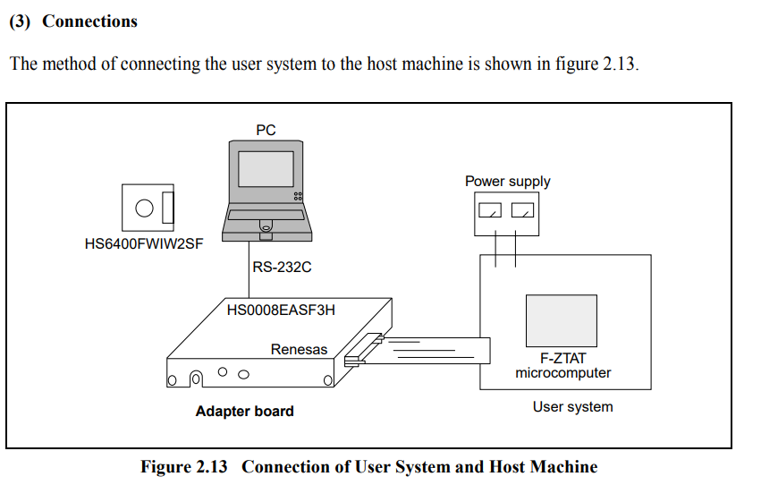
Unfortunately, if right this would mean I would need this programming adapter.

The communication with the chip seemed to have a different initialisation that the '0000 26'. So that might work.
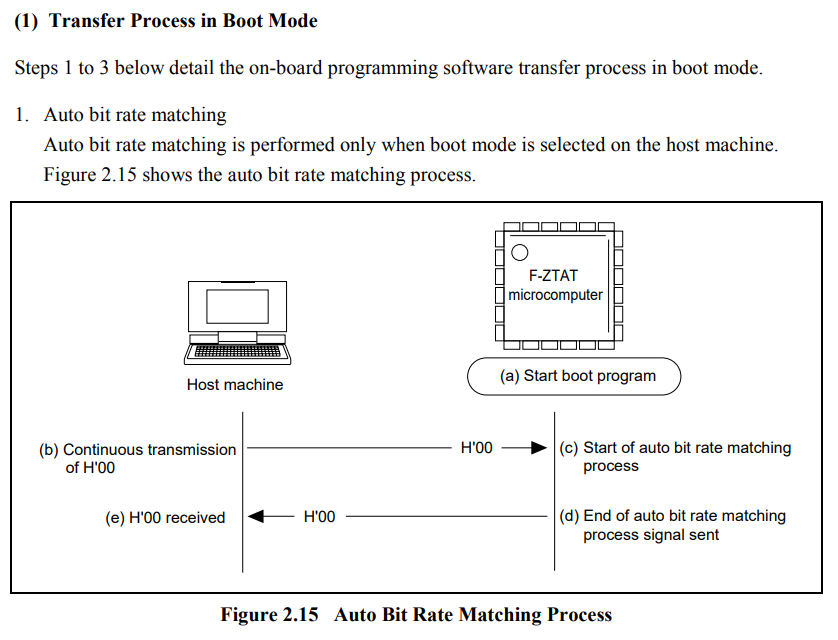

It seems like you would want to have a information file for your type of chip which holds the Flash memory block info. (I don't have it).
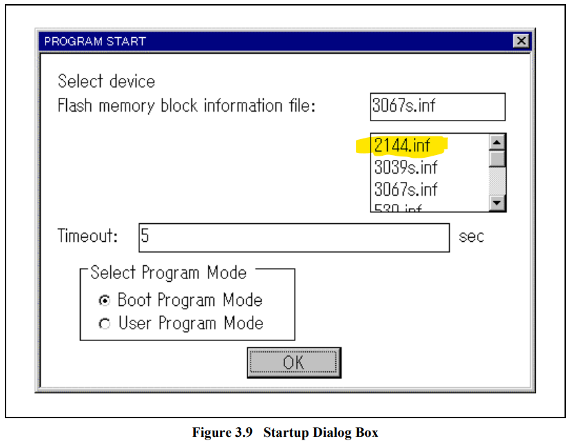

Furthermore I find no references when looking for 'Upload'. So it might be that it's not supported on F-ZTAT hardware...


Hardware manual page 683 and following are interesting but to me a bit confusing. 
The chip has 128 kbytes of ROM memory. But the pins MD1 and MD0 define if this ROM is enabled or not? What happens if it is disabled, from where should the application code then be loaded? The EXPE (expanded) bit expands the memory range.
I am assuming now that the external SRAM on the board is an memory extension that might store a part of the application code. I first assumed/hoped this would store some drive parameter sets. If true this makes the project quite harder.


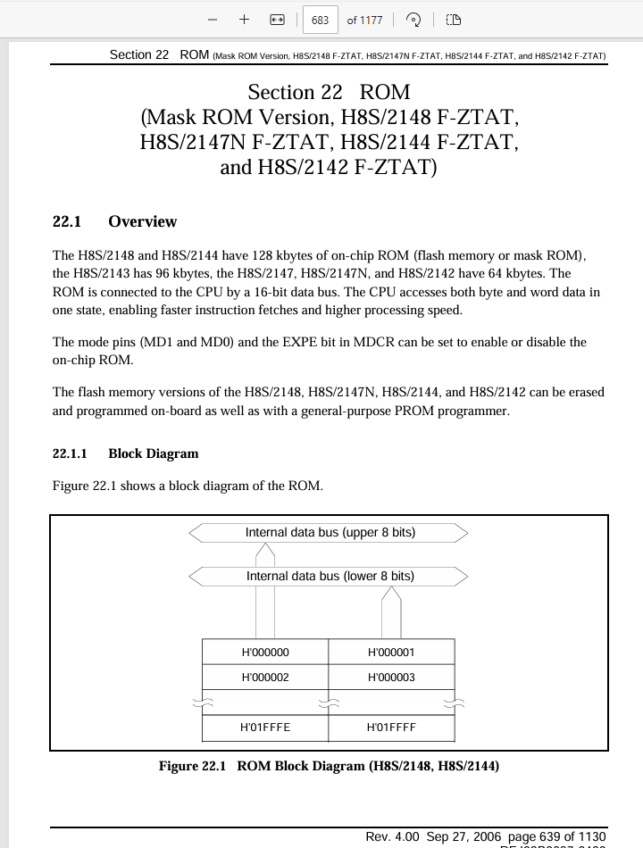


>21 sept '24 | At this point there is a lot unclear for me, and not having a board to experiment with or the knowledge if readout functionality has gotten me a bit 'stuck'. 
If you have further knowledge, idea's, possible approaches or anything that could help please contact me at svenonderbeke < at > gmail < dot > com
 
>30 sept '24 | I'm not stuck anymore. Insights still welcome though.

I was able to find another broken device at work which also uses a H8S-chip. H8S/2633 to be specific. I'll give it a try to communicate with this one. 

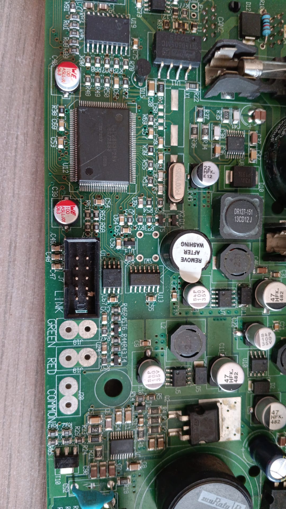

There is a 10-pin connector right of it with below some silk-text 'LINK' so this is probably the connector to program this CPU. Let's grab a multimeter and see to what pins they connect.

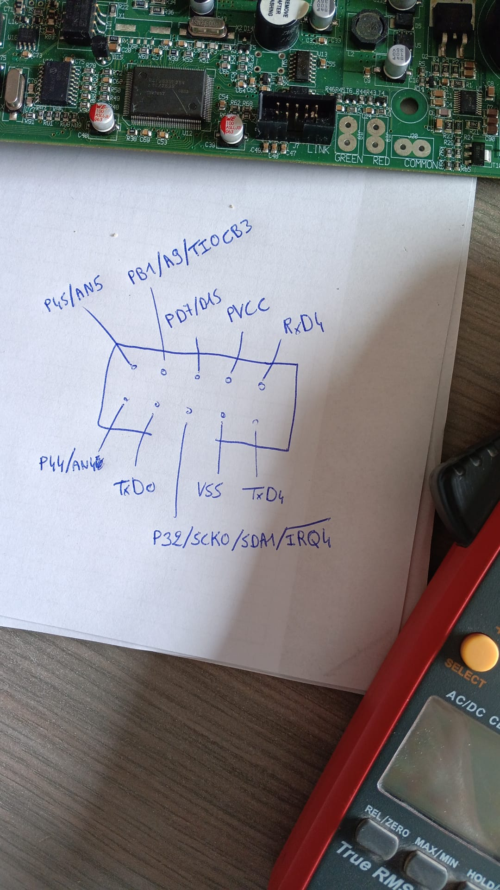

Hmmm we got SCI4, power pins and some transmit and random pins. Let's check the manual if SCI4 seems for programming. 

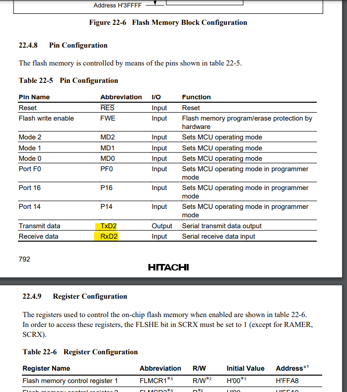

From the part above it seems to be SCI2. On the left of the board a bit further away from the CPU and on the back side is another 10-pin connector. We'll figure out this pinout as well:

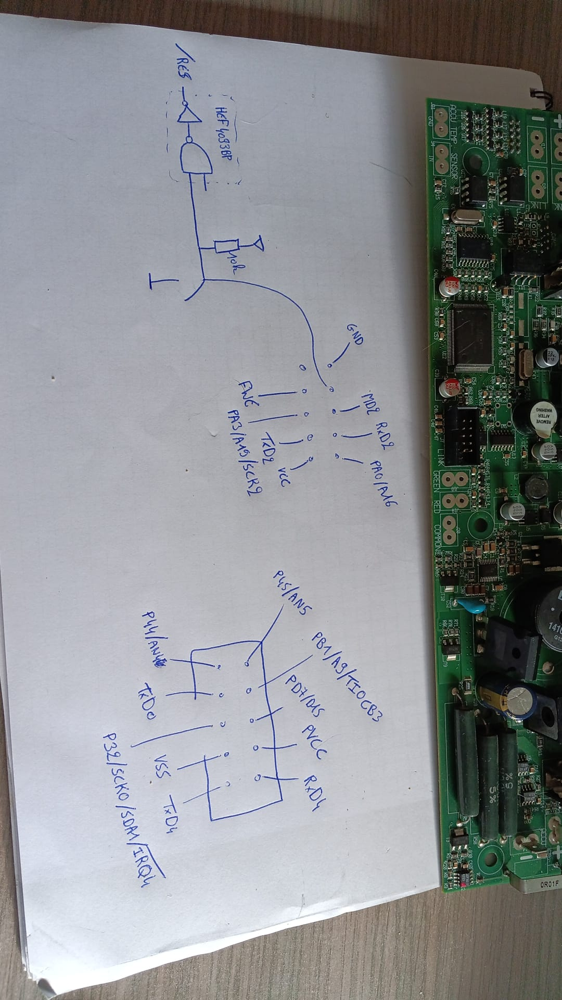

Okay this is definately the programming connector, having the reset pin, SCI2 and the FWE and MD2 pin

I attached MD2 to GND and FWE to VCC using a small resister since I had no wires easily available. Then I tried communication with the software and oh yeah, it just worked!
At this point I decided that I wanted to be able to work on this from inhouse, not from my shed where my variable powersupply and 
oscilloscope where. I was powering the device from the 12V rail but wanted to power on the 5V so I could have my setup laptop-powered.
The VCC of my FTDI USB to TTL adapter didn't cut it to power the 5V-line of the board but I knew the board was drawing around 200ma on this line.
So I cut a USB cable and made it a seperate power cable. This is a picture of my 'portable' setup:
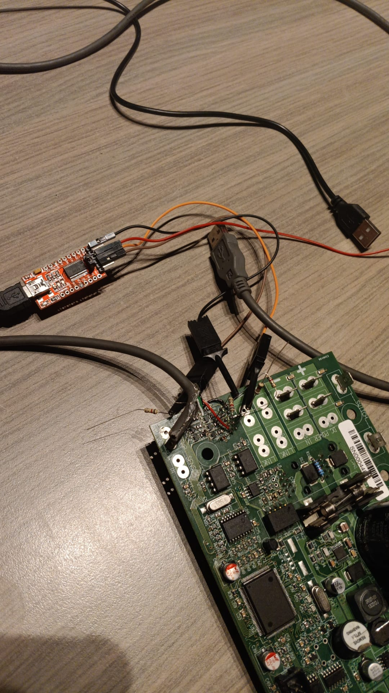

The 'succesfull-communication-achievement' gives me some room for experimenting again. I tried programming some random data and uploading it, that seems to work ok. 

What I learned was the I could could only connect once per powercycle using the BOOT-mode. From the log output you indeed see that it erases the flash content. It also installs the micro-kernel. After one connection you can reconnect if you pick the user-mode with kernel active. I've you download a file, you can only retrieve this file (upload) within the same boot cycle otherwise the whole content would be 'FF'.

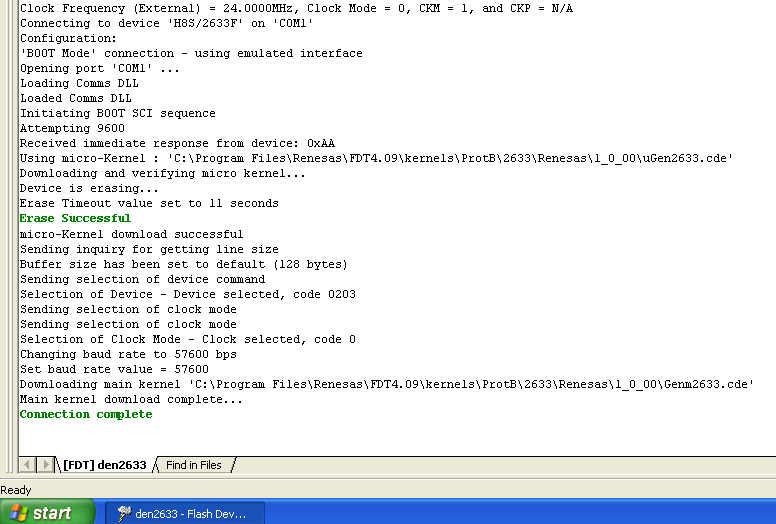


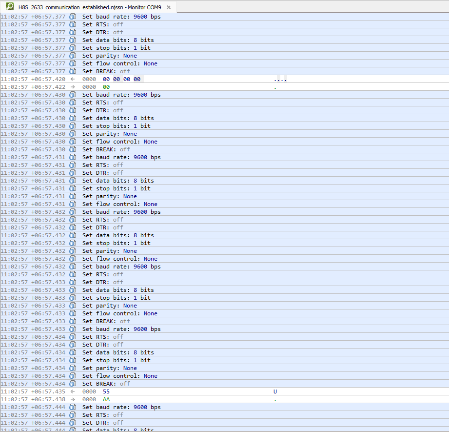

My next goal would be to understand and replicate the serial communication that performs connection, download, upload, etc... 

Fortunately the software itself is very verbose on what it is doing on a communication level.
most of the actions are even explained in the F-ZTAT manual and I was able to identify the 'auto-bit rate matching', 'write control program transfer' and the 'application program transfer' in the 
intercepted serial communication. In the picture above you can see the bit rate matching and a handshake before the micro-kernel transfer.
And the snippets below show those parts in the manual.

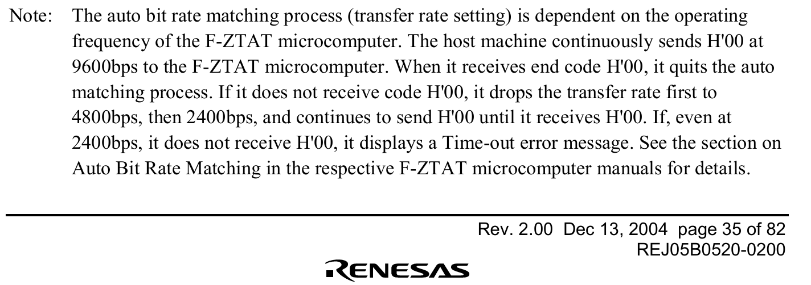
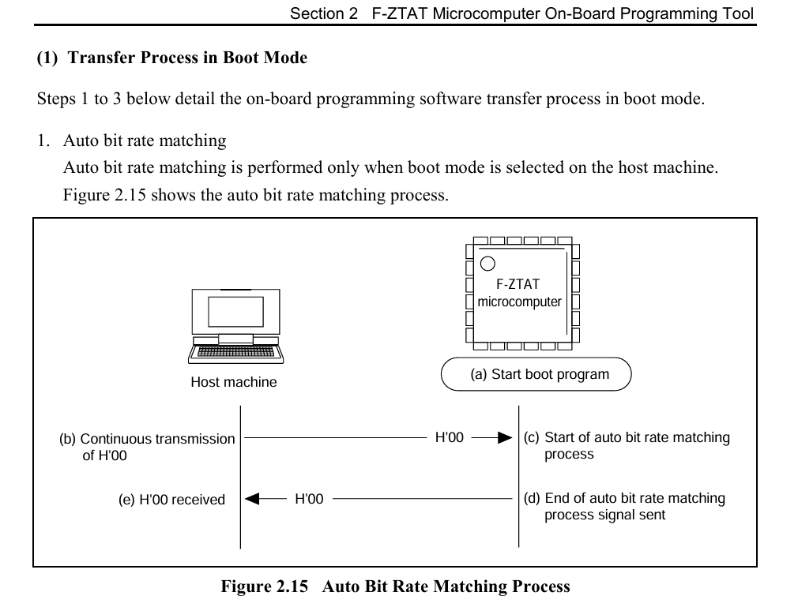
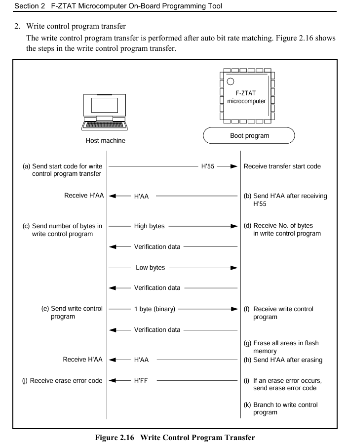

With the help op ChatGPT I was able to replicate these first actions in no time.

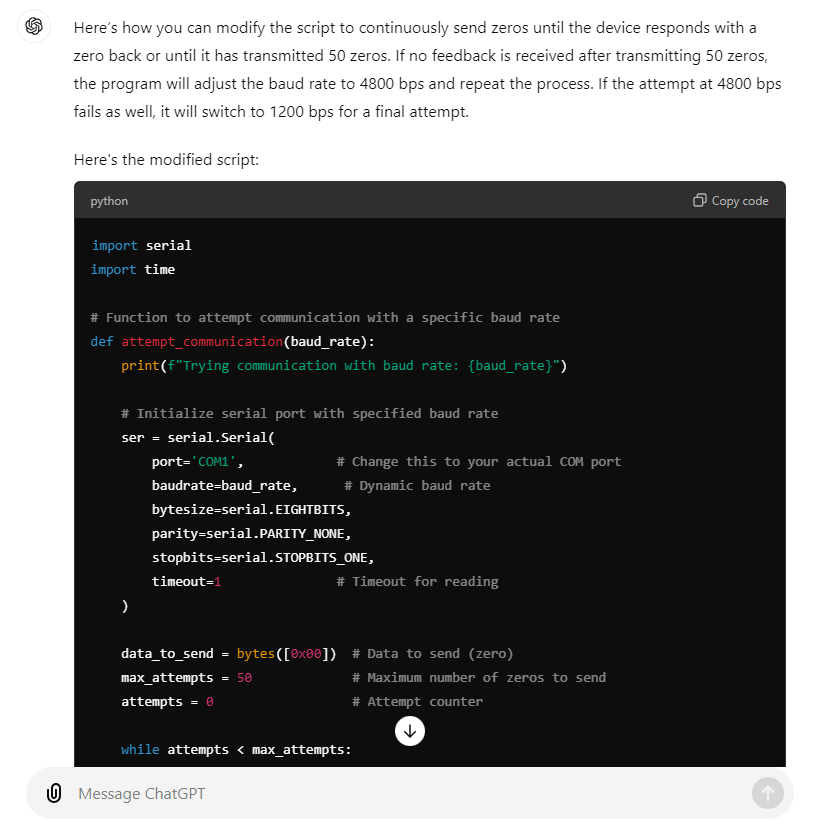

This is an oversight of the communication flow; setting up the connection, writing micro-kernel and main kernel and performing 
an upload.

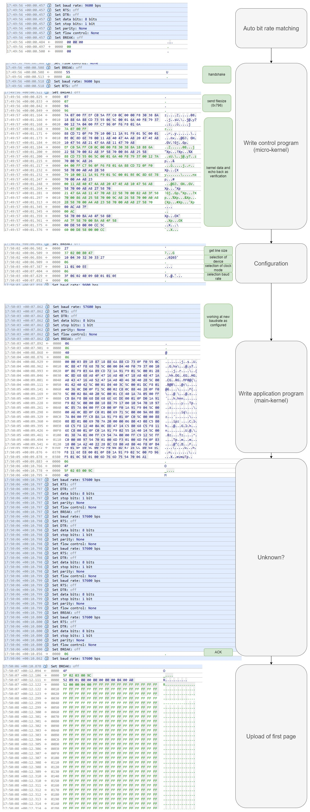

Only the steps of writing the kernel and the auto bit rate matching are explained in the manual.
Some parts were determined from the verbosity of the FDT program and some things are still unclear.

The writing of the main-kernel is answered by a 0x06 (ACK) command. Then comes the first totally unknown command (0x4F).
Searching google led me to another manual which gives me a name or short description for some commands (not all).
This one seemed to be the 'Boot program status inquiry':

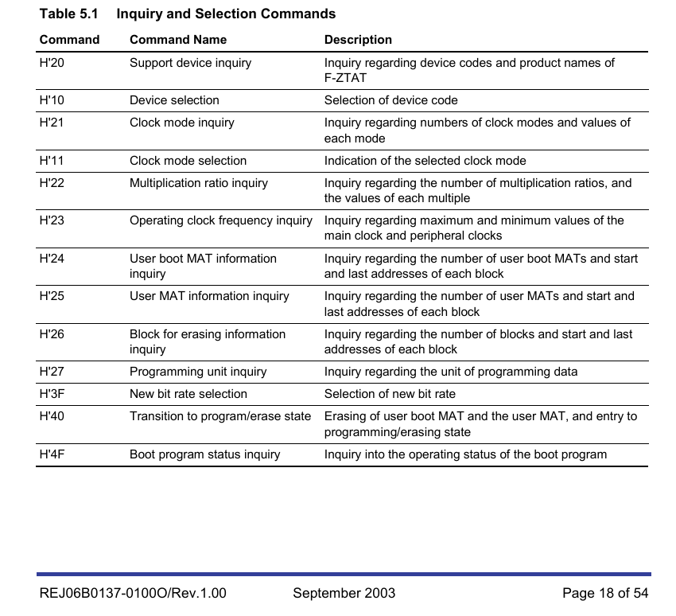

Anyhow without understanding every single bit of the communication I ported it to python and I am able to download kernels
myself now and perform upload. 

One interesting remark that I discovered while doing this:
first in the log it says:
... Using micro-kernel '...\uGen2633.cde' 
and then it transmits this exact file.
Then after some commands it says:
.... Downloading main kernel '...\Genm2633.cde' 
and then it downloads something different. I had to export the main kernel that it is really sending from IO-ninja
because I couldn't find a file with matching content. The data shows similarities to 'Genm2633.cde' but isn't exact the same and differs in length.

That little thing aside, it's time to come with a plan of attack!
My assumption is currently that the micro-kernel gets downloaded and then executed, I assume (hope) it
contains the instruction to erase the flash memory. 
I divided my goal in these smaller steps:
- Reverse engineer the micro-kernel of the H8S/2633
- Patch the micro-kernel to skip the erase, perform an upload.
- Perform same steps for the H8S/2144
- Read out its firmware
- Write a RAM-reader and RTC-reader
- Write program that automates the whole process of reviving an AOP

I'm aware there might be some pitfalls along the way and that this whole idea might fail. But for now
it gives me some path to follow and most importantly, for those who remember my goals I hoped to perform in the beginning:
- Reversing firmware
- Glitching a chip to upload its program (okay I will not glitch it, but patching the micro-kernel to unlock an upload which is not provided 
seems already like equally fun).

Writing the steps down made me think about a book I started reading yesterday. 
I actually never read books but I came accross this one named 'Microcontroller Exploits' from Travis Godspeed and I had to have it.
As you can probably guess its not a novel or a thriller but some techniqal literature about different microcntrollers
and how to make them perform something they are not intended to do. 
And in the first few pages I already got some good advice:

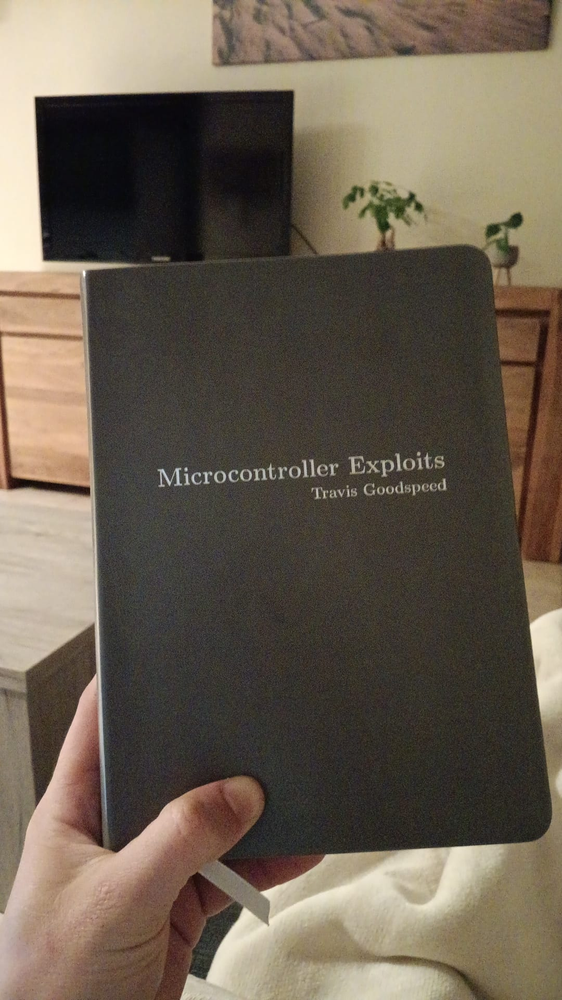
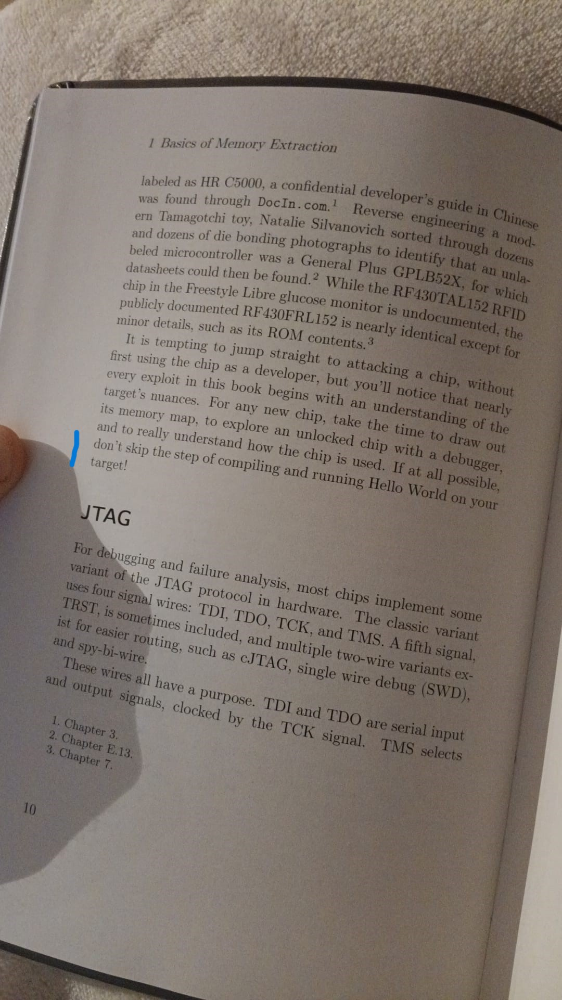

"If at all possible, don't skip the step of compiling and running Hell World on your target!".

And one should not skip some good piece of advice, so let's prepend this to our list from before.

# Greeting the world

To program for a H8S device the 'High-performance Embedded Workshop' - HEW for short - software was developped. 
I was able to find it on the internet.

After going to the steps of setting up a new project I got this:

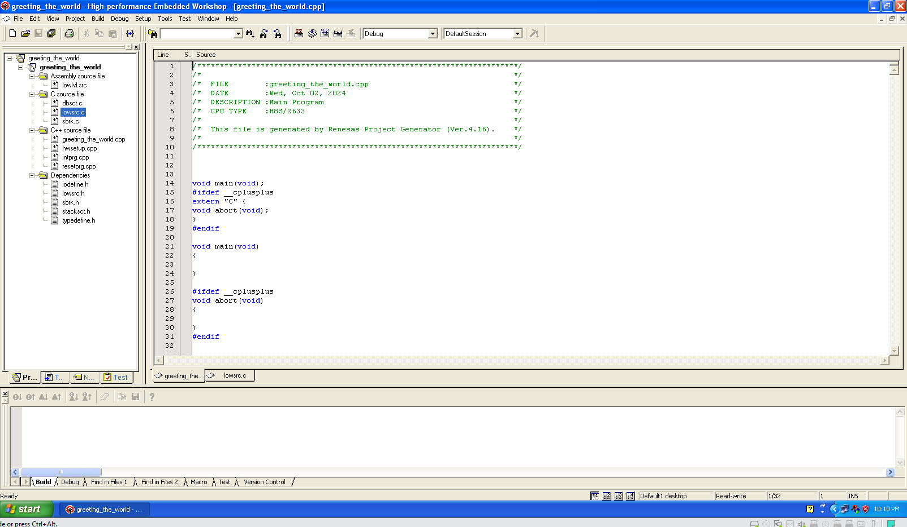

In this era of microcontroller programming I assume program space was so expensive because during the steps
I had to choose how big I want the stack and heap to be. Never had that before...


https://llvm-gcc-renesas.com/getting-started/hew/index.html


https://github.com/quarkslab/binbloom

a


