## AOP requires rebuild - Writeup of my reverse engineer approach
I'm an R&D engineer at an electronic repair company and an overall enthousiast of reverse engineering hardware and software. When encountering a 'dead' AOP panel at work with no available solution to fix this piece of hardware I wass triggered to investigate this at home in my spare time.

 As trying to provide a way for people to restore there AOP in an easy way would be nice, it is not my main goal. I choose this project because I would like to glitch out firmware from a secured microcontroller and to reverse engineer microcontroller firmware. I have no practical experience in the former and a very brief experience in the latter and was hoping to develop it during this project. 

 The structure of this writeup is lineair in time and genuine. Meaning I just write my approaches and efforts along the way, and if, after gettings smarter they are deemed irrelevant or there were incorrect assumptions I still let this be part of this writeup. 


## Siemens AOP

Siemens AOP (6SE6400-5AP00-0BB0
) is an Operator panel used to communicate with Micromaster drives. It has more features this basic brother 'BOP' hence the names Advanced Operator Panel and Basic Operator Panel.


Some of its functions are:
- It can upload and download parameters sets from a drive
- It can scan RS232 and RS485 ports for drives
- You can view / edit drive parameters with the display and buttons.

## Problem when battery is low or removed
It can stop working and its display would say : 
```
AOP is slave to PC! 
AOP requires rebuild 
P to exit when done
```


The cause of this is that the internal coin cell battery was either removed or dropped to much in voltage over the years.
According to [this thread](https://support.industry.siemens.com/cs/document/21367554/micromaster-4-(aop)-lifetime-and-exchange-of-the-aop-battery?dti=0&lc=en-BE) it should last 5-8 years on a single coin-cell. You could replace this battery if you happen to think about this before it runs out. But let's not kid eachother, nobody does since there is no indication for it on the display. There is however an internal parameter P8560, where you could check this battery level. But again it requires the user to think about this actively...
[Update: thats a lie, there is actually a battery low warning on the screen, it would however have made for a better incentive for this project]

## Known solutions 
From the manual, you get no help. It doesn't even mention this fault. From the internet the only suggestion I find is buying a new one, but that seems kind of a waste. Let's try to save some bucks and try to solve it ourselves. 

## Reverse engineering the AOP hardware
Let's open up this display and see what we are working with:


Okay, whenever I reverse a PCB like this, I start up by taking note of all the chips and there function. 
Reading all the markings I get:


Looking up all the datasheets we can get a simple idea of what each chip does:

Chip marking | Short function 
--- | --- |
2144B69FAV SIEMENS A&D | Microcontroller 
ACT/P8 | 16Mhz Crystall
HA573 | Octal latches
SAMSUNG K6X4008C1F-UF55 | CMOS SRAM
AHC00 | quad NAND gates
AHC08 | quad AND gates
L4931C50 | 3.3V LDO
74VHC32 | quad OR gates
HA74 | flip flop
MAX691A | supervisor
ADM202EA | RS232 line driver
PCF8563 | Real-time clock/calendar
32.768k | 32khz Crystall

Okay since the removal of the battery causes the issue, we want to check which chips are powered from this battery.

It seems the battery is only connected to the supervisor (MAX691A), the SRAM (K6X4008C1F-UF55) and the RTC (PCF8563). 


Okay from this we could guess what goes wrong.
I would assume the microcontroller performs all the logic and only uses the SRAM to store the drive-parameter sets it has uploaded. Though it could be that they wrote a bootloader with which they loaded some configuration into the SRAM. Alternatively the real time clock might need a valid datetime setting to work. Off course a combination of both could be the case as well.

One solution could be to read out the RTC / SRAM in circuit. Though I'd assume the connections to the MCU would alter our signals (a not powered mcu likely has some low impedance connection to ground on its IO). Apart from that it would also take us some effort.

Another option would be to attach a battery to the supply of the chips and them trying to desolder them without shorting any connections while desoldering and off course while not desoldering the batteryleads. An even more effortfull and risky solution if you would ask me, well for the SRAM at least. And we would need a working unit (I don't have one for now).

The cleanest solution I could think of would be trying to dump the MCU's firmware. Writing a program for this chips that reads the RTC and SRAM's content of a working AOP and reflashing the original firmware. Then the contents of a broken AOP could be restored in a similar fashion.

But no cigar there, the chipname 2144B69FAV SIEMENS A&D doesn't seem to give use any hits in google. Of course it being branded a 'SIEMENS'-chip at would not bring much hope. Seems like they bought or developped a custom MCU...

Fortunately I have a second broken AOP laying around. The PCB design seems totally identical, except for 2 chipmarkings...

The SRAM seems to be a CY62148ELL-45ZSXI on this one. The marking on the MCU: F2144AFA20V H8S/2144A
bingo! This brings some hope back, they nonetheless used an off-the-shelf MCU. Maybe they rebranded them in an effort to counter the dumping of the chip / make RE more difficult.


Okay we are dealing with a chip from Renesas. The datasheet is revisioned in 2006 so the chip is already quite old... Lets hope it supports upload functionality.

I started out by searching for the flash program software for this MCU. It seems to be conveniently named [Flash development toolkit](https://www.renesas.com/us/en/software-tool/flash-development-toolkit-programming-gui).
Let's spin up a Windows XP virtual machine in VMWare as I assume this program was developped in tis era. Install the software and creat a new project.


When proceeding on making the project it ask us the type  of controller. It knows the 2144 type we have so that's good. Then it asks us for a serial port for our connection to the chip. Perfect! Gives use some hope we don't need to buy a specific debugger / programmer to program/upload these chips. 


<br>

> Sidenote: Serial port is a PC port people often had on older pc's dating from the DOS, Windows XP era. I know it for it being used to communicate with (old) industrial electronics (PLC's, frequency drives, ...). But in fact it can be used for whatever communication you want. It is UART communication on RS232 levels. 

For the CPU frequency the software suggests 20Mhz but let's change it to 16Mhz because of the crystall on the PCB.


Next the connection type... We can choose between BOOT Mode and USER Program Mode. The former seems to erases its flash prior to connect. Well, let's NOT choose this one. 


USER Program Mode assumes we have a USER micro kernel installed. I don't  really know what this means but I assume its a bootloader similar like the one in an Arduino (Optiboot). Which enables a user to program it using serial. Let's just hope it is there.

As for the communication speed I just go with the default.

When the project is set up we go look for an upload method.


<br><br>'Device' -> 'Upload Image' seems what we need. Lets select the whole user flash region and hit  upload. <br><br>


I have nothing attached yet ofcourse so it doesn't read out anything but we can see from the debug window that it tried to communicate using COM1 with my chip, perfect. Let's figure out how to connect with the MCU.

The chip's manual didn't help me much there but I found another pdf: [Renesas Flash Programmer  
Sample Circuit for Programming  
by Using a PC’s Serial Port](https://www.renesas.com/document/man/renesas-flash-programmer-sample-circuit-programming-using-pcs-serial-port).

We have 3 connections options: 
- Type A circuit
- Type B circuit
- Type C circuit

Let's work with type B circuit since in the software I see we are apparently using 'Protocol B' let's assume this reflects the connection circuit. 


Okay, we need a RS232 to TTL converter chip. As from our chip markings we have seen that there is such a transceiver present on the PCB (ADM202EA).
Lets find out where pins FLMD0, TOOL0 and _RESET are located an how they are routed on the pcb.


Well no hits there, the datasheet doesn't seem to get any references on these names.
Let's take another approach and start from the RS232 transceiver and see how it is routed. We are only interested in the T/R IN/OUT connections, let's trace them.


The second channel doesn't seem used since T2in connects to ground. T1in and R1OUT seems to be connected to pin 97 and 98 (TxD1 and RxD1).
The RS232-leveled signals seems to go through 1k-resistors and one goes to pluggable connector, the other only to a testpin.

Okay, with that info lets re-evaluate our PC - MCU connection choice (type B). Maybe it's not what we need since we don't have those pins and since the relation to the 'Protocol: B' in software was just a wild assumption.

Type A also uses the FLMD0 pin, but looking at type C, this one might be a fit.


The pins required on the microcontroller seem to somewhat match what we got available.

TxD <-> TxD1
RxD <-> RxD1
MD0 <-> MD0
MD1 <-> MD1
RESET <-> /RES or /RES0


Let's make Type C circuit our new assumption and check what the current connections for MD0, MD1 and RESET are. From the circuit definition MD0 and RESET should be high, MD1 should be low.


- MD0 has a hard ground.
- MD1 is pulled up to VCC and is connected to  to  on-board dip-switch pin-1. Which when enabled pulls MD1 low.
- /RES  is connected to /RESET of the supervisor

It's quite a big datasheet so let us ask chatGPT what these pins do.


Okay, the difference between required upload configuration and current configuration seems to be the enable of the on-chip ROM. Not sure if this really effects the ability to perform a upload/download though...

Trust ChatGPT but verify:


Let's meet in the middle, we put MD1 to ground with the dipswitch but let MD0 be tied to ground. We go to the software and hit upload!

No luck. Maybe it's handy to get a view of what is happening on the serial port. For that I use some software called IO ninja and use it's serial monitor function. I enable it on COM3 because thats my serial port. After enabling the monitor I pass it through to my WINXP VM where it can be found as COM1.


We can tell that the software opens up the COM-port with the following settings:
- Baudrate: 9600
- Data bits: 8
- Stop bits: 1
- Parity: None

For short 9600 8N1, the most common communication setting.

As for what the software sends  we see '0000 27'. Maybe I should search the internet on some more info about programming this or similar MCU's. After some searches I found this: [System Specifications for Standard Boot Firmware](https://community.renesas.com/the_vault/other_products/h8/f/h8---forum/27943/how-to-program-a-h8-3067-microcontroller) It's about a different kind of microcontrollers (RA series) but it contains some info about the Serial Communication Interface (SCI).


Okay this seems to match our baud settings. We also learn that the software should put RxD low for the MCU to do some initialisation and respond. I'm assuming the 4 zeros we saw do just that. Unfortunately our MCU isn't responding yet, but okay I'm aware I didn't had the signal settings right. Let's do it good this time.

I disconnected MD0 from its fixed ground connection by physically pulling the pin high and attaching a wire, after which I pulled it high again (from an electronic standpoint this time).


- Here you see the wire on the cpu that is attached to MD0 and the 2 other wires are for a 3V3 supply.

Trying the upload once again yields no result. The CPU seemed properly powered, MD0 was high, MD1 low, as requested. But then I checked /RESET again, hmm it was low the whole time so the CPU isn't even running. I didn't think about this signal much untill now. After some measuring I figured the supervisor is keeping it in reset because it's VCC signal is below its threshold. Turned out I also naively assumed that the CPU needed a 3V3 supply but it turns out it needs 5V (the threshold of the supervisor chip is 4.65V).

Now all 3 signals are okay, I give it another go ... still no cigar :/

From the serial traffic it seemed that the cpu didn't reply in any way so either there is no bootloader listening on this serial connection or I'm still doing things wrong.

I decided it would now be a good idea to fully reverse the schematic of the PCB so I have a clear view of everything.

After spending several hours I was finally done retracing all electronic paths in Kicad and was represented with: 

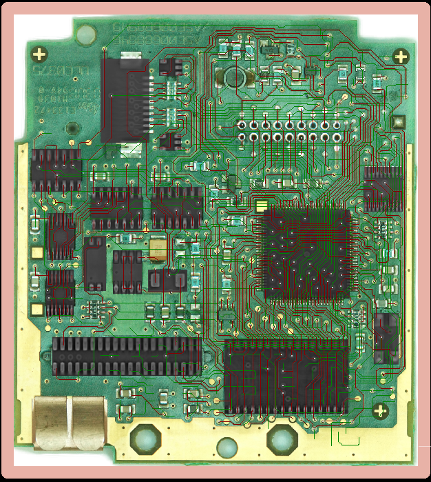
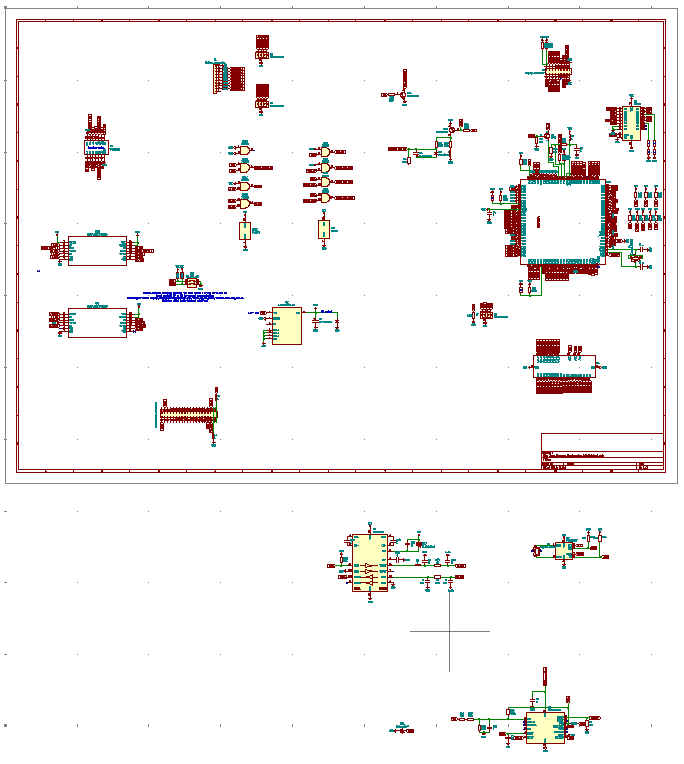

This soothing RE process brought me the following relevations: 
- Its a 4 layer PCB with a GND layer and a 5V layer in the middle. signals on the outside (lucky me!)
- PB7 and PB3 seem to be some configuration pins (see image below). The PCB provides footprints to solder a pulldown and a pullup resistor (pulldown not installed). Might be interesting to determine what can be configured with these pins when reversing the firmware.
- SCI0 goas to the plug connector.
- RES0 from the MCU is not connected
- P82 can switch the battery voltage with a BJT which then goas to P72 of the mcu?
- P83 / Q3 can switch the power to the supervisor to ground. 
- The signals going to the pinheader for the display doesn't make much sense to me since they are also connected to the SRAM. And some other signals come from the flip flop. 

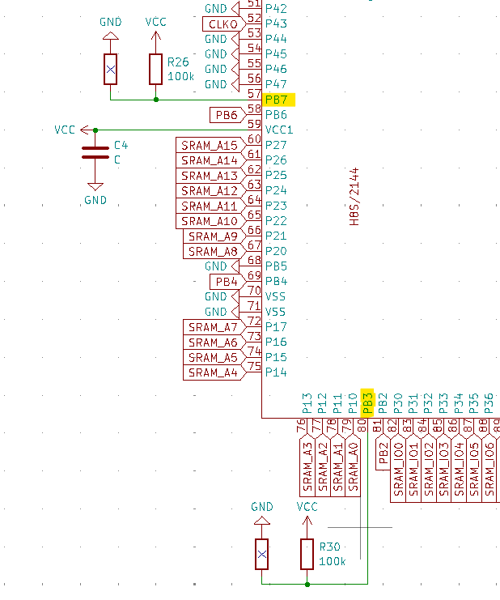
<br>
(Configuration pins)
<br><br>


<br>
(weird display connections)
<br><br>

Having all the electronical connections between the chips clears some questions but gives rise to others...

But what this shematic certainly tells me is how to properly power the board: VIN must be 5.5V - 20V and from this supply 5V Vcc will be made.

Now I had the device powered the proper way I tried communication again, again with no luck.
After some time I decided to resolder the display to the board (I disoldered it for making the Xray scan). What I was afraid for happend: the display doesn't work anymore, I see only the backlight going on. When removing the display I used a hot air gun to melt the solder but because I wasn't to carefull and an unhealthy spot arised in the LCD cause by the heat. When cooling down the LCD looked normal again but I has now been confirmed that I must have broken the LCD. Unless it's the microcontroller that has accidentally died in the mean time...

I checked some signals from the MCU with my oscilloscope and I saw it 'being alive', meaning it did set some pulses on some pins making me believe that it is certainly the display that is broken.

Another day, another approach. Temporarely tired from establishing software communication I wanted to take a closer look to the RTC. It has an I2C interface. I soldered some parallel wires to SDA, SCL and GND and tried to read its configuration from a library I found online. Using the address I found in the datasheet (A3h and A2h). Sadly the code seemed stuck on the chip initialisation. 
Then I decided to try the I2C scanner sketch. No luck.
Highered the address loop because it only goes to 128, while A3 is hex for 163. But again no luck.

Further analysing using my oscilloscope got me smarter: the MCU is not powered and in this state it's SDA and SCL pins have some impedance to ground which is low enough to not make my I2C communications signals valid. So I decided to power the MCU while my Arduino tries  to read/detect the RTC. Guess what? When the MCU is powered the SDA and SCL signals where to strongly pulled up so my problem remained. Finally, partly against my will I decided to cut the traces to the MCU. That eventually made reading and configuring this RTC possible. 

While there is a chance that putting a valid date into a broken AOP might solve the problem I don't have high hopes for this. I can't even test this right now since I wouldn't be able to confirm the workings with my broken display. But anyway this would take away the fun of exploring the MCU's firmware...

Exploring the internet some more I realised the H8S/2144 chip can also be named HD64F2144. This then brought me to the conclusion that there exists an [Elnec adapter](https://www.elnec.com/en/products/programming-adapters/DIL48_QFP100-1_ZIF_H8S-4/) with which to firmware of the chip could be read with Beeprog. I do have access to this programmer at work, unfortunately I do not have 280.0 € to spend for an adapter. But at least it gives me somewhat certainty that readout of this chip is possible, and in the explanation in the beeprog software there are no indications of readout security.

The datasheet that made me notice that H8S/2144 <-> HD64F2144 was:
https://www.ele.uva.es/~jesman/BigSeti/ftp/Microcontroladores/Hitachi/H8-300H/h8_16bit.pdf
Apart from this obvious aspect it also made RxD0/TxD0 more obvious. Which made me think: maybe instead of SCI1 I need to use SCI0?? (SCI = Serial communication interface by the way).
These signals are connected to the pluggable connector but in its pure TTL form (no RS232 transceiver). I tried it with a TTL converter attached to my pc but still the same miserable results.

Then I focused some more on starting with a working, clean chip. Like the programmers from siemens would have prototyped with when designing this board. In other words I tried to find a starters kid for this MCU. In [another manual](Manuals/h8s_renesas_mcus.pdf) I found The 2144 didn't seem to have one but the most similar one for which such a kit exist seemed to be:
H8S/2166 starters kit with part number: 3DK2166
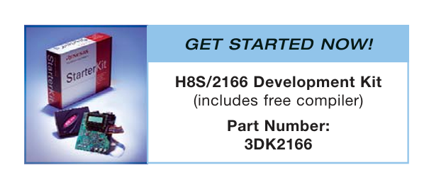
While the starts kit of the H8S series are still 'active' according to Renesas (https://www.renesas.com/en/products/microcontrollers-microprocessors/other-mcus-mpus/h8s-family-mcus/h8s2456r-starter-kit-renesas-starter-kit-h8s2456r) I don't seem to find a seller anywhere for these, also no one selling these on Ebay. Quite unfortunate.

Another free moment later I decided to optimise my setup. It was clumsy because I always soldered and desoldered wires to the PCB for power, signals. 
I also got hold of a working AOP from work but don't want to risk breaking this one in any way. 
To more fluently power AOP's and listen to the signals comming out of the pluggable connector I discovered there exists this I/O adding module for the micromaster called 1790L811A on which you can plug the AOP. 

We had a broken one laying around at work which I transformed to easily power and communicate with my target PCB:


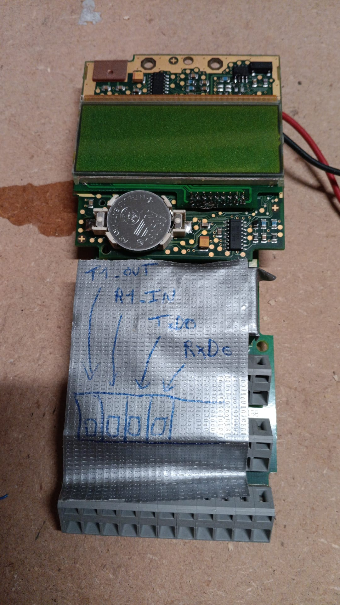

Another day again, I choose to put my focus on the broken display. I was willing to buy a new display. 
I started to google search for it using the keywords I could read on the pcb "VLUK2089 display".
No results but I came across this [website](https://s7detali.narod.ru/MM4_AOP/MM4_AOP.html):


With the text - I quote - "при вынимании батарейки
превращается в труп"
which translates: 'when you take out the battery
it turns into a corpse'. This made me laugh in a way while also feeling miserable as I have no real progress into a solution for this currently...

Apart from this they do seem to have pretty images of the AOP and display (which made me hit my google search). I didn't know till now that google forms results based on OCR performed on webpage images.

Since the image of their AOP-PCB is also very clear, you could easily read the chipmarking of the MCU: HD64F2144FA. It was not a Siemens rebrand it seems and also a plus for them: there display is removable, to bad mine wasn.'t...
Anyway nothing quite new it seems but this made me lookup this specific code in the datasheet:


Learning us this is the F-ZTAT version. 
Around the same time I got response on a help-ticket I submitted to Renesas support regarding my inability to communicate with this chip:

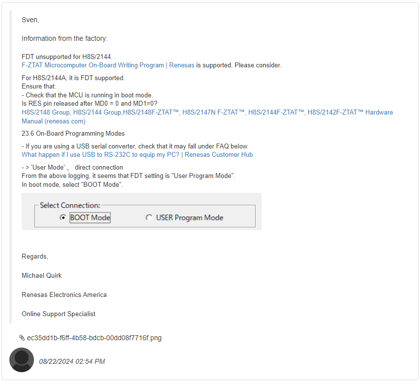

After this I asked for the F-ZTAT program and received some exe after which the ticket got closed. On the renesas website only updates for the F-ZTAT software could be downloaded now. But on the Japanese website of Renesas I was able to find some demo software.

Also I searched the web for more info on this F-ZTAT program and what the process was to program a chip using this program. The exe's or installer packages I currently got didn't seem to be a full program. They don't start or they ask for certain files. 

- https://www.apnet.co.jp/eng/products/flash2.html#dl
- https://web.archive.org/web/20020401144908/http://www.apnet.co.jp:80/hghome/product/superh/flash.html
- https://www7b.biglobe.ne.jp/~kenjia/J_H8.html#h8k
- https://download.csdn.net/download/qq_43598101/87614191?spm=1003.2122.3001.6634.19
s

I learned that the program is actually called Flash Writer PRO (2) and should look something like this:

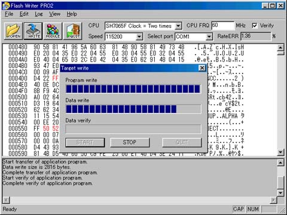

The program I received from Renesas wouldn't even start, it seems to require a certain .inf file:

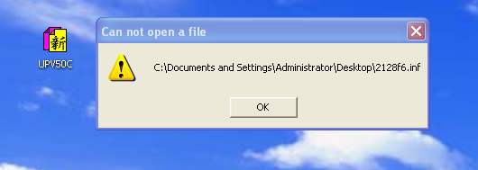

Also from my search journey I somewhat understood that this program has no upload function. 

The [Single Power Supply
F-ZTATTM
On-Board Programming
Application Note](Manuals/REN_rej05b0520_onboardprg_APN_20041213.pdf) gave me some more info. 

The program setup would look like: 

Unfortunately, if right this would mean I would need this programming adapter.

The communication with the chip seemed to have a different initialisation that the '0000 26'. So that might work.
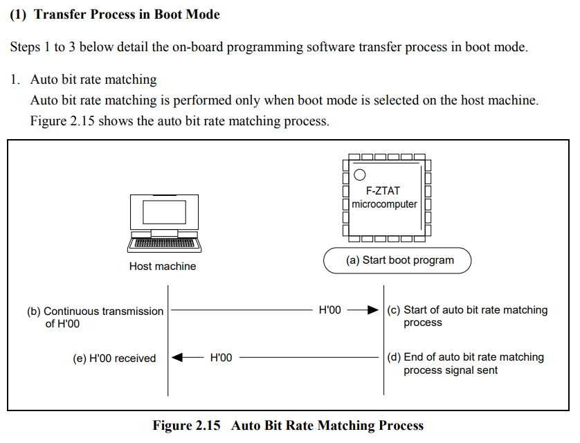

It seems like you would want to have a information file for your type of chip which holds the Flash memory block info. (I don't have it).


Furthermore I find no references when looking for 'Upload'. So it might be that it's not supported on F-ZTAT hardware...


Hardware manual page 683 and following are interesting but to me a bit confusing. 
The chip has 128 kbytes of ROM memory. But the pins MD1 and MD0 define if this ROM is enabled or not? What happens if it is disabled, from where should the application code then be loaded? The EXPE (expanded) bit expands the memory range.
I am assuming now that the external SRAM on the board is an memory extension that might store a part of the application code. I first assumed/hoped this would store some drive parameter sets. If true this makes the project quite harder.


>21 sept '24 | At this point there is a lot unclear for me, and not having a board to experiment with or the knowledge if readout functionality has gotten me a bit 'stuck'. 
If you have further knowledge, idea's, possible approaches or anything that could help please contact me at svenonderbeke < at > gmail < dot > com
 
>30 sept '24 | I'm not stuck anymore. Insights still welcome though.

I was able to find another broken device at work which also uses a H8S-chip. H8S/2633 to be specific. I'll give it a try to communicate with this one. 

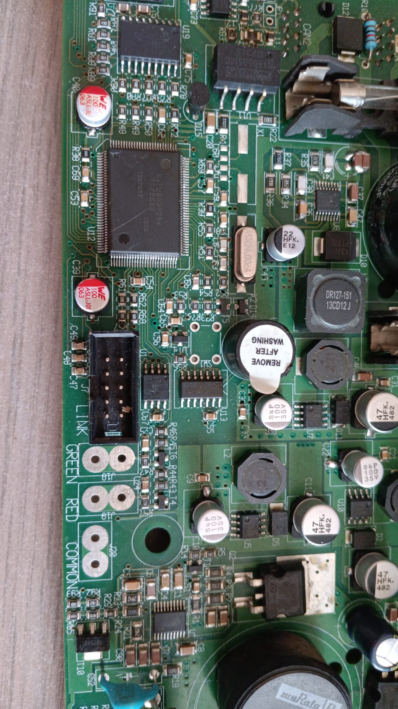

There is a 10-pin connector right of it with below some silk-text 'LINK' so this is probably the connector to program this CPU. Let's grab a multimeter and see to what pins they connect.

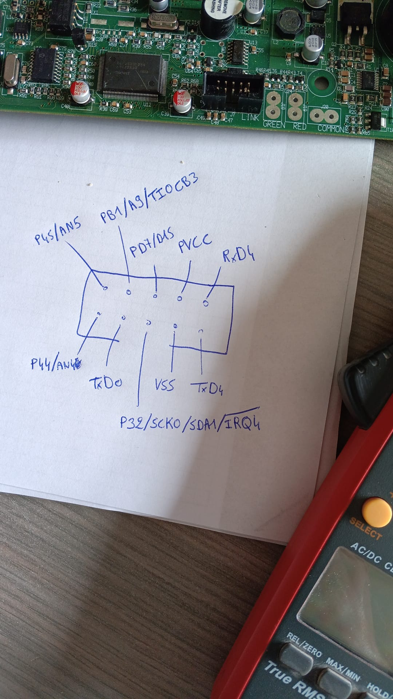

Hmmm we got SCI4, power pins and some transmit and random pins. Let's check the manual if SCI4 seems for programming. 

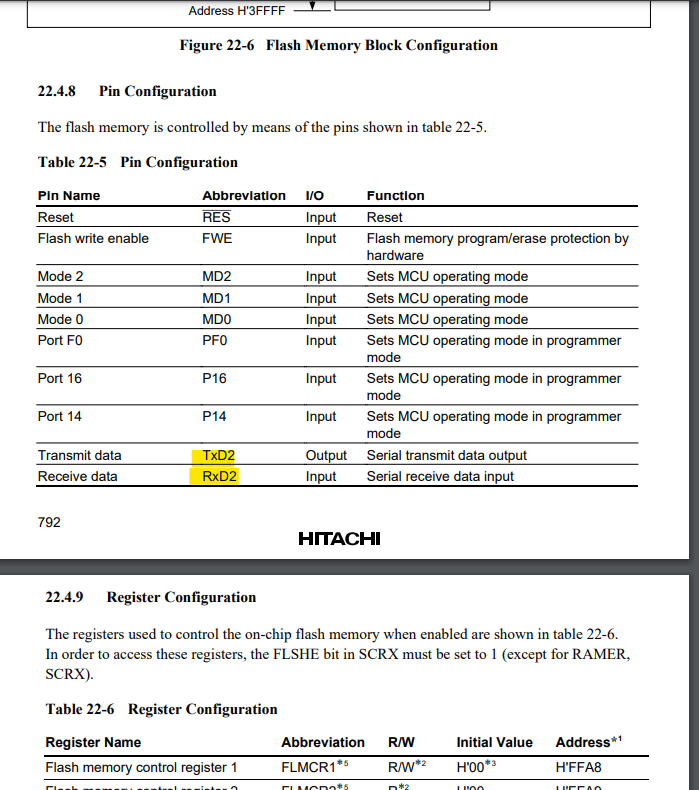

From the part above it seems to be SCI2. On the left of the board a bit further away from the CPU and on the back side is another 10-pin connector. We'll figure out this pinout as well:


Okay this is definately the programming connector, having the reset pin, SCI2 and the FWE and MD2 pin

I attached MD2 to GND and FWE to VCC using a small resister since I had no wires easily available. Then I tried communication with the software and oh yeah, it just worked!
At this point I decided that I wanted to be able to work on this from inhouse, not from my shed where my variable powersupply and 
oscilloscope where. I was powering the device from the 12V rail but wanted to power on the 5V so I could have my setup laptop-powered.
The VCC of my FTDI USB to TTL adapter didn't cut it to power the 5V-line of the board but I knew the board was drawing around 200ma on this line.
So I cut a USB cable and made it a seperate power cable. This is a picture of my 'portable' setup:
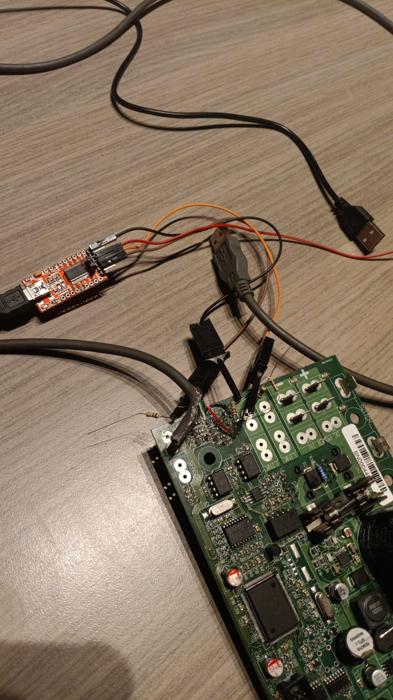

The 'succesfull-communication-achievement' gives me some room for experimenting again. I tried programming some random data and uploading it, that seems to work ok. 

What I learned was the I could could only connect once per powercycle using the BOOT-mode. From the log output you indeed see that it erases the flash content. It also installs the micro-kernel. After one connection you can reconnect if you pick the user-mode with kernel active. I've you download a file, you can only retrieve this file (upload) within the same boot cycle otherwise the whole content would be 'FF'.


My next goal would be to understand and replicate the serial communication that performs connection, download, upload, etc... 

Fortunately the software itself is very verbose on what it is doing on a communication level.
most of the actions are even explained in the F-ZTAT manual and I was able to identify the 'auto-bit rate matching', 'write control program transfer' and the 'application program transfer' in the 
intercepted serial communication. In the picture above you can see the bit rate matching and a handshake before the micro-kernel transfer.
And the snippets below show those parts in the manual.


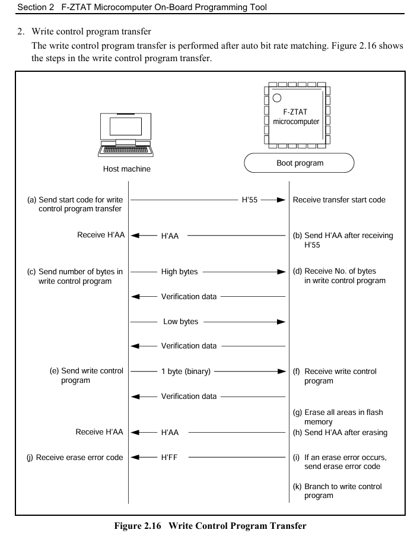

With the help op ChatGPT I was able to replicate these first actions in no time.

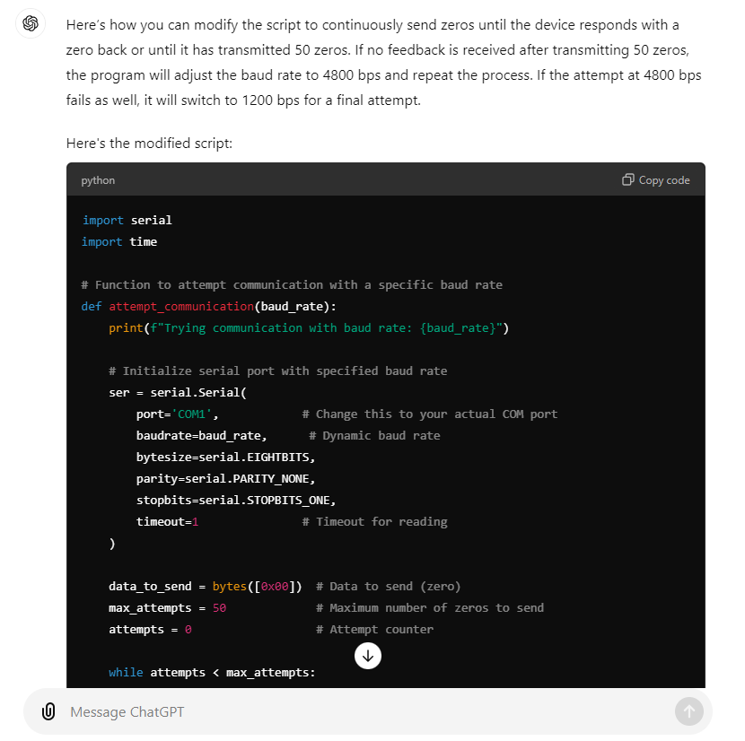

This is an oversight of the communication flow; setting up the connection, writing micro-kernel and main kernel and performing 
an upload.

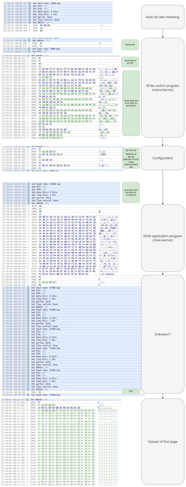

Only the steps of writing the kernel and the auto bit rate matching are explained in the manual.
Some parts were determined from the verbosity of the FDT program and some things are still unclear.

The writing of the main-kernel is answered by a 0x06 (ACK) command. Then comes the first totally unknown command (0x4F).
Searching google led me to another manual which gives me a name or short description for some commands (not all).
This one seemed to be the 'Boot program status inquiry':


Anyhow without understanding every single bit of the communication I ported it to python and I am able to download kernels
myself now and perform upload. 

One interesting remark that I discovered while doing this:
first in the log it says:
... Using micro-kernel '...\uGen2633.cde' 
and then it transmits this exact file.
Then after some commands it says:
.... Downloading main kernel '...\Genm2633.cde' 
and then it downloads something different. I had to export the main kernel that it is really sending from IO-ninja
because I couldn't find a file with matching content. The data shows similarities to 'Genm2633.cde' but isn't exact the same and differs in length.

That little thing aside, it's time to come with a plan of attack!
My assumption is currently that the micro-kernel gets downloaded and then executed, I assume (hope) it
contains the instruction to erase the flash memory. 
I divided my goal in these smaller steps:
- Reverse engineer the micro-kernel of the H8S/2633
- Patch the micro-kernel to skip the erase, perform an upload.
- Perform same steps for the H8S/2144
- Read out its firmware
- Write a RAM-reader and RTC-reader
- Write program that automates the whole process of reviving an AOP

I'm aware there might be some pitfalls along the way and that this whole idea might fail. But for now
it gives me some path to follow and most importantly, for those who remember my goals I hoped to perform in the beginning:
- Reversing firmware
- Glitching a chip to upload its program (okay I will not glitch it, but patching the micro-kernel to unlock an upload which is not provided 
seems already like equally fun).

Writing the steps down made me think about a book I started reading yesterday. 
I actually never read books but I came accross this one named 'Microcontroller Exploits' from Travis Godspeed and I had to have it.
As you can probably guess its not a novel or a thriller but some techniqal literature about different microcntrollers
and how to make them perform something they are not intended to do. 
And in the first few pages I already got some good advice:


"If at all possible, don't skip the step of compiling and running Hell World on your target!".

And one should not skip some good piece of advice, so let's prepend this to our list from before.

# Step 0: Greeting the world

To program for a H8S device the 'High-performance Embedded Workshop' - HEW for short - software was developped. 
I was able to find it on the internet.

After going to the steps of setting up a new project I got this:


In this era of microcontroller programming I assume program space was so expensive because during the steps
I had to choose how big I want the stack and heap to be. Never had that before...

Let's try to find some programming guideline for the H8S.
On youtube I only find some short videos from Digikey:
https://www.youtube.com/watch?v=oP-DdDqkkw8

They do however reference to more documentation on www.renesas.com . This reference is now outdated actually
but using the internet archive I got presented with this interested page listing information about H8S and HEW topics.

https://web.archive.org/web/20100722144159/http://www.digikey.com/PTM/PTMMaster.page?site=us&lang=en#Renesas-Technology-America
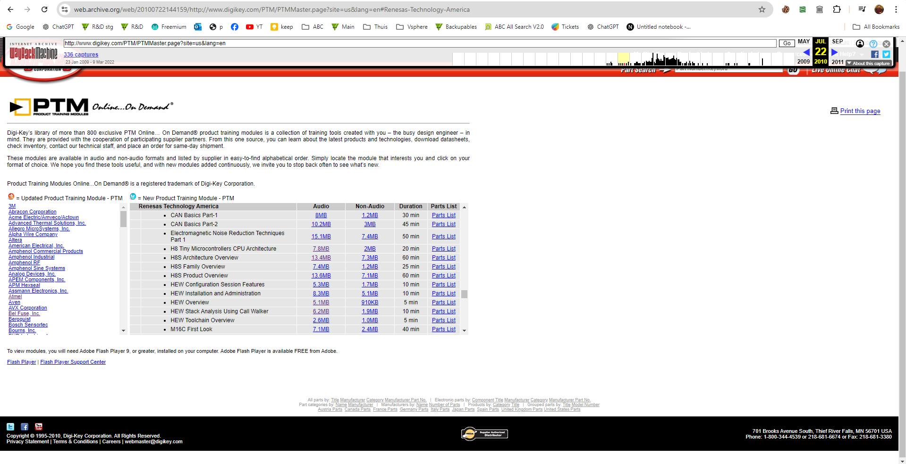

They all lead to a page explaining a topic with the use of the old flash format.
Flash is of course not supported anymore but Internet Archive has 'Ruffle' builtin in, a player use can use to play flash files nowadays.
Unfortunately it didn't seem to work. It's stuck on 100% loaded. 
I found out you had to open this flash page (.swf) seperately and then you have a right mouse option 'play' to start the Flash animation.

I downloaded all the HEW and H8S Flash animations and included them in this repo together with the Ruffle executable to play these files.
The documention made me have a better understanding of the H8S chips and HEW software.
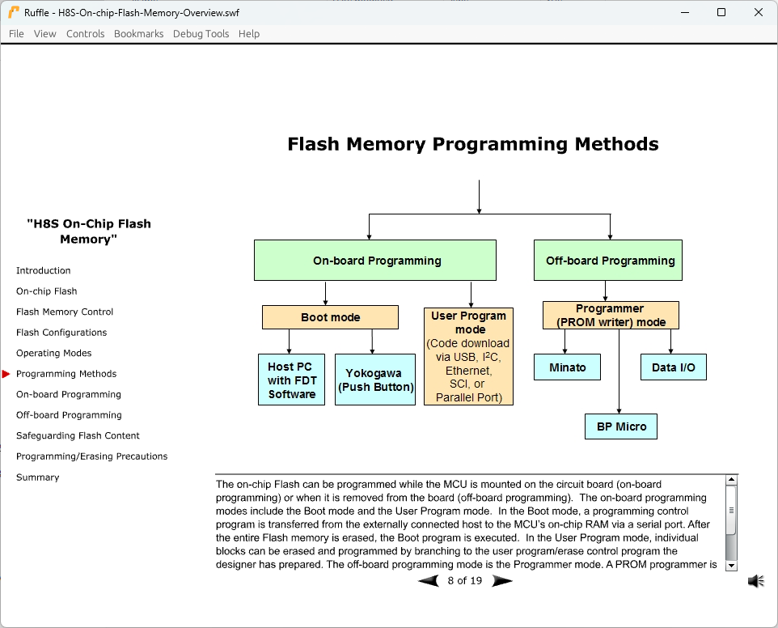

What I didn't find was some programming info (How to toggle a port, how to send something using the serial port).
The closest thing to some programming info I found was: 
https://llvm-gcc-renesas.com/getting-started/hew/index.html

I decided to just go and try to make the program from the info given in the H8S/2633 manual.
I have decided I want my testprogram to do the following:
+ Toggle the buzzer that is attached to pin PWM0_A6_PC6 a few times. 
+ Send "Hello world" over SCI4 because this one goes to the connector on the board.


To used the named registers I had to import "iodefine.h".
Then for using the SCI4 port p804 and further is quite interesting. Its shows which registers to set
to send serial data over a port. I had never had the need before to do this on this low level.
I usually have a library so that I just have to run "Serial.begin()" and "Serial.println()". but now
its a good opportunity to get to know how it works on the register-level.

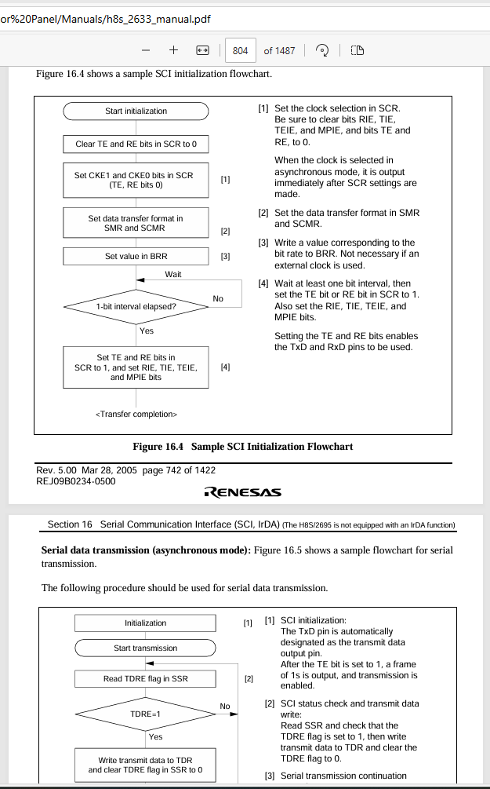


Well after some night spend on getting this code fixed, I settled with this being 'OK' to move
on to the next step. Getting so far to get the buzzer on or of was not so difficult, but I couldn't
get the serial to work. The core problem is that I never could get the TDRE bit of SCI4 to be one.
It always stayed '0'.
I asked a collegue at work but didn't find out why it isn't working.

This was  the code I settled on:

``` /***********************************************************************/
/*                                                                     */
/*  FILE        :setbuzz.c                                             */
/*  DATE        :Sun, Oct 06, 2024                                     */
/*  DESCRIPTION :Main Program                                          */
/*  CPU TYPE    :H8S/2633F                                             */
/*                                                                     */
/*  This file is generated by Renesas Project Generator (Ver.4.16).    */
/*                                                                     */
/***********************************************************************/


void main(void);
#ifdef __cplusplus
extern "C" {
void abort(void);
}
#endif

#include <machine.h>
#include "iodefine.h"  // Include register definitions

void delay_ms(unsigned long ms);  // Function declaration for delay
void beep(unsigned int amount); 
void sci4_init(void);   
void sci4_send_char(char c);      // Send a single character over SCI4
void sci4_send_string(const char *str);  // Send a string over SCI4
volatile int i;          

void main(void)
{
    // Set PC6 as an output pin
    PC.DDR |= (1 << 6);  // Configure PC6 as output
	
	beep(2);
	
    sci4_init();
	
	beep(3);
	
	// Step 3: Transmit "Hello, world!" over SCI4
    sci4_send_string("Hello, world!\n");
	
	beep(4);
		// Step 3: Transmit "Hello, world!" over SCI4
    sci4_send_string("AAAAAAAAAAAAAAAAAAAAAAAAAAAAAAAAAAAAAAAAAAAAAAAAAA");

	beep(5);
    while (1) {
        // Toggle PC6 (buzzer)
        PC.DR.BIT.B6 ^= 1;  // Toggle PC6 state (0 -> 1, 1 -> 0)
        
        // Wait for 1 second (1000 ms)
        delay_ms(1000);
    }
}

// Function to initialize SCI4 for 9600 baud communication
void sci4_init(void)
{
	SCI4.SCR.BIT.TE = 0; 
	SCI4.SCR.BIT.RE = 0; 
	
	
	SCI4.SCR.BIT.CKE = 0; 
	
    // Set the baud rate for SCI4 (Assume PCLK is 20 MHz, for 9600 baud)
    SCI4.SMR.BYTE = 0x00;  // Set clock source and mode
	SCI4.SCMR.BYTE = 0xF2;
    SCI4.BRR = 38;         // Baud rate setting for 9600 baud (PCLK / (16 * (64 + 1)))

    // Wait for the baud rate setting to stabilize (about 1 bit time)
	//unsigned int i = 0;
    for (i = 0; i < 1000; i++);  // Short delay for stabilization
	
	// Enable transmission
    SCI4.SCR.BIT.TE = 1;   // Enable transmission
	// Enable transmission
    SCI4.SCR.BIT.RE = 1;   // Enable transmission
	
	// Enable transmission
    SCI4.SCR.BIT.RIE = 0;   // Enable transmission
	SCI4.SCR.BIT.TIE = 0;
	SCI4.SCR.BIT.TEIE = 0;
	SCI4.SCR.BIT.MPIE = 0;
	
	
}

// Function to send a single character via SCI4
void sci4_send_char(char c)
{
	beep(1);
	
    // Wait until the transmit data register is empty
    while (SCI4.SSR.BIT.TDRE == 0);  // Wait for the TDRE flag to be set
	
	beep(5);

    // Write the character to the transmit data register
    SCI4.TDR = c;

    // Clear the TDRE flag by writing 0
    SCI4.SSR.BIT.TDRE = 0;
}

// Function to send a string via SCI4
void sci4_send_string(const char *str)
{
    while (*str) {
        sci4_send_char(*str);  // Send each character in the string
        str++;  // Move to the next character
    }
}

void beep(unsigned int amount)
{
        for (i = 0; i < amount; i++) {
			PC.DR.BIT.B6 = 1;    // Set PC6 high (turn on buzzer)
			delay_ms(500);
			PC.DR.BIT.B6 = 0;
			delay_ms(500);
        }
		
		delay_ms(2000);
}

// Function to create a delay (in milliseconds)
void delay_ms(unsigned long ms)
{
    unsigned long i;
    while (ms--) {
        for (i = 0; i < 5000; i++) {
			nop();
        }
    }
}

#ifdef __cplusplus
void abort(void)
{

}
#endif
 ```

During test and trial I learned how to use the builtin simulator. This is quite the treasure: clear insight in the memory region.
The possibility to step through the assembly and see the original C-code interleaved. 
This is a real help for my next step...

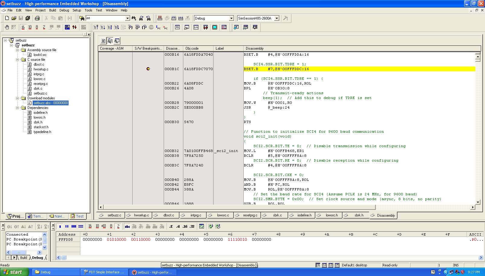

# Step 1: Reverse engineering the micro-kernel of the H8S/2633
Well, lets take it easy and first try to 'Reverse engineer' our previously written program.
For which we already have the source code.

First we need the binary of our program that we would flash to the chip. When building the program it creates'.mot' file.
This seems to be a Motorola S-record file. This is the textbased version of the raw binary we would want to flash. 
We could extract the real binary for the serial traffic when programming or we just use a simple program that does the conversion.
I used MOT2BIN.exe, I included it in the repo.

Now that we have got I bin-file we can put it into a dissasembler. I tried loading it with Ghidra
but soon it became clear that Ghidra does not have a dissasembler for this microcontroller's instruction set...

Adding the whole instructionset myself would certainly be some work. Fortunately IDA pro does.
I start IDA pro 32-bit and select my setbuzz.bin file. 
I suggests decompiling it as a COFF-file but I go with raw binary since that is what it is.
As a processor it settles with 'MetaPC' which I guess is the default, but this doesn't work.
Fortunately we have the 'Hitachi H8S advanced' and 'Hitachi H8S normal'. 

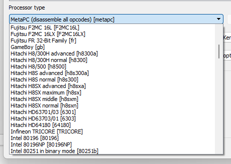

What I recall is the in advanced mode the chip uses a bigger address space. I programmed for advanced so 
lets go with that and hit ok. We get presented with:

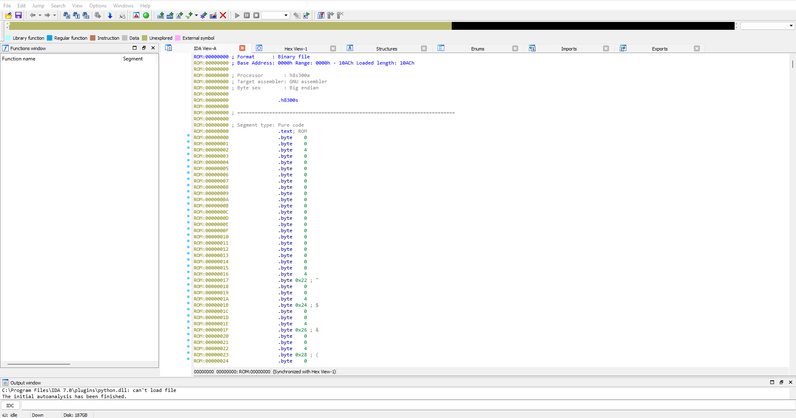

Offcourse no functions are found and no assembly codes can be seen because IDA doesn't know
where the program starts and thus where to start to dissasemble. We can start it from a certain address
by going to the address and pressing 'C'(ode). 

Let's take a peek in HEW where our main function start and lets disssable from this address:

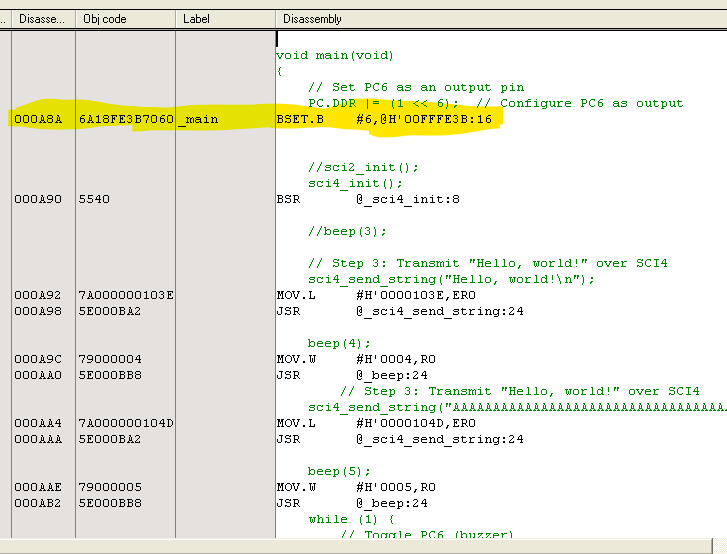

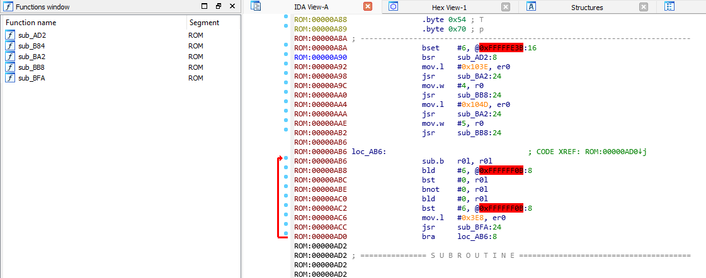

We hit 'C' on address '0xA8A' and IDA starts dissasembly from there and is able to find 5 functions.
In the picture above we see three addresses marked in red. This means they point to some memory that is not defined. 

The first address in IDA is '0xFFFFFE38'. While in HEW we see that the address is actually
'0x00FFFE3B' which is the address of 'PC.DDR'. In the manual however we see PC.DDR is 0xFE3B, a bit confusing no? 

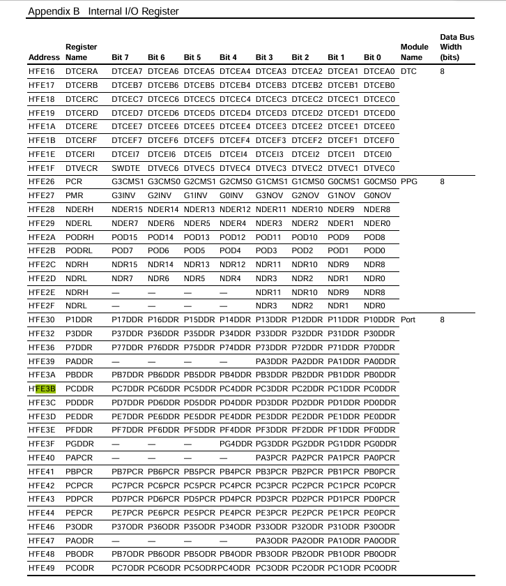

Well actually PC.DDR is at 0xFE3B when the CPU is in normal mode, then it uses 16-bit addresses.
in advanced mode it does however use 24-bit address mode making this register available at '0x00FFFE3B'.
However I guess even though we selected the advanced processor I assume IDA only works with either 32-bit addresses or 16bit.
(24 is quite uncommon I'd say).

How do we solve this? Well we can actually tell IDA what segments there are in the chip.
Which for us is:

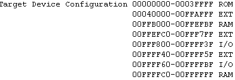

And then for each internal IO-register we can tell it at what address it lives.
So bassically telling IDA the memory map of the chip. 
Apperently IDA currently has this info for only 2 chips:

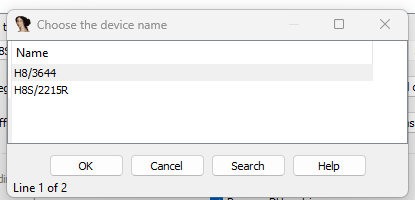

Let's give it the info of the H8S/2633 as well. I put ChatGPT to work once more and with some help I turn 
10 pages of registers (starting from p1272 from manual) into a nice IDA config file. I replaced the file in 'C:\Program Files\IDA 7.0\cfg\h8.cfg' with my definition of 
the H8S/2633 chip: 

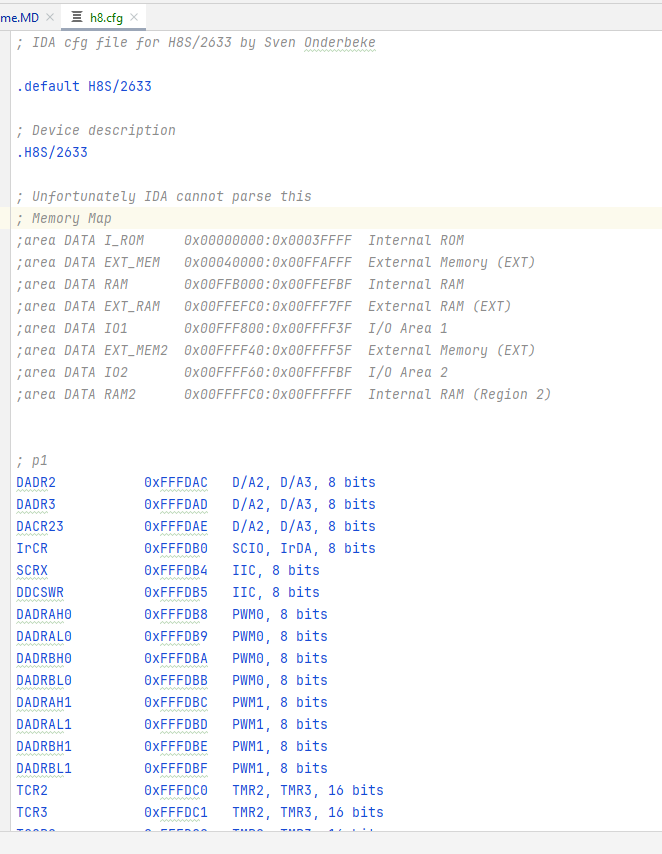

When I defined the memory regions IDA apparantly couldn't parse the file but I was able to define
all the registers. After this we can see the registers popup in our dissasembly:

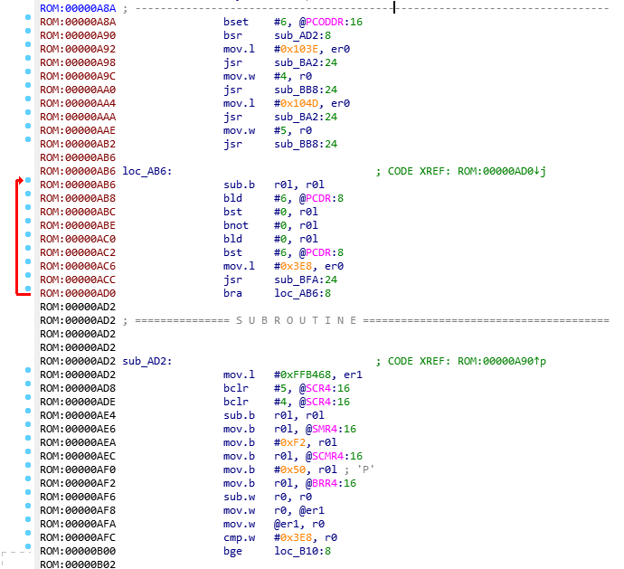

Okay now lets take a look at what happens before main. 
from 0x0000 to 0x0400 there are all NOP instructions (accept for some, I cannot explain).
So assuming code starts running from address 0x0000 it would just flow to 400hex. 

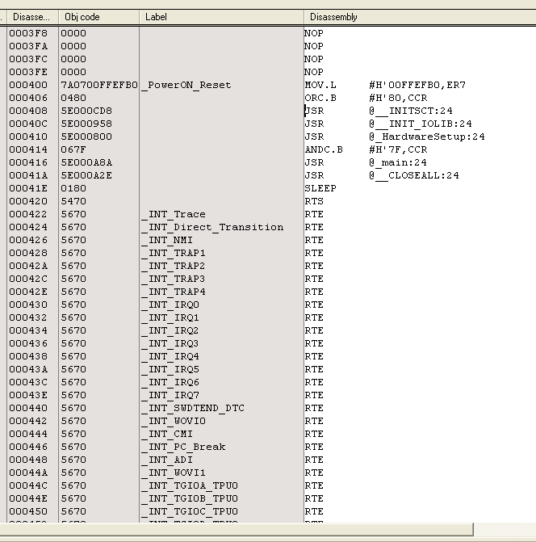

Actually from seeing the Dissasembly in HEW we could assume that after power is applied 
the code starts running from 0x400 (_PowerON_Reset). 

Then we see it jumps to __INITSCT (0x408) and __INIT_IOLIB (0x40C) and _HardwareSetup (0x410)
doing probably full setup of everything. 
A Google search led me to a [Renesas page that explains these steps](https://tool-support.renesas.com/autoupdate/support/onlinehelp/csp/V4.01.00/CS+.chm/Compiler-CCRX.chm/Output/ccrx08c0302y.html
)
Basically __INITSCT sets up variables in RAM, that part is something I'm familiar with since I once wanted to check
how I could [reverse engineer an arduino uno program](https://github.com/Sfeeen/Arduino-ATMEGA328-binary-reversing) and wrote a 'ramextracter.py'.
__INITSCT can be split up into 2 smaller functions. [Info can be found here](https://en-support.renesas.com/knowledgeBase/21268230). But this has probably no value
in our journey here.
__INIT_IOLIB is initialisation if you make use of the 'stdio.h, ios, streambuf, istream, or ostream'.

From 0x422 on we see the interrupt vector table. No interruptcode is defined and that's 
we they all have the value 0x5670 with opcode RTE (ReTurn from Exception). 

Scrolling down we encounter the code of the init routines we just discussed.

## Analysing the microkernel
Let's load the microkernel into IDA. Again it has no entrypoint so we just 'c' from the beginning, after 3 tries it suddenly unravels a big chunk of logic:

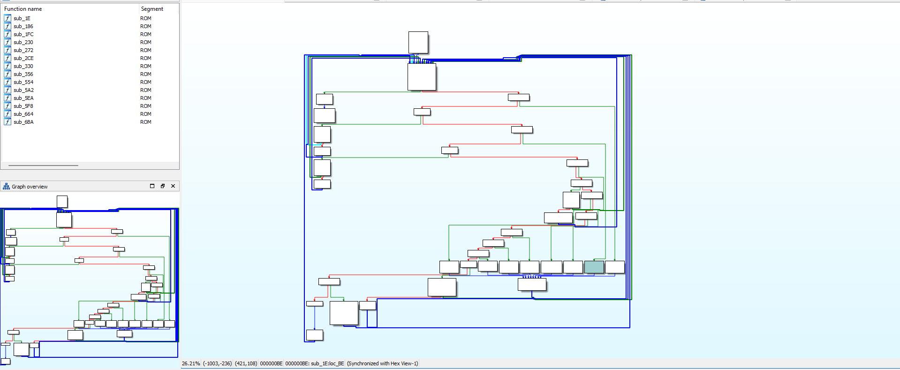

After inspecting a bit deeper whe see lots of cmp (compare) instructions:

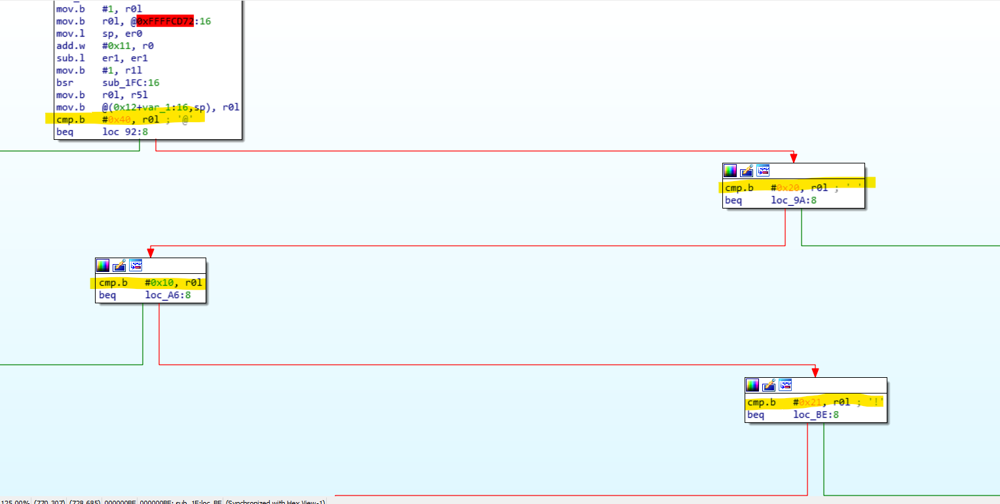

The byte from a register is each time compared to values like '0x40', '0x20', '0x21', ...
Well these bits seem a bit familiar to me, remember the inquiry and selection command's from the download proccess?


Very good, lets rename to blocks they point to with their 'Command Name'. 0x28 and 0x7F are commands that are
undocumented as far as I can find. 

Let's reverse this piece of firmware from bottom to top: we know this is a structure that accepts commands
over serial, performs and actions and then responds with some data over serial. So when we look for a function that is called a lot we find:
Taking a look at this function brings us to a small subroutine that calls this loop function:
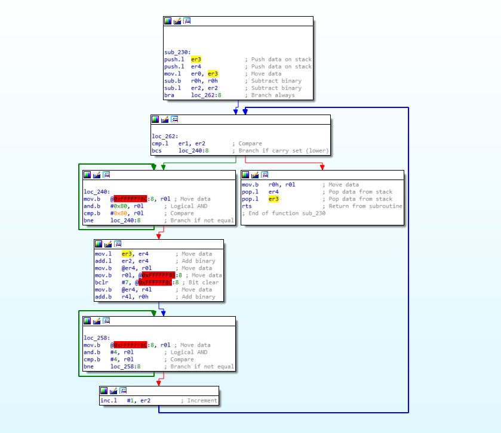

The addresses referenced are part of the I/O map but aren't replaced by their register name because they 
are addressed in 32-bit. I added them to the IDA.cfg file. Turns out it are SCI2 related register, something I already expected.
Analysing the whole logic step by step learns use that this is the function that transmit bytes over SCI2.
It's parameters are a address in memory to send the data from (er0) and an amount of bytes to send (er1). It returns the sum of each byte transmitted. 
We become:
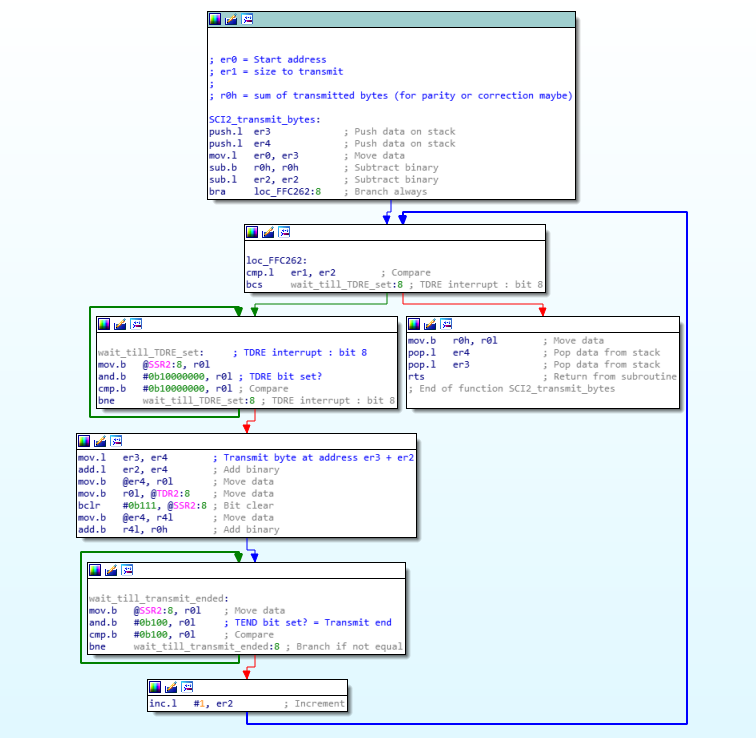

This first one took some time, but as soon as you get the picture things get a bit easier.
Next I was able to find and rename the function that receives bytes as well. 

Then there was a function that calls these transmit bytes function a several times. 
I called this one 'SCI2_send_packet'. Looking back at the main loop function now we get to see this:

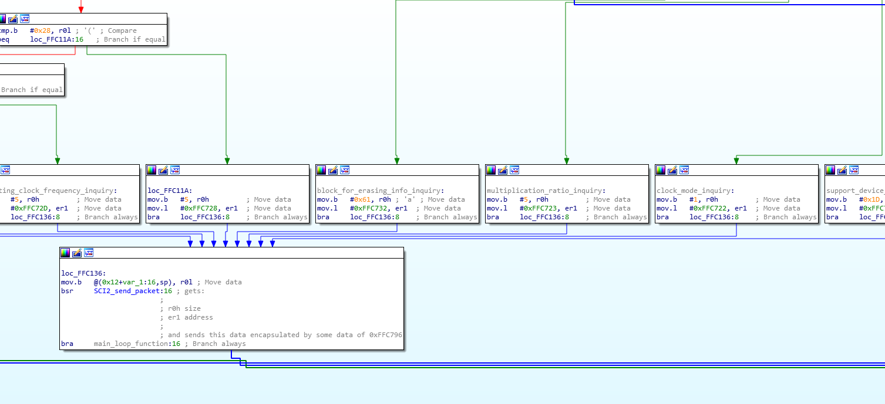

All commands set a certain address and a size and call 'send_packet'. This function encapsulates the data that needs to be sent back
with some bytes before it and after it.


The first one and for us the most important one is the 0x40 instruction or ' Transition to program/erase state'.
It didn't come through to me before that this is such an important one so I looked back to the communication
traffic I annotated above and saw that this command is issued before downloading the main kernel. 
However from the FDT-logs we saw 'Device is erasing...' Already before 'micro-Kernal download successful'.
Strange! 

Lets focus some more on this instruction for a bit, all other functions more or less seem to result in the sending of some packet
and loop than back to the beginning. But  this one seems a one-way street.
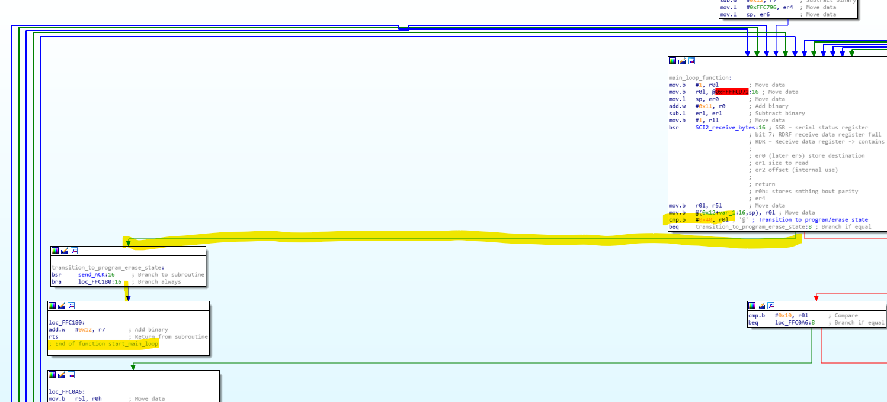

So lets take a look at what comes actually after the this loop function.
When the main-loop is escaped there is actually another function, so my guess this one is performing the erase.
I've called it the 'after_main_loop_maybe_erase' for now. After this it just goes back to the main loop, so I'm expecting
this one actually jumps to another memory region.

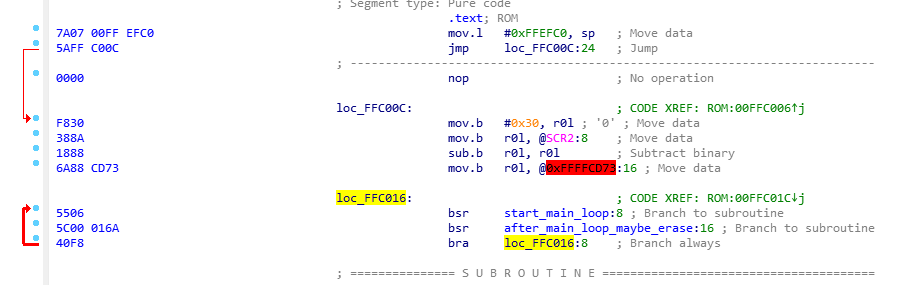

At this point I rebased my program to the start of the internal ram region (0xffb00). Off course I have no real
clue of what address this piece of code would be loaded at but from the documentation it was clear that it get's loaded in RAM
Their are 2 regions of RAM (0x00ffb000 - 0x00ffefbf) and (0x00ffffc0 - 0x00ffffff). I took a guess for the first one
and the beginning of the RAM because that would be the most obvious location to put it, right?
Also while reversing I encountered a few unresolved addressed which were 0xFFxxxx (so in the first memory region).

Then I decided to first name all my function because there are only a dozen or so. I ended up with:
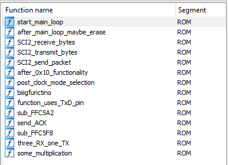

Now appart from the code that is translated into assembly instructions there is also a piece at the end of the file
that didn't got translated into code. Looking at this data we see random bytes but also something that seems to to be a string
more specific a product code. 

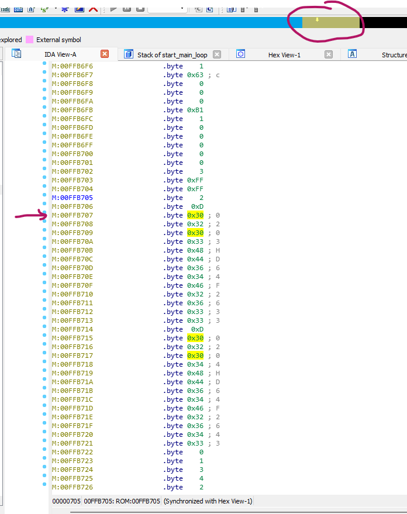

If we look back at the annotated communication we see that there is a 'selection of device'. and in the
response we also see the string '0203'. This is the 0x10 instruction. 

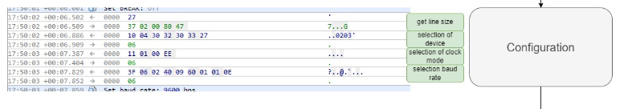

Taking a look at this code for this function: 

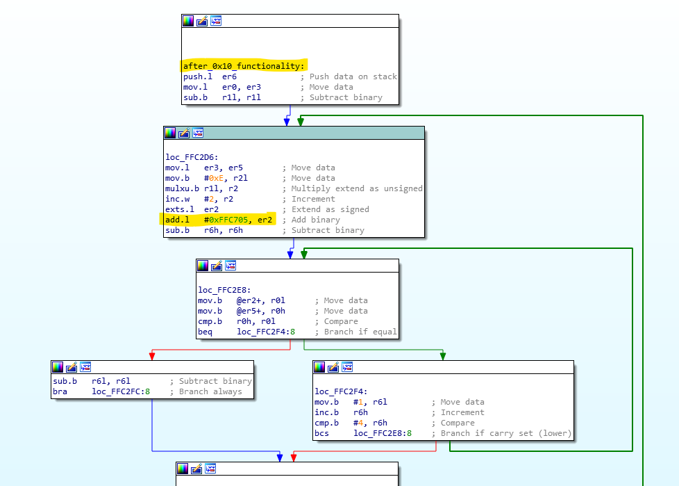

We can see it makes use of address 0x0FFC705. From the picture above we see that 0x0FFB705 points to the value '0x2'.
Probably meaning this microkernel is for 2 devices. Then byte '0xD' follows which it the length of the product string that follows:
'0203HD64F2633' after this the second length byte and the other devicename (0204HD64F2643).

Conclusion: this code is probably loaded at 0xFFC00 instead of 0xFFB00. Let's rebase it again.
Now the 'send_ffc795_byte' function makes also more sence. I was able to name it 'send_ACK' now because of where it occured and comparing it with the recorded
communication flow but now that the addressing is changed I find that 0xFFC795 points to 0x6. Which is indeed the byte value
used for an acknowledgment. Another confirm that our memory is loaded at 0xffc00. This and more pieces
are falling together now. The data after the code section seems like all the global defined variables.

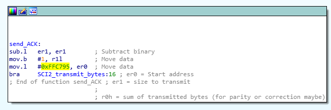

I decided to note which commands all get handled in this microkernel: 
0x40, 0x20, 0x10, 0x21, 0x11, 0x22, 0x3F, 0x25, 0x26, 0x28, 0x23, 0x27, 0x7F, 0x4F

Now looking further at the 'after_main_loop_maybe_erase'-function we get to see this:

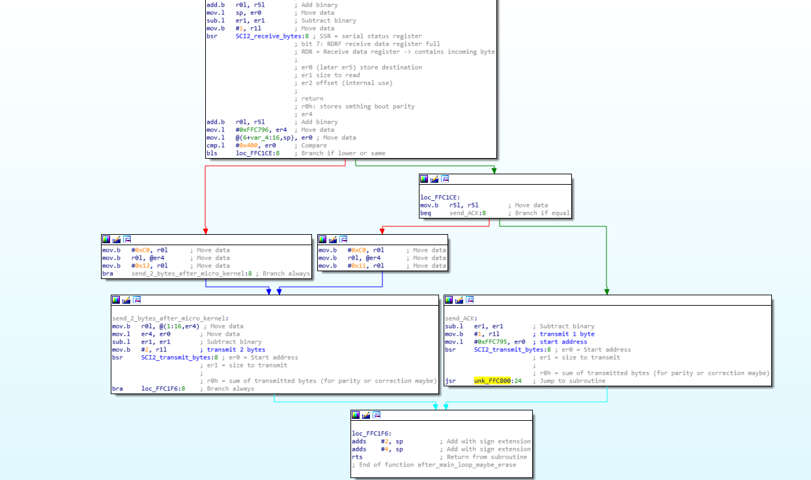

It seems  to receive some bytes over SCI, sends and 'ACK' but no instruction loop that could
erase a memory region unfortunately...
According to some condition it does jump to 0xffc800.
Our microkernel lives at ffc00 - ffc975 so that would be right behind this.
Probably this just hands over code execution to the main-kernel. It's unclear of how the erase 
gets performed, I can't get my head around it. 

But I have another intermezzo in mind. I want to play and fuzz with this command system so 
I started making a gui to send certain instructions: 

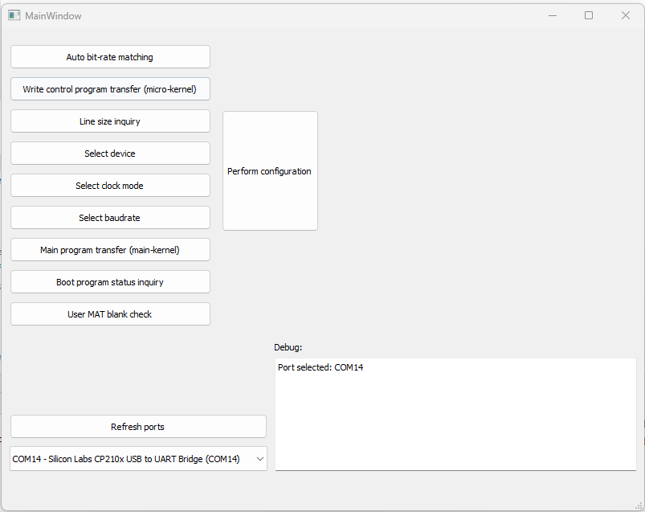

I aborted the GUI development halfway because I didn't see a lot of gain in sending commands by buttons 
then by changing my code...

Looking further into this project I decided to try making a first patch to the microkernel 
and hoping to see some effect. I decided to start with a small change: changing the size of the data that gets 
spit out over SCI2. In this piece below I changed the opcode 'F002' to 'F0FF' so it would 
instead of spitting out 2 bytes (surrounded with some other bytes), spit out 0xFF bytes instead.
I saved the patch and used my python programmer to load the kernel and see what happens when the programming
unit inquiry was send. 

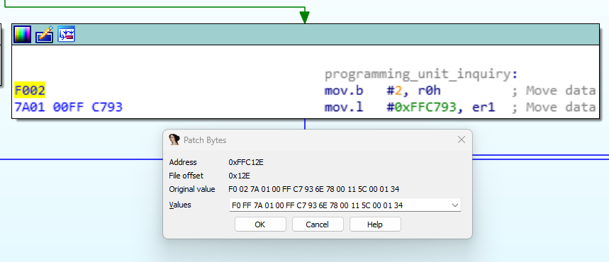

But unfortunately there was no difference.
I checked if what I communicated whas indeed the patched kernel by using IO ninja but it was.
My idea behind this patch was that if this works I could path this kernel so it spits out all memory of the chip
but for now it seems not to work for some reason. This got me doubting if I'm actually
interacting with this code when or for some reason with another piece of code (mask rom) that has similar instruction commands...

I decided to focus some more on the code of the erase state transition (0x40).

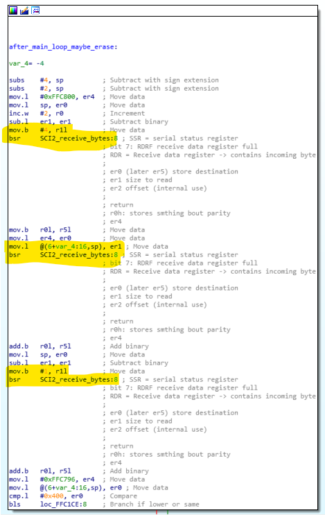

I learnt it does the following:
- Receive 4 bytes
- Receive a chuck of bytes
- Receive 1 byte

Now, again keeping the communication I saw in IO-ninja in mind, I understood that this is the logic
that receives the main-kernel. The first 4 bytes are the length of the main kernel. Then follows the kernel data
and after that 1 byte, maybe a checksum.

This explains also why I thought that my communicated main-kernel was different from the file
(Genm2633.cde) that was mentioned in the software as kernel. I compared them and they didn't match, but it's just
because I saved the length bytes and the checksum bytes with it. The microkernel got transmitted differently
because the size gets corresponded and acknowledged before sending the file.

I checked the checksum of the file in Hxd: 'D3' but it doesn't match the value transmitted 'A1'.
this doesn't matter that much right now, actually looking further at the kernelcode we can see
that the main kernel will get loaded at 0xFFC800 and it will jump to this code afterwards.
Pretty predictable actually because of the Command Name: I recite: 'Transition to program/erase state'

The description of this command is:
'Erasing of user boot MAT and the user MAT, and entry to programming/erasing state'.
But regarding the 'Erasing' aspect of this command, nothing confirming this can be seen in the code...

Maybe the erase happens at the beginning of the main-kernel then?
Since we now now were it gets loaded I can add it into IDA and decompile this one as well.
I struggled a bit adding a new segment and loading a new piece of data into this project while still having the addressing 
as I wanted so I actually ended up making a merged file that combineds both kernel with some padding bytes and then loaded this one
in a new project and based it at address 0xffc00.
Exporting the function names I already reversed didn't go well so there I also just manually 
renamed the function to the same name. 

Now again we follow the same process of hitting 'c' on segments of the main kernel and we get the 
functions of the main-kernel. 

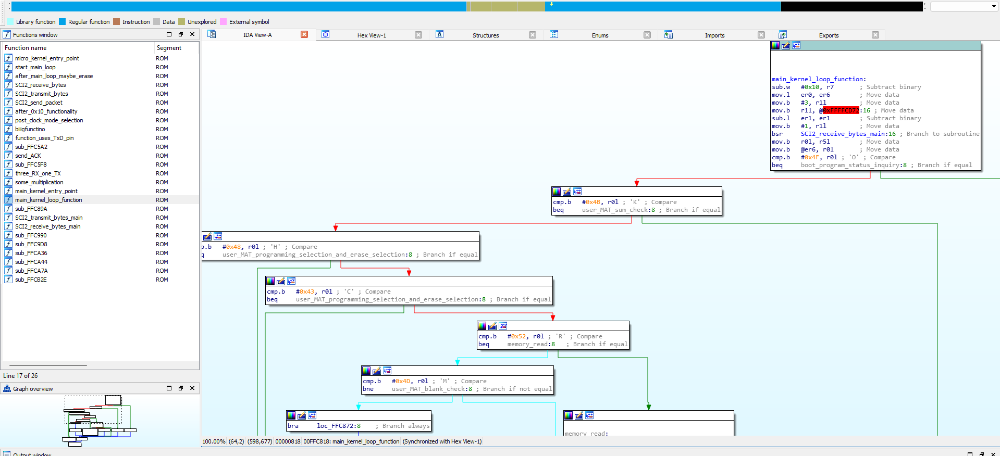

It's actually pretty similar to the microkernelcode. It also has this loop function that checks what command is received.
I listed the commands this kernel can handle:
- 0x4F boot program status inquiry
- 0x4B usermat at sum check
- 0x48 erase selection
- 0x43 user mat programming selection
- 0x52 memory read
- 0x4d user mat blank check

I renamed some functions in the main_kernel and then took a look at the beginning of this main kernel.
Maybe the erase happens before  the starting of the loop? Wellno, it doesn't seem so:
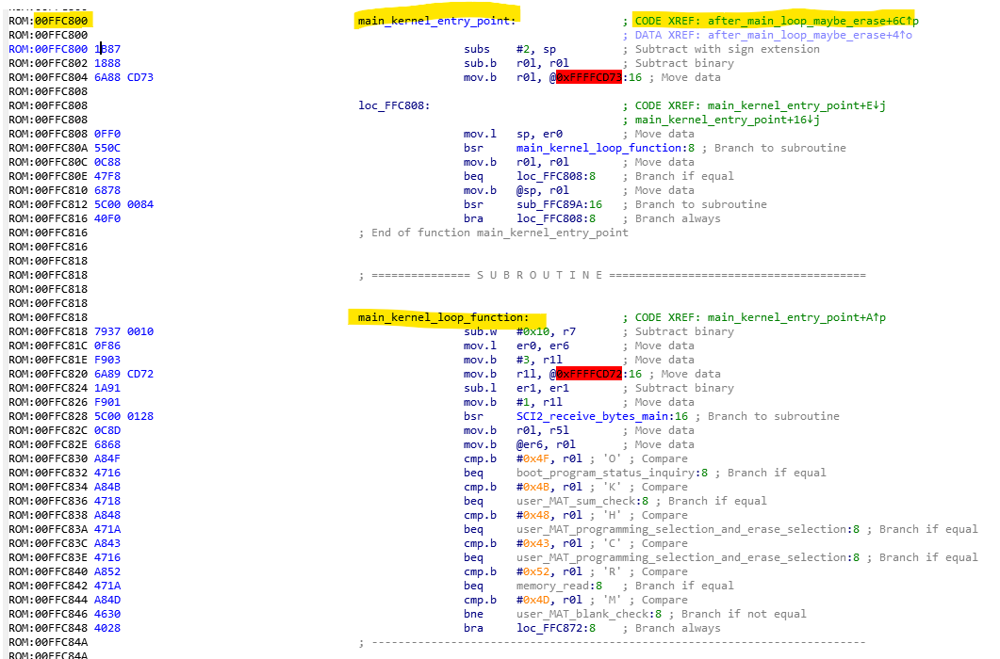

I decided to take a look from 'to other side', being the software that already interracts with 
the chip and clearly seems to know when the erasing is happening and when it is done...
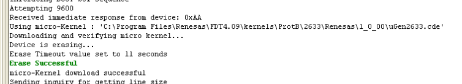

I 'wingrepped' the softwarefolder for the sentences 'Device is erasing...' and 'Erase Successfull'

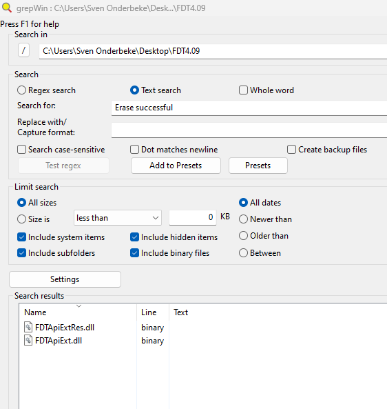

2 hits! the 'FDTApiExt(res).dll' do contain these strings! I loaded these dll's into IDA but couldn't find where these strings are located. 
From experience I know that Wingrep searches more advanced for strings then IDA or cntr+f in notepad. Especially UTF-16 formatted strings
doesn't seem to be found be the latter two. I quickly got annoyed and aborted this path. 

Maybe there is some manual of FDT that would lead to more info? 
Taking a look I stumbled on the 'Renesas FLASH Development Toolkit 4.09 User's Manual'...

The only chapter that could have some relevant info is Chapter 3, 3.2 more specific.
First of all in explains the "Protocol B, C, D and E", A selection I had to make in the beginning when setting up
a project and I had no idea what these meant. 
Then I was reading a section talking about Boot mode and User mode and it talks about a file named 'gentest.h'.

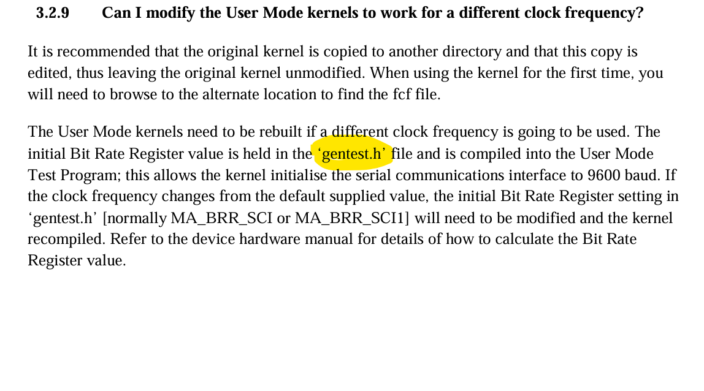

I found this file in the same folder as I found the micro-kernel and the main-kernel... but then... 
did you spot it yet? 
Yes, the source code for both the micro-kernel and main-kernel were actually always right there, next to the compiled kernel code is the header file and the C-file
that make up that code. How could I have not seen this before, when I copied the kernels from this folder?

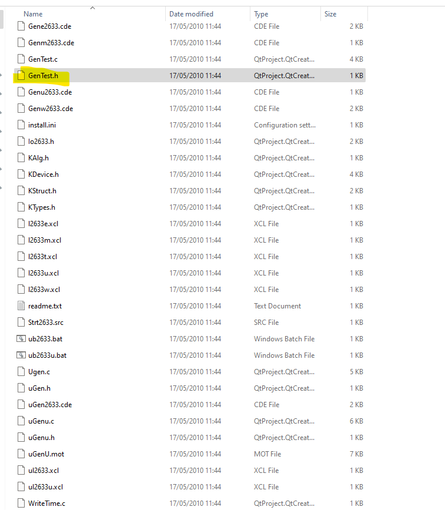

Probably because I simply did not expect that they want to share the source code for this, but now looking
back to the content of the FDT-pdf is seems like they even want to help users compile their own kernel

'3.2.7 - How do I recompile a kernel'...

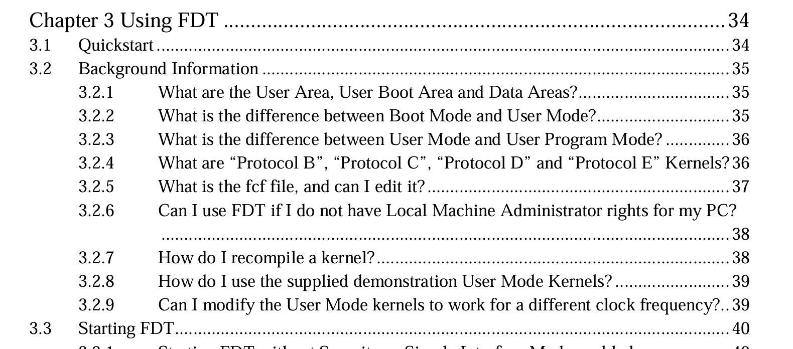

It felt like a nice discovery with a touch of 'feeling stupid' not having seen this the whole time.
It has cost me hours reversing those two kernels in IDA but I didn't regret it. It taught me things I didn't know
and was an acceptable challenge starting in Firmware reversing.

That said let's take a look at the original code now!
First 'Gentest.h', the file mentioned.

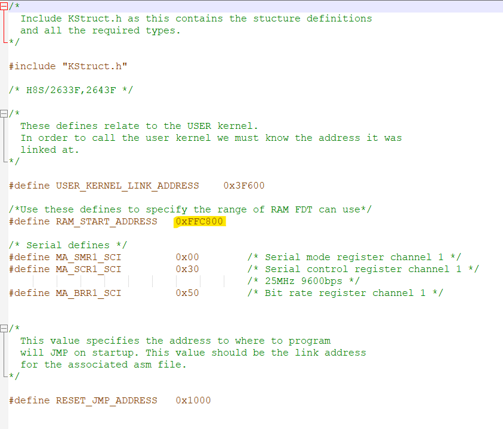

Okay this one reveals the entry point of the main kernel.
Now 'Ugen.c', microkernelcode:

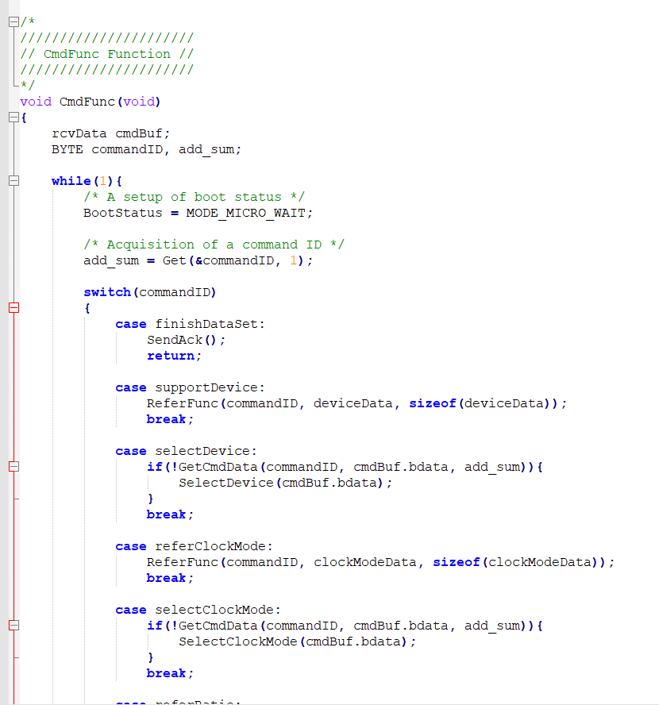
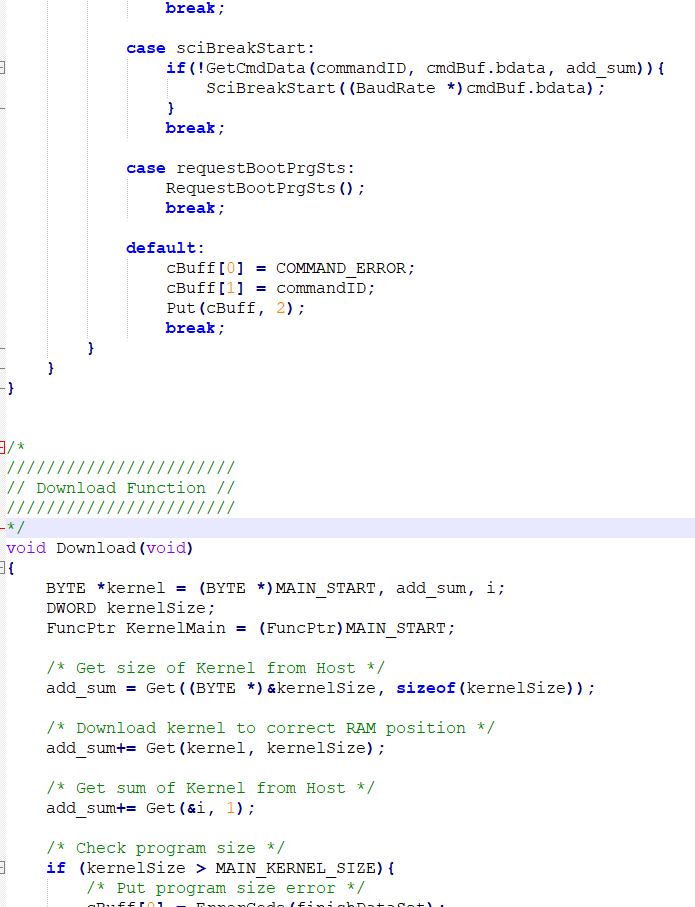

Okay, seeing this mainly satisfies me with confirmation of how I assumed the code was working.
We indeed see the command switch structure... We see the Get function (SCI_receive_bytes) returns a add_sum so a
kind of checksum indeed. 

Gentest.c actually contains some SCI init function and off course I did also find the functions to send and receive serial
so that should help me if I want to talk over serial furtheron because I couldn't get it working... :')

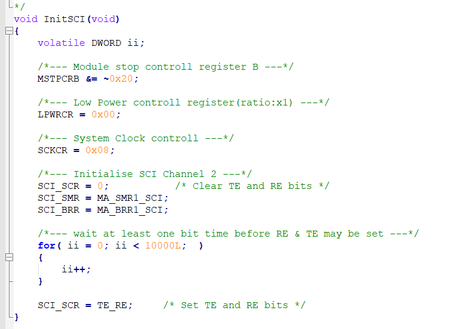

Looking at the source code from both kernels, indeed the erase function that automatically erases user data
is not there. 
Looking further at other files in this folder e.g. 'KDevice.h' we see FUNC_START, code located at 0xFFC000
with the command 'Write/Erase function start position'. This is actually just the micro-kernel, so no erase there.

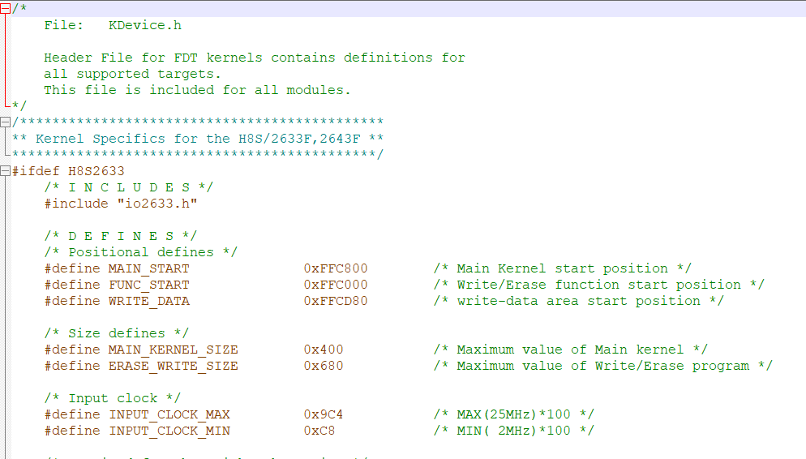

FDT_erase.c shows some EraseFlASH function that is the FDT entry point. I don't think this is  the exact source code of the erase function we are searching for but it might have similarities.


Okay that's most of the interesting stuff in this folder now. Let's rephrase what my current assumption is:
The MASK rom of the chips contains some code including a part that erases the user's flash region. 
This piece of code, when in boot mode, gets loaded into RAM somewhere at 0xFFB000 - 0xFFC000.
Another piece of code is, what I will call a pre-micro-kernel. Code that gets loaded at the very start of RAM (0xFFB000) 
and handles the acception of the micro-kernel. It plays its part in the bit-rate matching. Then accepts the 
size commands of the kernel and  then the kernel itself. But after writing this kernel to 0xFFC000, before handing execution over to this kernel
it first calls the wipe all flash function and the gives execution to the micro-kernel.

Be aware that this is just my current assumption, and similar to my previous ones it might be subject to future changes.
Though I'm really thinking I'm getting it right now.

Good, what about our plan of attack now, since we don't have assembly to look at now?
Glad you asked! Let's dump the content of the chip from within the micro-kernel.
Okay the ROM section will be already wiped but the pre-micro-kernel code will probably still be in RAM.

I didn't want to compile my own kernel, because it actually seems harder to change the sourcecode
at this point and get it to properly compile then to path the assembly. 
As for why the previous patches I made didn't work: I got it cleared out.
I simply patched the size-byte of the wrong command action. In the graph I stupidly 
followed the wrong arrow for the inquiry I wanted to path resulting in me patching the 
size of bytes that get returned for when you send an INVALID command. Eventually while 
fiddling I decided to send it some faulty instruction suddenly resulting in the bigger readout I was expecting the whole time.
Good, but now I do know my patched code does really run and my patches do what I expect them to do.

My main issue right now is finding an easy patch to dump the whole chip content without
having to make to many changes or changing the size of the kernel bytes.
I could set the start address of a function to 0x00000000 but the size to spit out is only put in a byte-variable
so I would have to perform this an enormous amount of time...

[Taking a walk and thinking about a good patch]

Having a walk did great, and yes, while being outside I got the greatest idea:
lets just patch the SCI_TRANSMIT_BYTE function start from address zero, increment by one and loop endlessly
As soon as this function will be called it will start to dump its entire memory and beyond (would eventually loop over).
I was able to pull it of with only 2 instructions patched, as seen below:

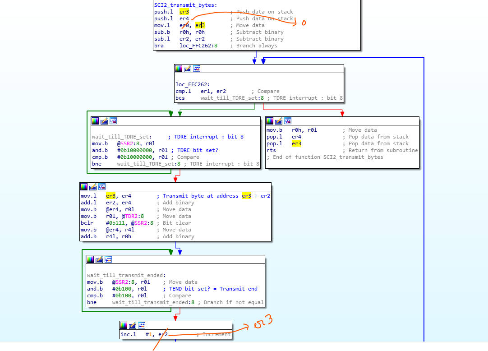

It was already after bed-time but I had to try it. And ooh yess, this worked!
it kept spitout out bytes like it had nothing else to do! 

I quickly wrote some lines of python that would accept each bytes and carefully append it to a binfile: 
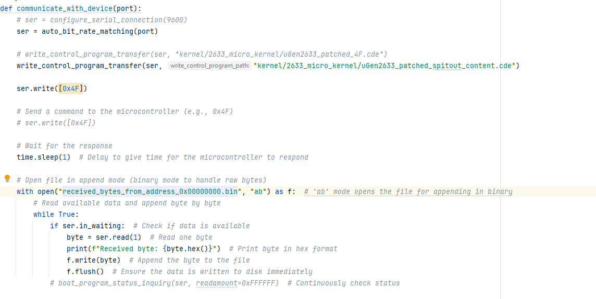

It is kind of slow though and I kept staring at it for a bit, but some simple maths learns me that
was going to take hours so I keep my pc running and get some sleep!

[The day after]

First thing in the morning,  checking my program it was still running perfect! I stopped it and saw it had created a bin-file the size
of a small 32Mbyte so it was really slow dumping but it's enough to cover the advanced mode memory region almost twice
(24-bit addressing = 16Mbyte).

Scrolling over it's content in my hex editor I noted where, what kind of data was found:

- 0x000000 - 0x040000: 0xFF
- 0x040000 - 0xFFB000: 38 8B 38 8B (8<8<) pattern
- 0xFFB000 - 0xFFEFC0: code
- 0xFFEFC0 - 0xFFFDAB: 38 8B 38 8B (8<8<) pattern
- 0xFFFDAB - 0xFFFFFF: some weird data

For the 'weir data', this it what it looks like:

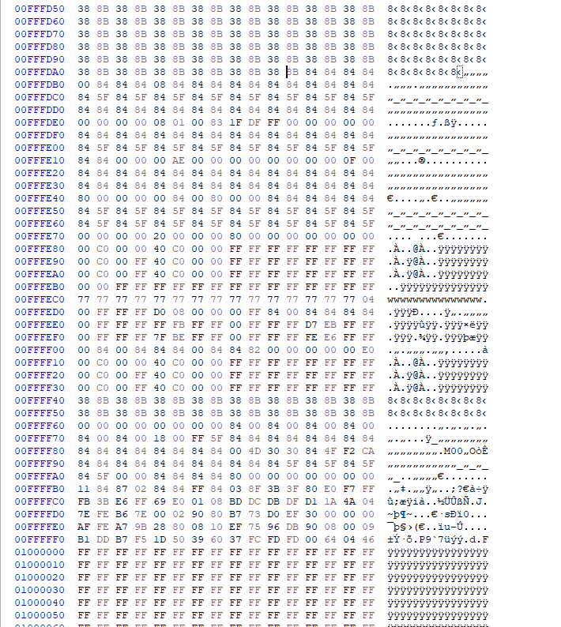

I cannot make out what kind of data this is!

Now mapping our findings on the known parts of the memory map we get:

translated to the memory regions:
- 0x000000 - 0x03FFFF (ROM) -> 0xFF
- 0x040000 - 0xFFAFFF (EXT) -> 0xFF
- 0xFFB000 - 0xFFEFBF (RAM) -> code
- 0xFFEFC0 - 0xFFF7FF (EXT) -> (0x38 0x8B) pattern
- 0xFFF800 - 0xFFFF3F (I/O) -> (0x38 0x8B) and some weird data
- 0xFFFF40 - 0xFFFF5F (EXT) -> 38 8B 38 8B (8<8<) pattern
- 0xFFFF60 - 0xFFFFBF (I/O) -> weird data
- 0xFFFFC0 - 0xFFFFFF (RAM) -> weird data

Okay looking at it now its maybe somewhat more explainable. I could understand that the I/O registers
have a kind off repeating though somewhat changing values.
For the second RAM section I have no idea, I don't understand why there are even 2 RAM parts.
Nonetheless I just extracted the first RAM porten and put it into IDA. 

## Reversing the pre-micro-kernel

Reversing this kernel is nothing like the other two. When hitting 'C' it only transforms several lines into code
and then mostly follows a byte or two that cannot be transformed into code, after this again a small portion of code can be formed...
This one is clearly going to be a bit thougher. I also won't find much info about this code from manuals or certainly would find source code for this (Or would I ?).

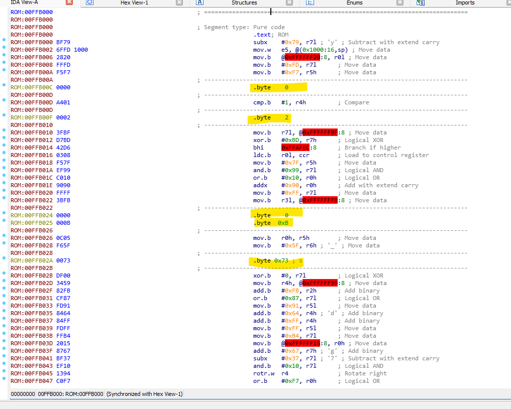


The parts that get transformed to code are certainly code I figured because they aren't some exotic opcodes you would find from
forcing data bytes into code. 

For a moment I though that maybe dissasembly would be different (beter) when I loaded the H8S/300 processor in normal mode.
Maybe first some part runs in a universal 'normal' mode and after this the microkernel can run in advanced mode
but the IDA result was the same. After doing so I figured this explanation also doesn't make a lot of sence but reversing is also sometimes just trying things.

Let's look at a part if the microkernel where it jumps to some location:
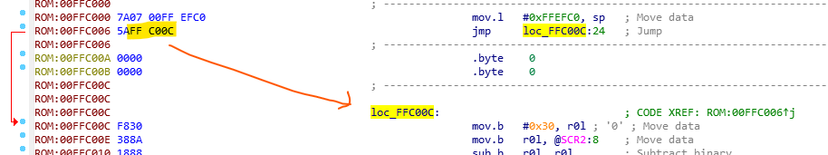

We see that when it wants to jump to address 0xFFC00C these bytes are in the opcode (and in this order / big endianess!).
So we can search the pre-kernel for a sequence of bytes 0xFFC000 to find the code that eventually jumps to the micro-kernel?

No real luck it seems. The first and only find is in the RAM after the kernels and dissasembling this we actually just get a mov.b instruction instead of a jump.
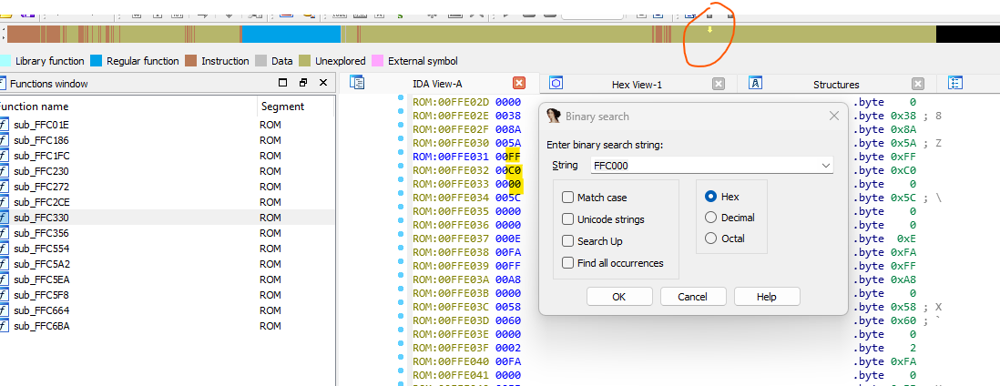
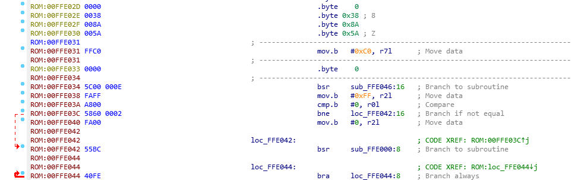

Wait let's try forcing the bytes before into code...

Great success!! 
It turns out it matters from which bytes you start to force to code. This was indeed the jump to the main kernel
and as a bonus we also get to see some indications of SCI2 interaction, that's a good sign!
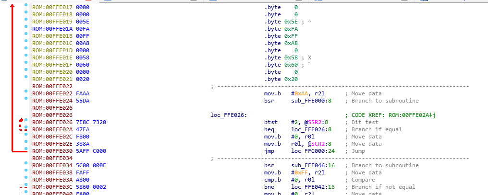


As a reminder the red squared content is interaction coming from the pre-kernel. So we should look for code that seems to do this.
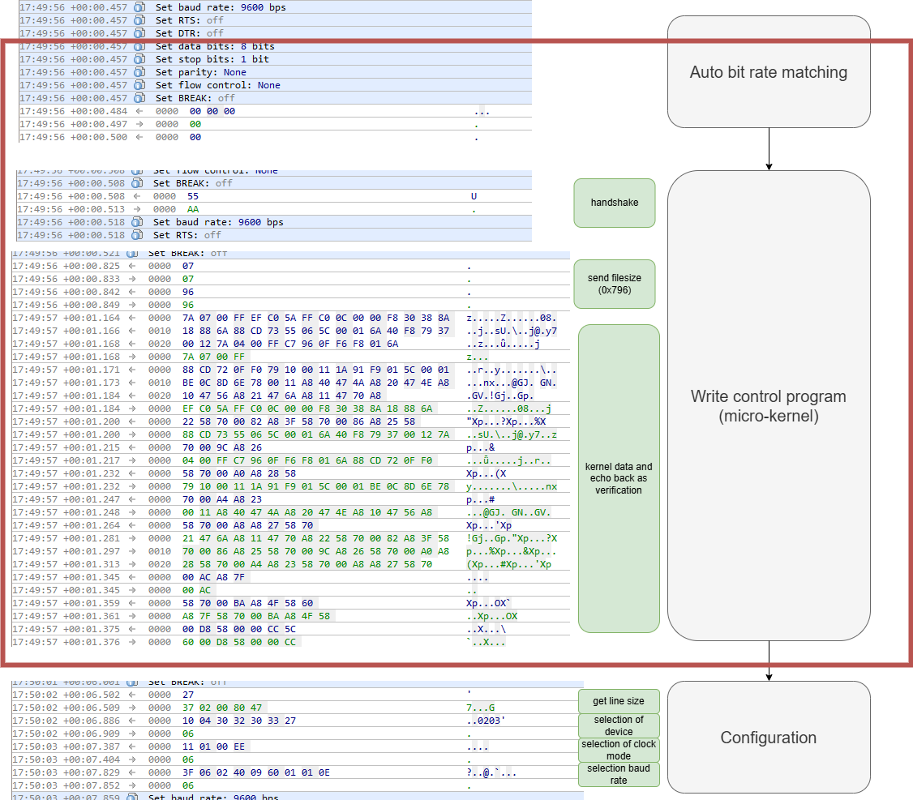

I decided to get started with IDA python and write some code to export the function names I already had declared and made it so I can import them 
in the new project and so I did. I also experimented a bit and tried to make the segments and do some register renaming from python
scripts. Nothing fancy so you get no snippet of this code but it's included in this project!

After this I searched further for 'sequence of bytes'
search 0xffc000 and recovered some functions
searched 0x3fff (I asssume  this address should be present in the erase function to erase all ROM (0x0 - 0x3fff). I got
3 hits but didn't look like the erase function...
Then tried searching typical bytes for the SCI2 receive byte function (from main and microkernel). Because I assume the pre-kernel
must also have it to do its auto bit rate matching but no founds...

I tried to look for code that uses the SSR2 register (0xFFFF8C) but discovered I cannot just simply look for these bytes
as you can see below (short addressing makes it only '8C'):
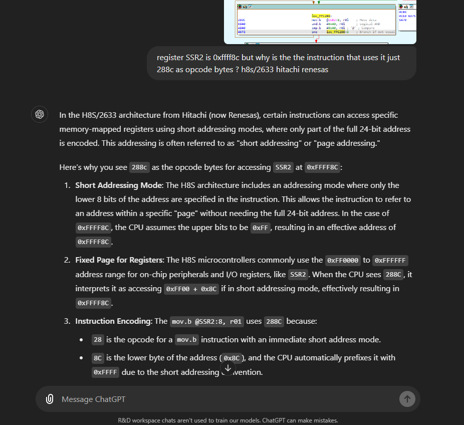

Okay let's search for 0x55 since that is this byte is used for the initial handshake, we do find this:
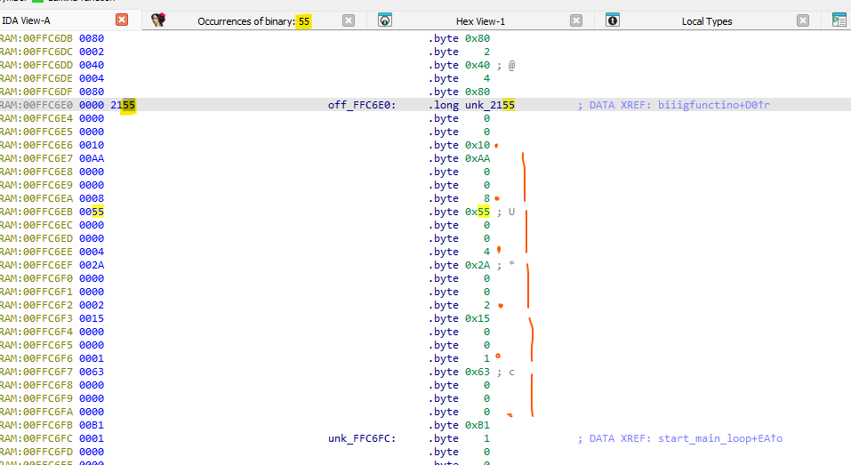
As a response to this handshake 0xAA gets send and we also find this value some bytes above 0x55.
It seems to be some datastructure of an array with 4 WORD values but I could not make much out of it.

We can assume this code will receive a byte for the handshake and compare if this byte is 0x55 so instead of searching
for 0x55 we might get lucky searching for the bytes of the 'compare' opcode. While cntr + B'ing (stepping through the results)
I seem to have found the code that transmits the 0xAA handshake response though we don't see a compare with 0x55:

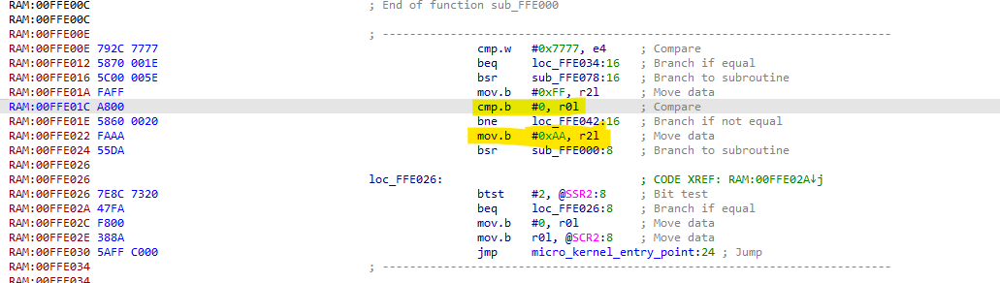

After looking around I figure the beginning of the pre-kernel might be located at 0xffe000
which would make sense (start RAM is 0xffb000, start uKernel is 0xffc000).

I also learned that the stack starts at the bottom of the RAM (0xFFEFC0)
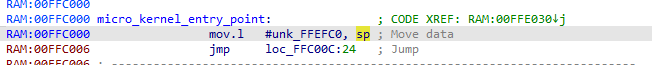
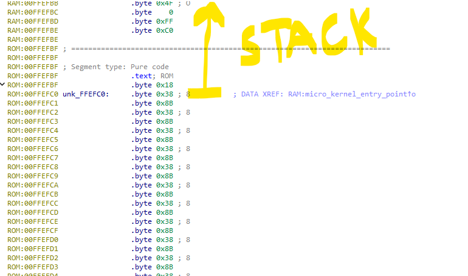

After this I started trying to make sense of all the prekernel code but got lost in functions of which I could not found out what they exactly do.

I was thinking of approaches that would make this simpler:
Since we have in the kernelmap source code for the erase module (I assume), but no binary of it we could try
to build this module ourselves. We do find a windows bat file for compiling the source code and we might be able to include
debug symbols by changing /nodeb to /deb or just removing this option.
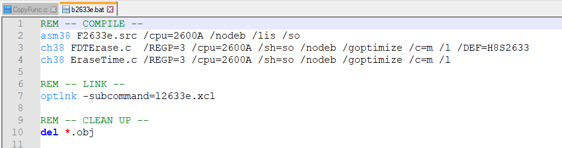

Unfortunately this code depends on a library 'H8Sruntime.lib' which I don't have. It does not exist on the system and I
don't find any info about it...

Going through files in the kernel source map I looked at "F2633e.SRC" (file regarding the erase module) From the output of chatgpt I figured this might give an explanation for the 'spaces' or undecompile-able bytes between code: variables that are aligned inbetween
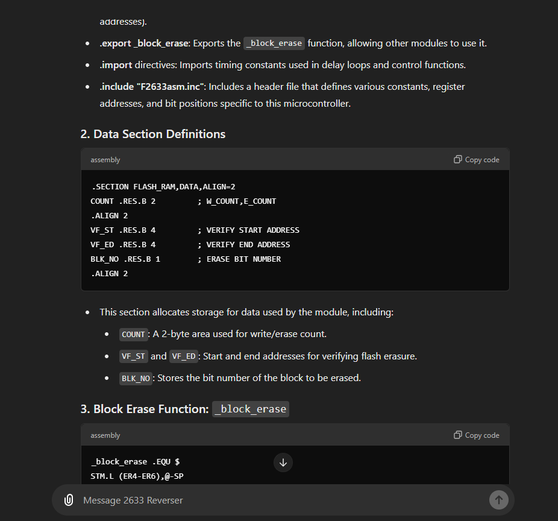

What also could help is the flowdiagram of how the flash can be erased, I found this one online:
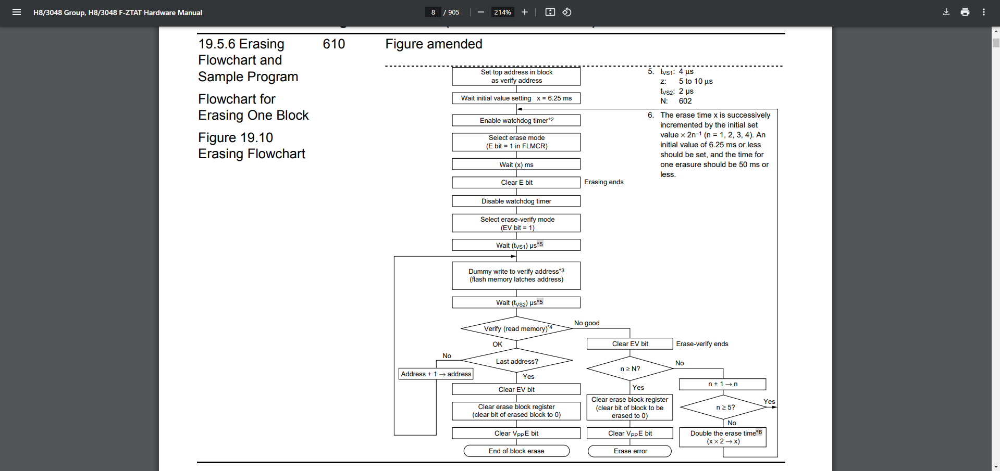

But generally I am not making much out of the dumped RAM content. Some pieces I cannot decompile, I have no hold of what's what...

I want to put my focus on finishing the hello world script aka trying to get my transmit function to work.
Now it should be easier since I have the source code of the kernels which includes a uart init function but I also have 
found some HEW examples from an installer for a startskit. I found 2 examples for different microcontrollers that show how to transmit over uart so it should be a walk in the park right?

Well no ... I clearly performed the same steps of the example code (couldn't just copy it because it has other register addresses and some other function definitions).
I spend days grasping why it didn't work. 
Some things I did:
- Tried different SCI channels
- Verified the registers values in code after setting them to a value (if not equal=beep) so I would be sure the value is stored correctly
- Verified the steps in the simulation but It just would never set the TDRE bit.
- Attached a scope and set the SCK to output the clock: but no clock could be seen :'(

At this point my code is:

```
/***********************************************************************/
/*                                                                     */
/*  FILE        :setbuzz.c                                             */
/*  DATE        :Sun, Oct 06, 2024                                     */
/*  DESCRIPTION :Main Program                                          */
/*  CPU TYPE    :H8S/2633F                                             */
/*                                                                     */
/*  This file is generated by Renesas Project Generator (Ver.4.16).    */
/*                                                                     */
/***********************************************************************/


void main(void);
#ifdef __cplusplus
extern "C" {
void abort(void);
}
#endif

#include <machine.h>
#include "iodefine.h"  // Include register definitions

void delay_ms(unsigned long ms);  // Function declaration for delay
void beep(unsigned int amount);
void sci2_init(void);   
void sci2_send_char(char c);      // Send a single character over SCI4
void sci2_send_string(const char *str);  // Send a string over SCI4
void text_write (const char * msg_string);
void uart_init(void);
volatile int i;    
char dummy;    

#define ORER_BIT (1 << 5)  // Overrun Error at bit 5
#define FER_BIT  (1 << 4)  // Framing Error at bit 4
#define PER_BIT  (1 << 3)  // Parity Error at bit 3

#define TE_BIT  (1 << 5)  // Transmit Enable
#define RE_BIT  (1 << 4)  // Receive Enable
#define RIE_BIT (1 << 6)  // Receive Interrupt Enable

/* String constants used for screen output */
const char cmd_clr_scr[] = {27,'[','2','J',0};
const char cmd_cur_home[] = {27,'[','H',0};

volatile unsigned char UART_in;
  

void main(void)
{
    // Set PC6 as an output pin
    PC.DDR |= (1 << 6);  // Configure PC6 as output//PC6

	uart_init();
	//sci2_init(); //PA1 PA2
    text_write(cmd_clr_scr);
	beep(5);	 	
	text_write(cmd_cur_home);	 	
	text_write("Renesas Technology Corporation \r\n");	   
	text_write("RSK2H8S2456R UART demo. \r\n");	   
	text_write("Press z to stop, any key to continue. \r\n");
    //sci2_send_string("Hello, world!\n");
    //sci2_send_string("AAAAAAAAAAAAAAAAAAAAAAAAAAAAAAAAAAAAAAAAAAAAAAAAAA");

    while (1) {
        // Toggle PC6 (buzzer)
        PC.DR.BIT.B6 ^= 1;  // Toggle PC6 state (0 -> 1, 1 -> 0)
        
        // Wait for 1 second (1000 ms)
        delay_ms(1000);
    }
}

void uart_init(void) 
{
    unsigned char dummy;
	unsigned char expected_brr;
	
		// Set PA3 as output
	PA.DDR |= (1 << 3);  // Set bit 3 of PA.DDR to 1, configuring PA3 as output

	// Set PA3 high
	PA.DR.BIT.B3 = 1; 

    // Reset SCR register and check if it was set to 0x00
    SCI2.SCR.BYTE = 0x01;
    if (SCI2.SCR.BYTE != 0x01) {
        beep(3);  // Error indication if the SCR byte wasn't set to 0x00
    }
	


    // Set baud rate register (BRR) for 9600 baud (PCLK assumed to be 25 MHz)
    SCI2.BRR = (unsigned char)((((25000000L * 2u) / 64u) / 9600) - 1u);
    expected_brr = 0x50; // 80
    if (SCI2.BRR != expected_brr) {
        beep(3);  // Error indication if BRR didn't set as expected
    }

    // Set Serial Mode Register (SMR) to asynchronous mode, 8 data bits, no parity
    SCI2.SMR.BYTE = 0x00;
    if (SCI2.SMR.BYTE != 0x00) {
        beep(3);  // Error indication if SMR wasn't set to 0x00
    }
	
	//INTC.INTCR.BYTE = 0x00;	
	SYSCR.BIT.INTM = 0x00;
	
		/* Enable interrupts	 */
	set_imask_ccr((unsigned char)0);
	
	// Clear errors by resetting the respective bits
	SCI2.SSR.BYTE &= ~(ORER_BIT | FER_BIT | PER_BIT);

	// Enable transmission (TE), reception (RE), and reception interrupt (RIE) without altering other bits
	SCI2.SCR.BYTE |= (TE_BIT | RE_BIT | RIE_BIT);

	// Check if the required bits are set
	if ((SCI2.SCR.BYTE & (TE_BIT | RE_BIT | RIE_BIT)) != (TE_BIT | RE_BIT | RIE_BIT)) {
	    beep(4);  // Error indication if any of the bits are not set as expected
	}

    // Dummy read to clear any residual data in RDR
    dummy = (unsigned char)SCI2.RDR;
	beep(1);
}

void sci2_send_char(char c)
{
    // Wait until the transmit data register is empty
    while (SCI2.SSR.BIT.TDRE == 0){}  // Wait for the TDRE flag to be set
	//while ((SCI2.SSR.BYTE & 0x80) == 0){}
	//while (SCI4.SSR.BIT.TDRE != 1)
	
    // Write the character to the transmit data register
    SCI2.TDR = c;
    // Clear the TDRE flag by writing 0
    SCI2.SSR.BIT.TDRE = 0;
	beep(3);
	
	
}

void text_write (const char * msg_string)
{
	/* Variable used to refer specific data while reading from the message buffer */
	char loopCnt;
	
	/* This loop reads a text string from the buffer and loads it to the SCI1
	   transmit buffer */
	for (loopCnt = 0; msg_string[loopCnt]; loopCnt++)
	{	 
		while (SCI2.SSR.BIT.TDRE != 1)
		{
			/* Wait till TDRE flag is set */
		}
		
		/* Output the character on the serial port. */ 
		SCI2.TDR = (unsigned char)msg_string[loopCnt];
		
		/* Reset the TDRE flag */
		SCI2.SSR.BIT.TDRE = 0;
	}
}

void beep(unsigned int amount)
{
        for (i = 0; i < amount; i++) {
			PC.DR.BIT.B6 = 0;    // Set PC6 high (turn on buzzer)
			delay_ms(200);
			PC.DR.BIT.B6 = 1;
			delay_ms(200);
			PC.DR.BIT.B6 = 0;
        }
		
		delay_ms(1000);
}

// Function to create a delay (in milliseconds)
void delay_ms(unsigned long ms)
{
    unsigned long i;
    while (ms--) {
        for (i = 0; i < 5000; i++) {
			nop();
        }
    }
}

__interrupt(vect=89) void INT_RXI2_SCI2(void)
{
	PC.DR.BIT.B6 = 1;
	while(SCI2.SSR.BIT.RDRF == 0)
	{
		/* Make sure that the receive is complete */	
	}
	delay_ms(10000);
	
	PC.DR.BIT.B6 = 1;
	
	/* Read the received data */
	UART_in = SCI2.RDR;

	/* Clear the RDRF flag */
	SCI2.SSR.BIT.RDRF = 0x00;
	
	/* If 'z' was entered: wait for previous transmission to complete, echo "z" to screen
	and  turn LED2 ON */
	if (UART_in == 'z')
	{		
		while (SCI2.SSR.BIT.TDRE != 1)
		{
			/* Wait till TDRE flag is set */
		}
		
		/* Echo 'z' on the screen */ 
		SCI2.TDR = 'z' ;
		
		/* Reset the TDRE flag */
		SCI2.SSR.BIT.TDRE = 0x00;
						
	}
}
/**********************************************************************************
End of ISR INT_RXI1_SCI_1
***********************************************************************************/

#ifdef __cplusplus
void abort(void)
{

}
#endif
```

Finally I had it solved by looking at GenTest.c, some C code that has a InitSCI for the kernels.

These lines are there that I didnt find in any other SCI example 'uart_init'-function:

```
	/*--- Module stop controll register B ---*/
	MSTPCRB &= ~0x20;

	/*--- Low Power controll register(ratio:x1) ---*/
	LPWRCR = 0x00;

	/*--- System Clock controll ---*/
	SCKCR = 0x08;
```

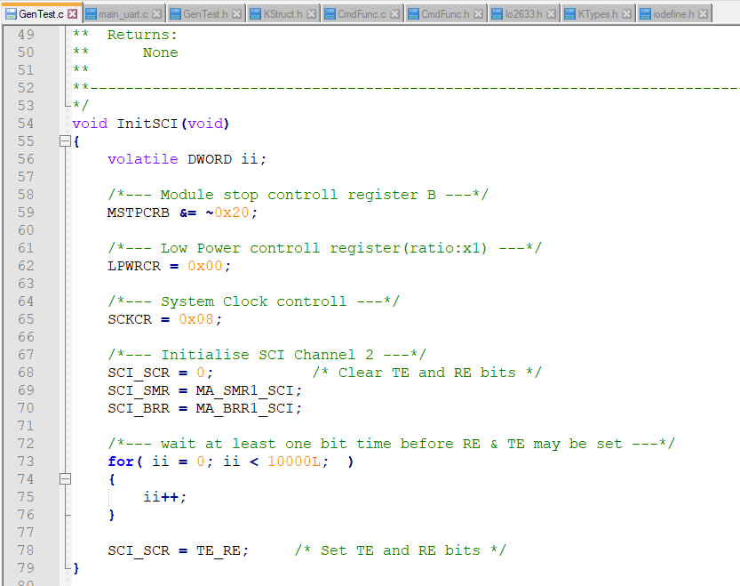

Since the kernelcode is quite low level, I was assumming this wasn't relevant, that this sets up some clock and power things not related to SCI.
the examples didnt seem to have this part and if they needed it, it is probably done in some import so I would have it also when having a project setup in HEW...
Well I guess a was WRONG!

The first line is crucial: 

`MSTPCRB &= ~0x20; `

In HEW I don't have that register defined like this so for me I had to insert:

`MSTP.CRB.BIT._SCI2 = 0; // CRUCIAL!!!`

and then I suddenly heard a melody of beeps that I was craving to hear a long time.
My serial port greeted me with some text that was defined to be send in my code:

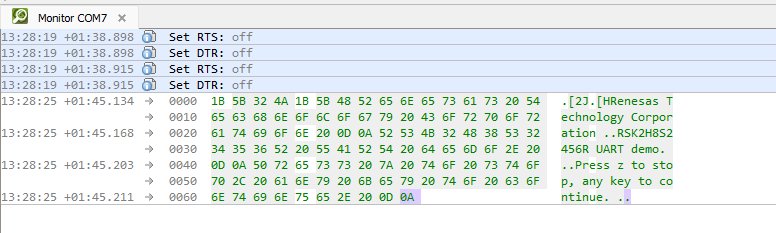
(the text is a copy from some SCI example)

Also when I send something myself over serial the interrupt I defined seemed to work as well since
it makes my buzzer beep for a long time. Today is a good day!

# Further steps

Now currently we have no fixed plan of attack to readout ROM from a unit we would like to copy.
The erase function is baked into the chip and runs before any configurable code runs. 
You might think we could try clock or voltage glitching to try to skip the erase but even if there
is some instruction in the mask rom code which, if glitched would skip the erase then we would
only have one try when performing this on our chip of interest, since after a single failure the content
would be irreversibly lost... 


Getting a glitch to work all of the time, even on different chips is not feasible, so we'll have to figure out another
way. I don't have any concrete ideas right now on how we could do it, but if we want to do it
we should first explore the workings of the chip some more, specifically the writing/reading of the ROM.

Now this is FINALLY done, lets just write a dumper reading out all address from application level.
I might need this for some exploit tests.

First I made the following dumper to dump the code portion of the RAM:

```
/***********************************************************************/
/*                                                                     */
/*  FILE        :dumper.c                                              */
/*  DATE        :Sun, Nov 10, 2024                                     */
/*  DESCRIPTION :Main Program                                          */
/*  CPU TYPE    :H8S/2633                                              */
/*                                                                     */
/*  This file is generated by Renesas Project Generator (Ver.4.16).    */
/*                                                                     */
/***********************************************************************/
                  


void main(void);
#ifdef __cplusplus
extern "C" {
void abort(void);
}
#endif

#include <machine.h>
#include "iodefine.h"  // Include register definitions
#include <stdio.h>  // For sprintf

void delay_ms(unsigned long ms);  // Function declaration for delay
void beep(unsigned int amount);
void text_write (const char * msg_string);
void uart_init(void);
void loop(void);
void dumping(void);
volatile int i;    
char dummy;    


#define RAM_START_ADDRESS 0xFFB000  // Example start of RAM section (adjust as needed)
#define RAM_END_ADDRESS   0xFFEFBF  // Example end of RAM section (adjust as needed)


#define ORER_BIT (1 << 5)  // Overrun Error at bit 5
#define FER_BIT  (1 << 4)  // Framing Error at bit 4
#define PER_BIT  (1 << 3)  // Parity Error at bit 3

#define TE_BIT  (1 << 5)  // Transmit Enable
#define RE_BIT  (1 << 4)  // Receive Enable
#define RIE_BIT (1 << 6)  // Receive Interrupt Enable

volatile unsigned char UART_in;

void main(void)
{
	
    // Set PC6 as an output pin
    PC.DDR |= (1 << 6);  // Configure PC6 as output//PC6

	uart_init();
	 	
	text_write("2633 dumper started \r\n");	  
	
	while(1){
		loop();
	} 

}

void loop(void){
	if (UART_in == 'r'){
		UART_in = '0';			
		text_write("Dumping RAM: \r\n");	
		dumping();
	}
}

void dumping(void) {
	unsigned char *address;
	
    // Iterate over the specified RAM range
    for (address = (unsigned char *)RAM_START_ADDRESS; address <= (unsigned char *)RAM_END_ADDRESS; address++) {
        // Send each byte directly over UART without formatting
        while (SCI2.SSR.BIT.TDRE == 0) {
            // Wait until the transmit data register is empty
        }
        
        // Load the byte from memory directly into the transmit data register
        SCI2.TDR = *address;
        
        // Clear the TDRE flag
        SCI2.SSR.BIT.TDRE = 0;
    }

    // Send a newline to indicate end of dump, if necessary
    text_write("dumping done!\r\n");
}


void uart_init(void) 
{
    unsigned char dummy;
	unsigned char expected_brr;
	
	/*--- Module stop controll register B ---*/
    MSTP.CRB.BIT._SCI2 = 0; // CRUCIAL!!!
	//MSTPCRB &= ~0x20;
	
		// Set PA3 as output
	PA.DDR |= (1 << 3);  // Set bit 3 of PA.DDR to 1, configuring PA3 as output

	// Set PA3 high
	PA.DR.BIT.B3 = 1; 

    // Reset SCR register and check if it was set to 0x00
    SCI2.SCR.BYTE = 0x01;
    if (SCI2.SCR.BYTE != 0x01) {
        beep(3);  // Error indication if the SCR byte wasn't set to 0x00
    }
	


    // Set baud rate register (BRR) for 9600 baud (PCLK assumed to be 25 MHz)
    SCI2.BRR = (unsigned char)((((25000000L * 2u) / 64u) / 9600) - 1u);
    expected_brr = 0x50; // 80
    if (SCI2.BRR != expected_brr) {
        beep(3);  // Error indication if BRR didn't set as expected
    }

    // Set Serial Mode Register (SMR) to asynchronous mode, 8 data bits, no parity
    SCI2.SMR.BYTE = 0x00;
    if (SCI2.SMR.BYTE != 0x00) {
        beep(3);  // Error indication if SMR wasn't set to 0x00
    }
	
	//INTC.INTCR.BYTE = 0x00;	
	SYSCR.BIT.INTM = 0x00;
	
		/* Enable interrupts	 */
	set_imask_ccr((unsigned char)0);
	
	// Clear errors by resetting the respective bits
	SCI2.SSR.BYTE &= ~(ORER_BIT | FER_BIT | PER_BIT);

	// Enable transmission (TE), reception (RE), and reception interrupt (RIE) without altering other bits
	SCI2.SCR.BYTE |= (TE_BIT | RE_BIT | RIE_BIT);

	// Check if the required bits are set
	if ((SCI2.SCR.BYTE & (TE_BIT | RE_BIT | RIE_BIT)) != (TE_BIT | RE_BIT | RIE_BIT)) {
	    beep(4);  // Error indication if any of the bits are not set as expected
	}

    // Dummy read to clear any residual data in RDR
    dummy = (unsigned char)SCI2.RDR;
	beep(1);
}


void text_write (const char * msg_string)
{
	/* Variable used to refer specific data while reading from the message buffer */
	char loopCnt;
	
	/* This loop reads a text string from the buffer and loads it to the SCI1
	   transmit buffer */
	for (loopCnt = 0; msg_string[loopCnt]; loopCnt++)
	{	 
		while (SCI2.SSR.BIT.TDRE != 1)
		{
			/* Wait till TDRE flag is set */
		}
		
		/* Output the character on the serial port. */ 
		SCI2.TDR = (unsigned char)msg_string[loopCnt];
		
		/* Reset the TDRE flag */
		SCI2.SSR.BIT.TDRE = 0;
	}
}

void beep(unsigned int amount)
{
        for (i = 0; i < amount; i++) {
			PC.DR.BIT.B6 = 0;    // Set PC6 high (turn on buzzer)
			delay_ms(200);
			PC.DR.BIT.B6 = 1;
			delay_ms(200);
			PC.DR.BIT.B6 = 0;
        }
		
		delay_ms(1000);
}

// Function to create a delay (in milliseconds)
void delay_ms(unsigned long ms)
{
    unsigned long i;
    while (ms--) {
        for (i = 0; i < 5000; i++) {
			nop();
        }
    }
}

__interrupt(vect=89) void INT_RXI2_SCI2(void)
{
	while(SCI2.SSR.BIT.RDRF == 0){}

	/* Read the received data */
	UART_in = SCI2.RDR;

	/* Clear the RDRF flag */
	SCI2.SSR.BIT.RDRF = 0x00;
}
/**********************************************************************************
End of ISR INT_RXI1_SCI_1
***********************************************************************************/


#ifdef __cplusplus
void abort(void)
{

}
#endif

```

This works, nice, bit it's quite slow. I upped the baudrate to 57600. I tried 115200 but then my text output had errors. 
But 6 times faster is already nice!

I dumped ROM but the values are all '0xFF'. But to read and write to ROM I know you have to set certain bits, 
I should get acquainted with this procedure, but luckily I had seen an example project while struggling with SCI called 'FLash data'':
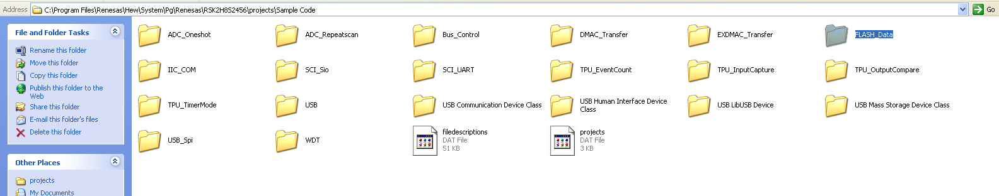

Description.txt reads: 
```
FLASH_Data
The application demonstrates the usage of Flash Programming mode to write and erase the on-chip data flash memory.
```
I looked into it but it gave no clues in why a 'read' would be protected. I then got the idea of reading
ghost memory regions of the ROM data, these are memory regions that can be accessed but don't fall in the defined memory map.
So we might read the content of ROM by reading 0x78000000 - 0x78003FFF instead of 0x000000 - 0x003FFF and find the same data but unprotected.
But while trying this out I saw I actually could read out the ROM at it's normal address just fine... 
I probably had made a stupid mistake before but anyway there is no further need to investigate the FLASH procedures now.

Also I checked in which of the 7 possible modes our controller runs, since the operation mode affects that memory map. 
We are in mode 7 since hardware signals MD0, MD1 and MD2 are 1. This is advanced mode/ single chip mode so internal ROM is indeed 
what is mapped at 0x0 - 0x003FFF.

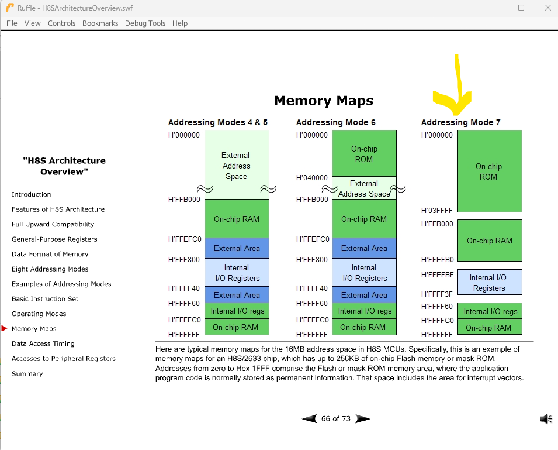

Next up I got the following idea which could help me in reversing the code from the pre-kernel:
since the dump contains a lot more data then only the code of this pre-kernel I write an application that fills the whole RAM
with a dummy value, let's say the value 0x75 being char 's'. After this 'cleaning' of the RAM I reset the microcontroller into BOOT MODE 
and upload the patched microkernel that dumps the whole RAM. With regard to the dump before I should now have the prekernel code and the microkernel
code in RAM and all the rest should be 's' instead of noise of which I can not make clear if its part of the microkernel.

This is the code I came up with for clearing the RAM, note that there is also a dumping_RAM function but this one is just
for testing. We want our RAMdump to contain as least as possible code so we dump from within the microkernel.

```
void dumping_RAM(void) {
    unsigned long address;

   
    for (address = RAM_START_ADDRESS; address <= RAM_END_ADDRESS; address++) {
        // Wait until the transmit data register is empty
        while (SCI2.SSR.BIT.TDRE == 0) {
            // Busy wait
        }

        // Access the address in the 24-bit space
        SCI2.TDR = *((unsigned char *)address);  // Cast address to 8-bit pointer for dereferencing

        // Clear the TDRE flag to indicate byte has been sent
        SCI2.SSR.BIT.TDRE = 0;
    }

    // Send a newline to indicate end of dump, if necessary
    text_write("dumping done!\r\n");
}

void clear_RAM(void) {
    unsigned char *address;

    // Iterate over the specified RAM range and set each byte to 's' (0x73)
    for (address = (unsigned char *)RAM_START_ADDRESS; address <= (unsigned char *)RAM_END_ADDRESS; address++) {
        *address = 's';  // Write ASCII value of 's' (0x73) to each byte in RAM
    }

    // Optionally, send a message to indicate the operation is complete
    text_write("RAM cleared with 's'!\r\n");
}

```

Here I run the cleaning function, as I somewhat expected the program crashes after cleaning the RAM, that's understandable since the application
itself gets ran from RAM so it actually deletes itself. But it is able to clean most of  the RAM so we can go through with this idea.
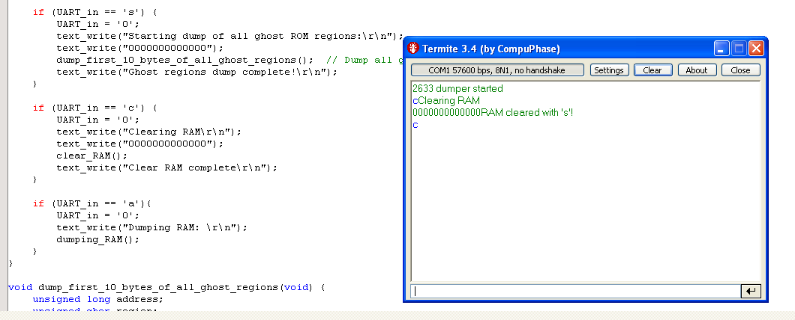

Now after dumping RAM from the microkernel and looking at this dump in HxD we see sections still being cleared:

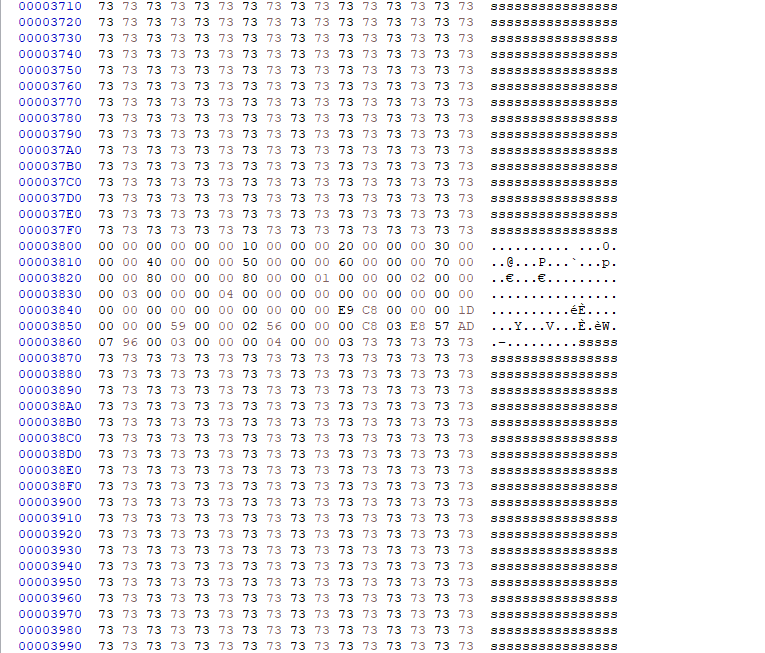

If we analyse the regions of this dump now:
- 0xFFB000 - 0xFFB470 95% '0' with sometimes a value
- 0xFFB470 - 0xFFC000 unknown code
- 0xFFC000 - 0xFFC795 microkernel code + data at the end
- 0xFFC795 - 0xFFE000 unused space (all ox75 or 's') (though 2 lonely bytes at 0xFFCD72)
- 0xFFE000 - 0xFFE3E5 unknown code
- 0xFFE3E5 - 0xFFE800 unused space (all ox75 or 's') 
- 0xFFE800 - 0xFFE86A data space (see image above)
- 0xFFE86A - 0xFFEF97 unused space (all ox75 or 's') 
- 0xFFEF97 - 0xFFEFBF unknown code or data -> Here starts the STACK as seen before.

The pieces of unknown code are the most interesting and we should be able
to label them to a certain function.
Let's now fully reverse this code.

First I'v put my focus on 
- 0xFFE000 - 0xFFE3E5. 

This sections decompiles nicely into functions. Reversing the function here was a bit harder
since it clearly performs some FLASH operations (program / verify) but to understand these you should know
what addresses the CPU is copying from what to where in the background.

I learned that it's entry point is 0xFFE00E. There it checks if e4 equals 0x7777, if it does it will
perform the program step, else it will do the erase step. How e4 is set I do not know but for our
operation it is probably not the value 0x7777 and so performs an erase step. 
After this flash operation it will send out a byte to SCI2 serial port and then perform an endless loop.
After erase this byte can be 0xFF (if failure?) or 0xAA (success).
For the program it can be 0xFF (if failure?) or 0x00 (success).

- 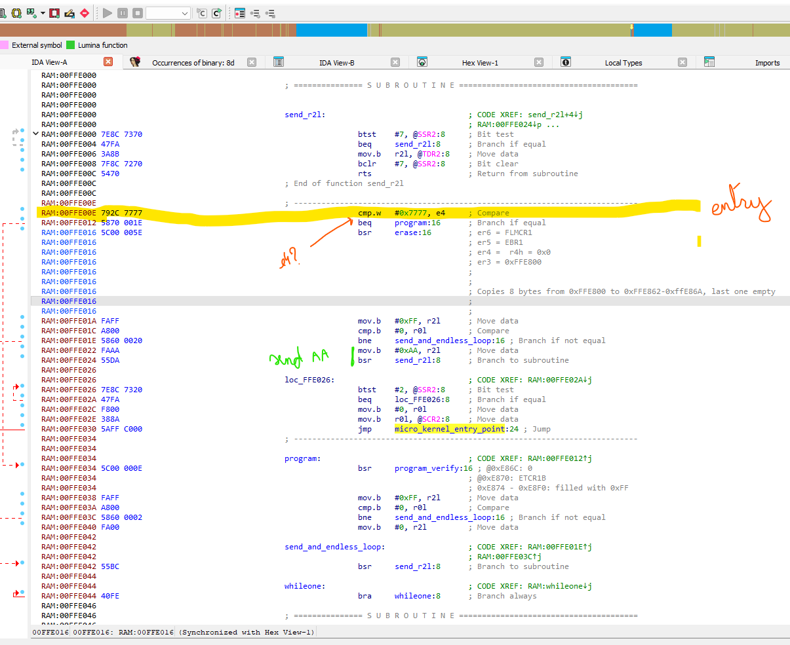

Now the other unknown section is
- 0xFFB470 - 0xFFC000.

Reversing this takes a lot more effort because this can not but decompiled into functions.
I can manually define code but then there are bytes that can not be decompiled. It's often (not always) just one byte
I between some code that is not decompilable. At a certain moment I wanted to transform this hex byte into decimal
and saw that IDA provides an option to label it as an alignment byte. Also before we already had some hints these 
could be for alignment.
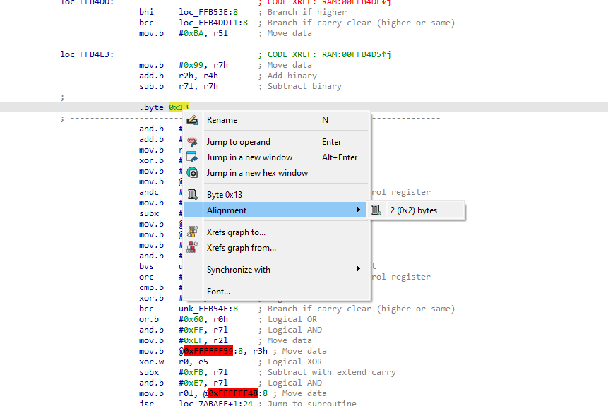

I just assume they are and manually go through the whole sections and try to decompile as much as possible
here you can see from the bar above that I'm halfway through this process.
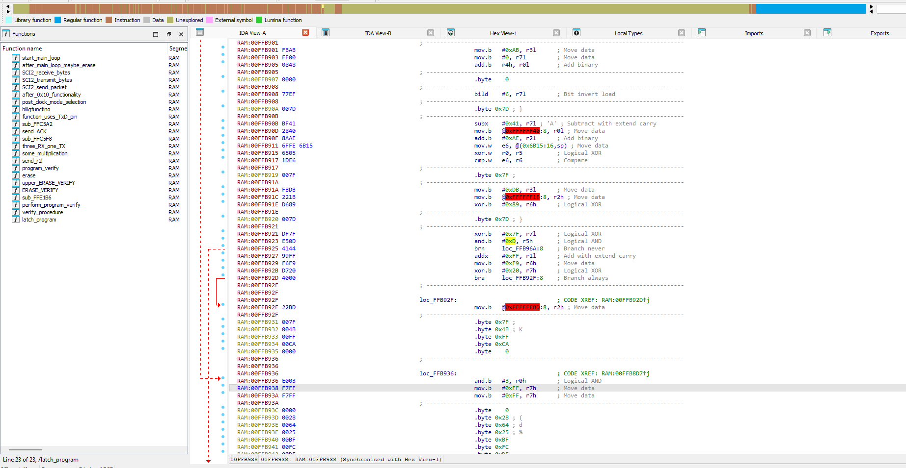

After being done I just had a huge bunch of small snippets of code in this sections. There are some pieces that reference
eachother but not so many. Also it is not clear if a snippet end where the code flow will get to next...
Just from eyeballing the whole section we do see references to addresses from the registers area so that
might be prove that this code is indeed valid code. But I will let reversing it for now...

After some showerthinking I concluded that beside the 2 places in RAM 0xFFB470 - 0xFFC000 and 0xFFE3E5 - 0xFFE800 there might
actually be another place where some prekernel code might live. If I had to design this chip and I would try my best
so the prekernel code or mask rom needed to be as secret as possible (to avoid people finding exploit bugs in it) I would load
it in RAM at the place the microkernel would later overwrite it. So specifically at 0xFFC000 - 0xFFC795.
Since we only have control as soon as the microkernel runs we cannot make sure this place doesn't get overridden.
But we can try to override as less as possible.

As being an engineer we get taught that micro is 10 to the power minus 6 which we consider very small let's try to
make our smallest version of the dumping microkernel: the nanokernel.

The only things we need is the patched version of the function SCI2_transmit_bytes so I copied the bytes over in my hex-editor
changed it a bit so it loops endlessly and a clear startaddress of dumping is set. 
I tried it out using my FDT-python imitation and viewed at the serial spy in IO-ninja: after the microkernel transfer
the microcontroller sends '0xAA' and then stays quiet... hmmm
Some later I discovered that at the total beginning of the microkernel the TX and RX pins get dissabled! 

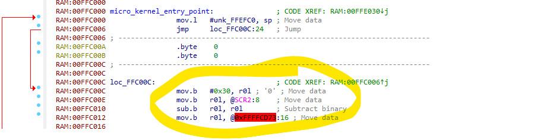

Off course that's crucial so I prepend these opcodes and try again, no luck again.
Well now I don't have much ideas anymore, but after I while I figured I could try a NOP-slide. Assumming the microkernel
might perhaps not be invoked from 0xFFC000 after all but some bytes after. So after prepending a bunch of '0x00' (NOP is 0x00 in H8S opcode).
I was indeed blessed with the controller spitting out bytes endlessly! For keeping my nanokernel still as small as possible
I trimmed the NOPs till it stopped working. Finally behold the nanokernel:

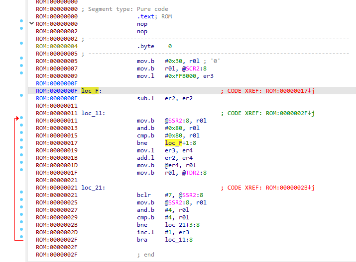

This dumping kernel is only 49 bytes long compared to 1749 bytes microkernel.

Short-after update: it was because my python script overrides the start address in the binary at a fixed offset that
my later kernel-tries did not work. But the NOP's are actually unnecesary and the code does indeed start from 0xffc000.

Performing a clean and dumping RAM gave us:
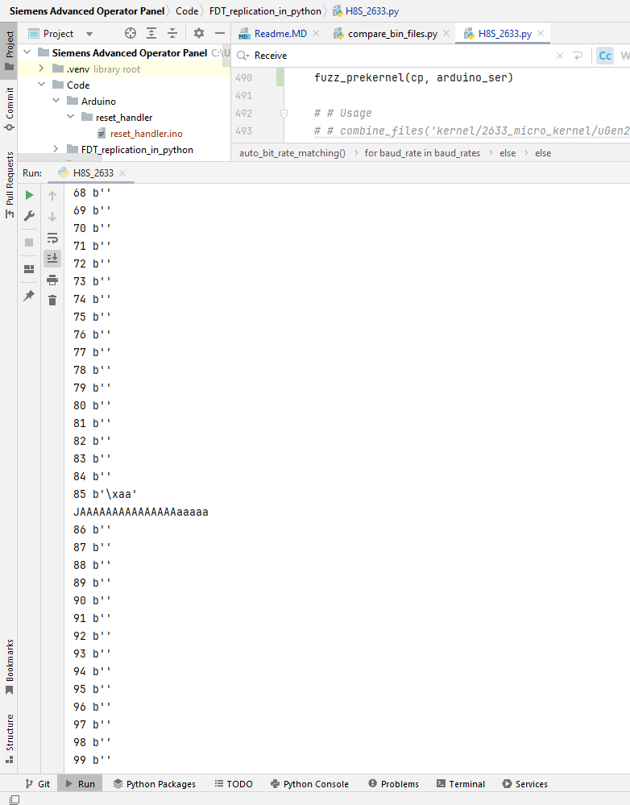
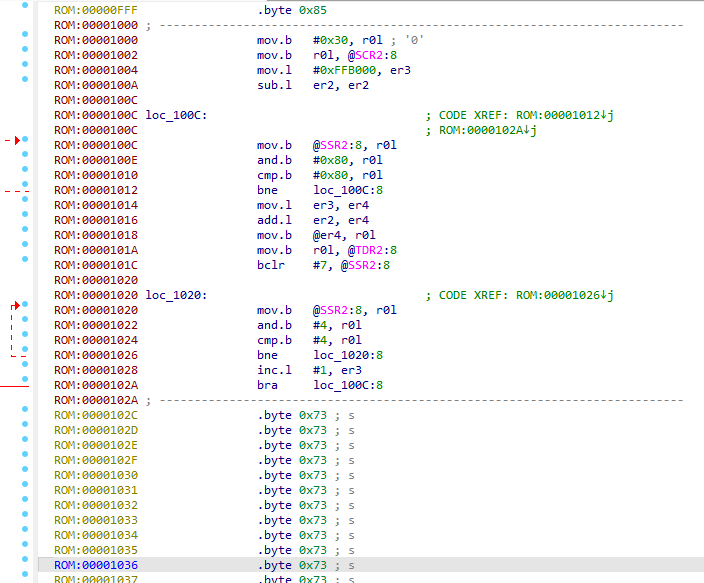
... so no luck, but worth the try.

The setup I have is quite clumsy, it's a big PCB, needs a seperate 5V cable and a programming cable and measuring/altering signals
is a pain in the ass. 
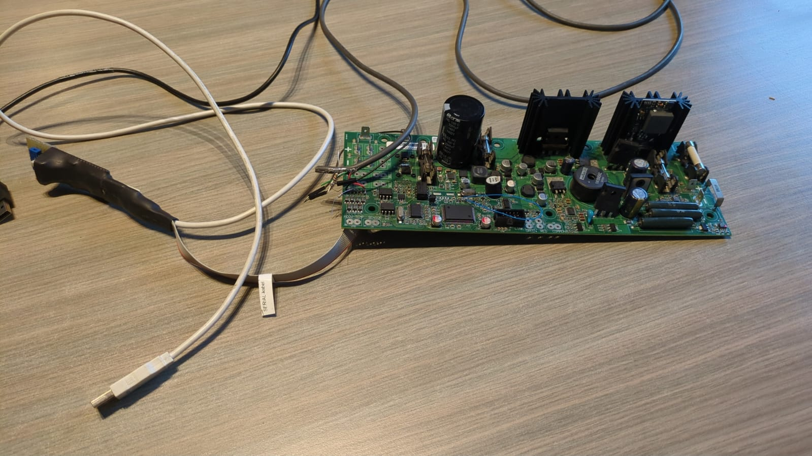

That's why I decided to make my own PCB for this chip. Portable, easy to alter and diagnose some interesting
signals, that's how I want it. As I might want to try glitching this chip I provide two SMA connectors which can be used (by 
the chipwhisperer) for crowbar glitching and for powertracing. To have all glitching options I also placed a multiplexer
so I can try brownout glitching. 
A second attacksurface I want to investigate is the operating modes and the fact that code could run from a external memory device (often SRAM).

I ended up with this schematic (Kicad files are in this repository):
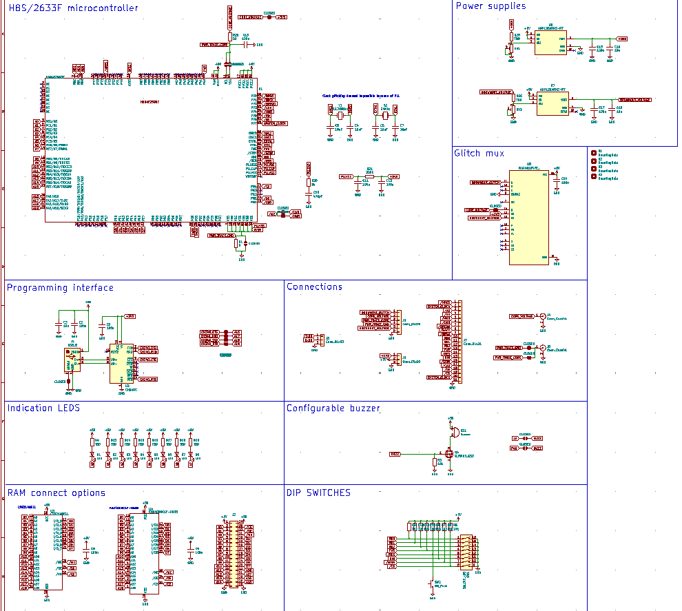

And PCB:


Two weeks later and I now have my own creation in my hands, the 'H8S/2633F experimental board':
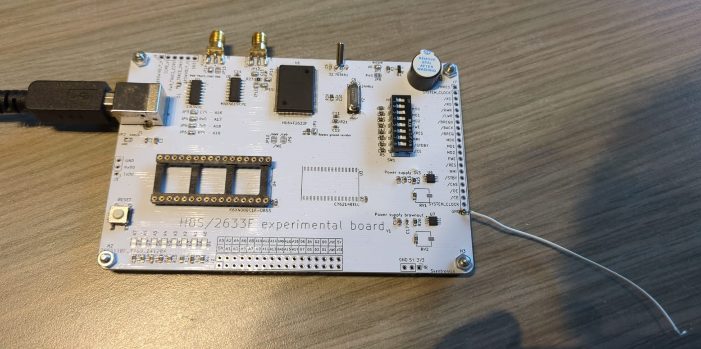

For desolding this LQFP-128 pin package from the old PCB I used the hot air station blower and a pair of tweezers.
For Soldering it back on my own pcb I tried positioned it tightly and tried blowing it on with hot air as well but that didn't do much
The pins have different height because there is still older solder attached. Its also not easy to have this liquid all simultaneous.
I chose to solder it using plenty solder and stroking it on one side making sure each pin is attached. Then I 
stroke it again with a clean spoon-tip and this multiple times until the excessive solder is gone.
Then I cleaned the flux and solder residue with some PCC brush, after which I was going to check under a microscope if every pin
is indeed soldered! BUT YOU SHOULD DO IT THE OTHER WAY AROUND! The PCC brush bends all the pins that are not soldered correctly... 
I managed to straighten them and fix the mess I've made. Finally the chip seemed to be soldered OK.

Being able to program the chip didn't work at first time either. But I of course had a working board to compare with.
I learned that pin MD2 needs to be low and FWE high. This is attached to my dipswitches so easy fix and boom that works!

The fact that MD2 needs to be low when programmed is a surprise. That FWE needs to be high I understand,
without it being high it is not able to program or erase the memory.
When MD2 is low, and MD0, MD1 are high we are in mode 3 according to the datasheet. A mode that doesn't seem available
in the H8S/2633 Group...
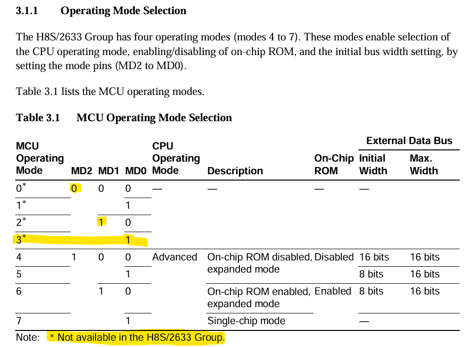

Okay, it seems this is the general setting for boot-mode:
https://community.renesas.com/the_vault/other_products/h8/f/h8---forum/14376/h8-2633-serial-programming
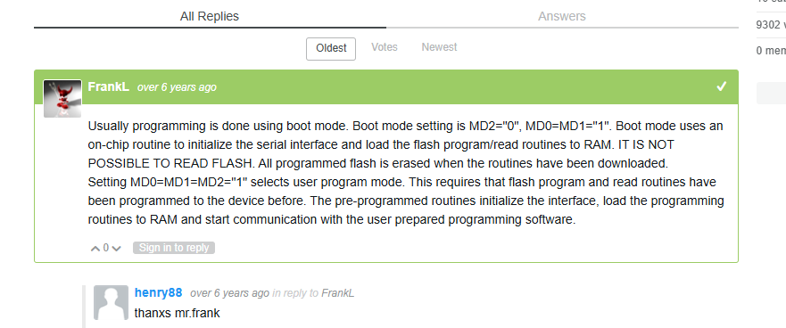

Today I received the LEDS for my PCB, see how coool:
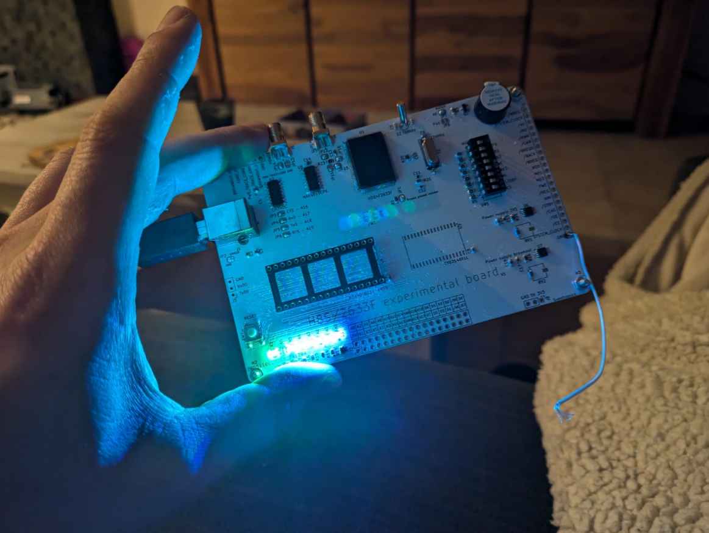
Well I know, you guys just see one bright lightspot, damn camera!

The leds represent the signal on 7 pins of the microcontroller. Depending on the mode selected they form
the address lines A0 - A7 for some external memory. Note that this is only a part of all the address lines, they go untill A19. 
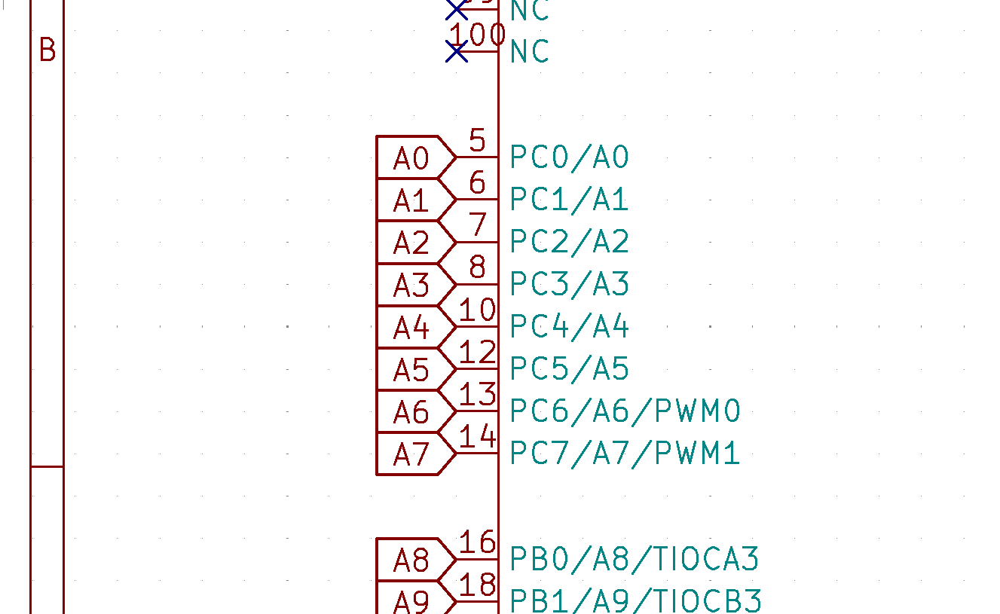

Already a first simple test that we can do using this leds is program the controller with the buzzer program, it then toggles
pin A6 (Which is connected to a LED) a bunch. We are currently running in Mode 7 (No external address space).
We have this interesting piece of the manual that says 'Do not change the inputs at the mode pins during operation':

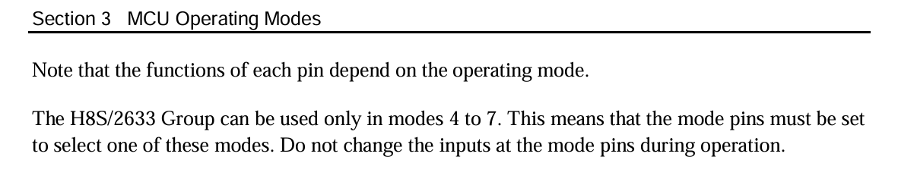

Well it's my chip, lets do what I want and change the mode to mode 5 and 6: The leds change clearly.
Going back to mode 7 sometimes makes  the original buzz program beep further, or somethings seems to be stuck in a certain state.
Anyway it seems like these mode pins are constantly monitored by the CPU and that you can live changes the mode of this chip.
This is interesting behavior for our goal, but I want to pick this up later again and first walking the glitching route!

# Glitching

As having no experience in glitching a microcontroller let's approach this step by step. What I do have is this microcontroller
exploit book that I mentioned before. Page 131 is what I need:
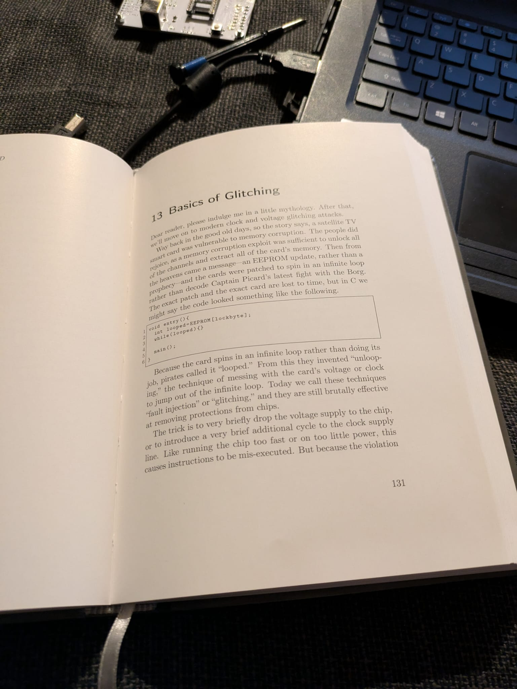

The first act of glitching was to break out of an infinite while loop (called 'unlooping' back then). That's a good first
step since the timing of our glitch is not really relevant. We can tune our duration of our glitch in this first step before moving on.

Let's first write our loop function. We turn on A5 and if we manage to glitch out of our loop we turn on A6 (our buzzer).
I settled with this code:
```
volatile int looped;  

void main(void)
{
	looped = 1;
	
	// Set PC4, PC5 and PC6 as an output pin
    PC.DDR |= (1 << 6);  
	PC.DDR |= (1 << 5);  
	PC.DDR |= (1 << 4);  
	
	PC.DR.BIT.B6 = 0; // PC6 low means LED is on (attached to VCC), but buzzer is off 
	PC.DR.BIT.B4 = 0; // A4 led on
	PC.DR.BIT.B5 = 1; // A5 led off
	
	while(looped){}
	
	PC.DR.BIT.B6 = 1; // Buzzer on
	PC.DR.BIT.B4 = 1; // A4 led off
	PC.DR.BIT.B5 = 0; // A5 led on


}
```

As you can see I defined the variable looped as volatile. If this old compiler would be somewhat 'smart' and I didn't use volatile it could have
optimized the binary to not have the loop functionality and no code to turn on the buzzer because it could never be reached.

For good measure I still check the binary I flashed so I'm certain the assembly instructions I want to glitch are there.
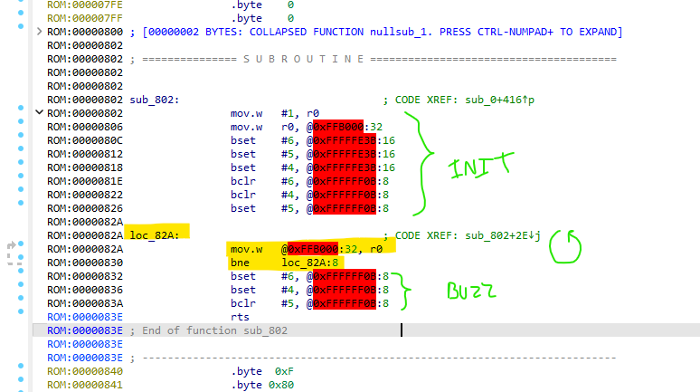

Good, the board is flashed with this constant loop, what now? 
Well lets look at our setup:


The CORE_VOLTAGE signal is attached to our SMA-connector. I provided so I can easily connect it to a Chipwhisperer lite 
that I can use. This signal is fed from the 3V3 power supply and is meant to power the core.
There is a 0R resistor, I've put it there because I might change it to e.g. 100R later and use it for power tracing.

We have a 100nF capacitor which I will remove so the glitch should be steeper and thus better.
and then it feds the VCL and VCC pin with its voltage.

Looking at the pin definitions:
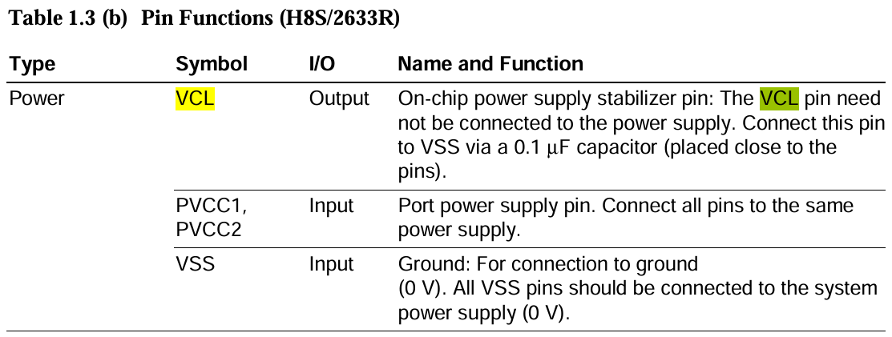
As you see I designed it incorrectly... What I did was copy the design from reference board I had so
that one didn't follow the advice from the datasheet as well. But I guess it doesn't really matter that much for normal use.

As I understand it, it works like this:
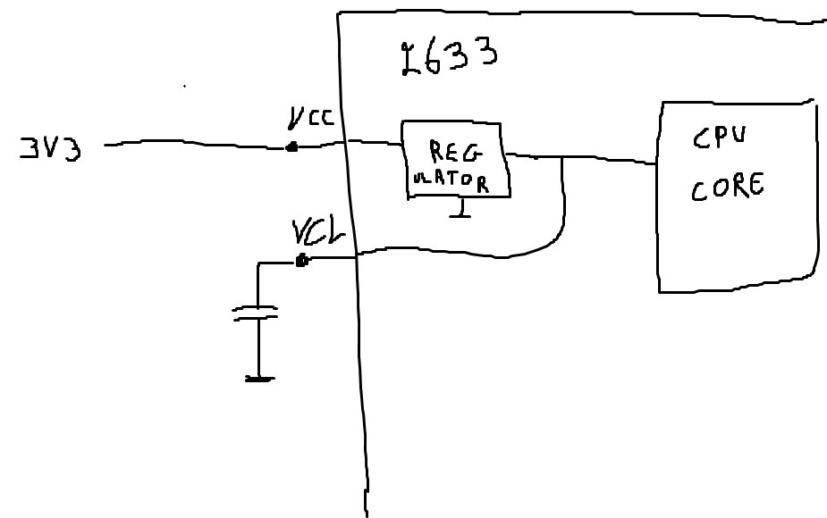

So what I will do for my board:
- remove my 100nF capacitor
- open the solderjumper to VCC
- Glitch!

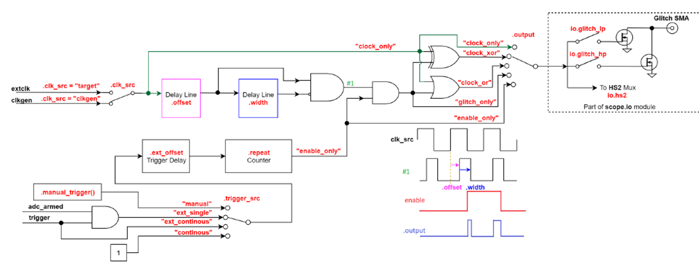


---------------------------------------------------------------------------------------
Try building erase module with symbosl: H8Sruntime.lib not found

set PATH="C:\Users\Sven Onderbeke\Desktop\1_0_00\bin";%PATH%
set PATH="C:\Program Files\Renesas\Hew\Tools\Renesas\H8\6_2_1\bin";%PATH%
set INCLUDE=C:\Users\Sven Onderbeke\Desktop\1_0_00\include;%INCLUDE%

lbg38 -output=H8Sruntime.lib -head=runtime -cpu=2600A -include="C:\Program Files\Renesas\Hew\Tools\Renesas\H8\6_2_1\include"
FWE pin might be interesting
if FWE low: erase fails, instead of 0xAA , 0xFF 


